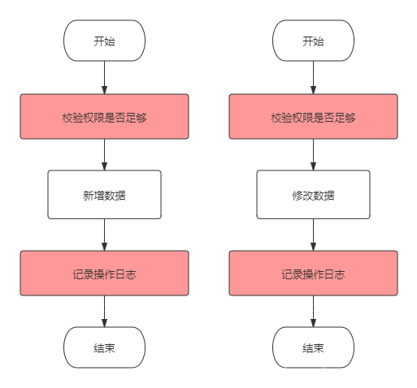
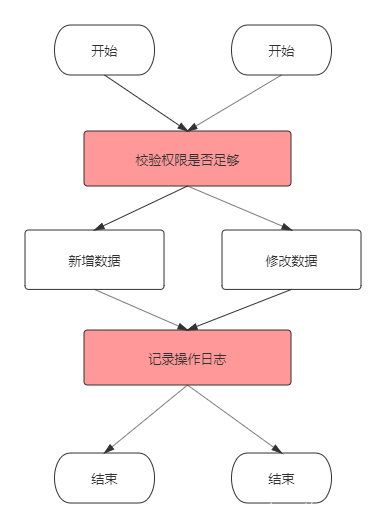
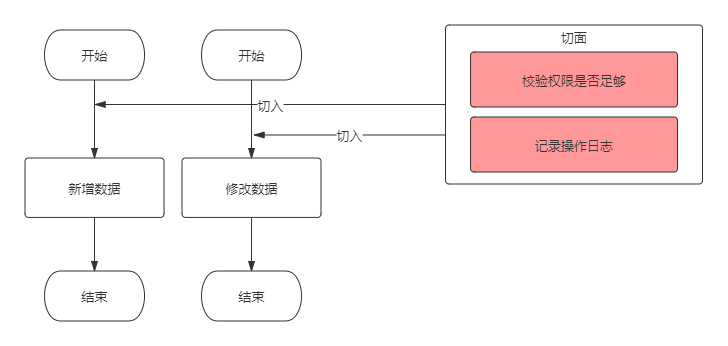
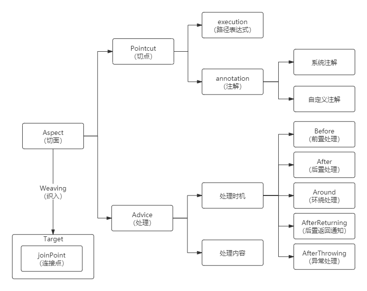
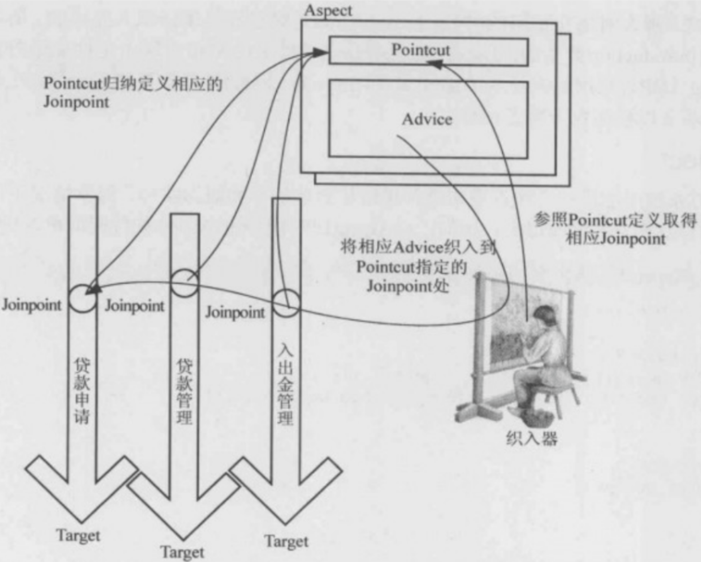
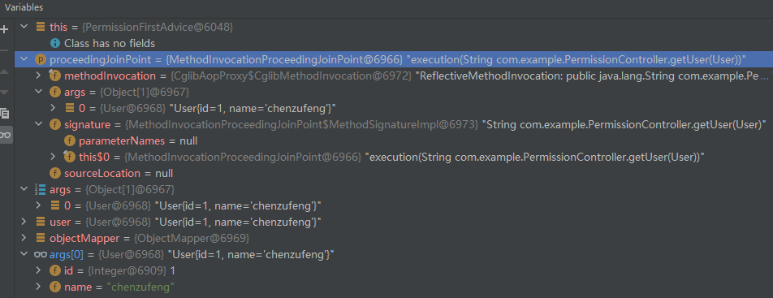

# AOP 作用

AOP（Aspect Oriented Programming），面向切面思想，是 Spring 的三大核心思想之一（两外两个：IOC——控制反转、DI——依赖注入）。

那么 AOP 为何那么重要呢？

在我们的程序中，经常存在一些系统性的需求，比如权限校验、日志记录、统计等，这些代码会==散落穿插==在各个业务逻辑中，非常==冗余==且不利于维护：



如上图逻辑的现实所示，有多少业务操作，就要写多少==重复==的校验和日志记录代码，这显然是无法接受的。

用面向对象的思想，可以把这些重复的代码抽离出来，写成==公共方法==：



这样，代码冗余和可维护性的问题得到了解决，但每个业务方法中依然要依次==手动调用==这些公共方法，也是略显繁琐。

有没有更好的方式呢？有的，那就是AOP！

AOP将权限校验、日志记录等非业务代码完全提取出来，与业务代码分离，并<font color=red>寻找节点切入业务代码中</font>：



# AOP 概念

简单地去理解，其实 AOP 要做三类事：

- <font color=red>在哪里切入</font>：也就是权限校验等非业务操作在哪些业务代码中执行。
- <font color=red>在什么时候切入</font>：是业务代码执行前还是执行后。
- <font color=red>切入后做什么事</font>：比如做权限校验、日志记录等。

因此，AOP 的体系可以梳理为下图：



- Pointcut：切点（对 **Jointpoint** 进行拦截的定义），决定处理如权限校验、日志记录等在==何处切入业务代码==中（即==织入切面==）。切点分为 `execution 方式`和 `annotation 方式`。前者可以用==路径表达式==指定哪些类织入切面，后者可以指定被哪些==注解修饰==的代码织入切面。
- Advice：处理，包括处理时机和处理内容。
  - ==处理内容==就是要做什么事，比如校验权限和记录日志。
  - ==处理时机==就是在什么时机执行处理内容，分为前置处理（即业务代码执行前）、后置处理（业务代码执行后）等。
- Aspect：切面，即 Pointcut 和 Advice。
- Joinpoint：连接点（类里面可以被增强的方法），是程序执行的一个点。例如，一个方法的执行或者一个异常的处理。在 Spring AOP 中，一个连接点总是代表==一个方法执行==。想要修改哪个方法的功能，那么该方法就是一个链接点。
- Weaving：织入，就是通过==动态代理==，在==目标对象方法==中执行处理内容的过程。
- **Target**（目标对象）：==要增强的类==成为 **Target**。



- Pointcut 使用注解或路径表达式，归纳定义相应的 JoinPoint；
- Advice 包括处理时机和处理内容；
- “织入器”参照 Pointcut 定义，取得相应的 Jointpoint，然后将相应的 Advice 织入到 Pointcut 指定的 Joinpoint 处。

# AOP 示例

## 示例一：简单功能

实现所有的 Get 请求被调用前在控制台输出一句"Get请求的advice被触发了！"。

### 依赖

```xml
<parent>
    <artifactId>spring-boot-starter-parent</artifactId>
    <groupId>org.springframework.boot</groupId>
    <version>2.6.4</version>
</parent>

<dependencies>
    <dependency>
        <groupId>org.springframework.boot</groupId>
        <artifactId>spring-boot-starter-web</artifactId>
    </dependency>

    <dependency>
        <groupId>org.springframework.boot</groupId>
        <artifactId>spring-boot-starter-aop</artifactId>
    </dependency>
</dependencies>
```

### 切面类

创建一个 ==AOP 切面类==，只要在类上加个 `@Aspect` 注解即可：

- `@Aspect` 注解用来描述一个切面类，定义切面类的时候需要打上这个注解。
- `@Component` 注解将该类交给 Spring 来管理。

在这个类里实现 advice：

```java
package com.example;

import org.aspectj.lang.annotation.Aspect;
import org.aspectj.lang.annotation.Before;
import org.aspectj.lang.annotation.Pointcut;
import org.springframework.stereotype.Component;

/**
 * @author chenzufeng
 * @date 2022/4/4
 */
@Aspect
@Component
public class LogAdvice {
    /**
     * 定义一个切点：所有被 GetMapping 注解修饰的方法会织入 advice
     */
    @Pointcut("@annotation(org.springframework.web.bind.annotation.GetMapping)")
    private void logAdvicePointcut() {
        System.out.println("logAdvicePointcut没有被执行！");
    }

    /**
     * Before表示logAdvice方法将在目标方法执行前执行
     */
    @Before("logAdvicePointcut()")
    public void logAdvice() {
        System.out.println("Get请求的advice被触发了！");
    }
}
```

### controller

```java
package com.example;

import org.springframework.web.bind.annotation.GetMapping;
import org.springframework.web.bind.annotation.PostMapping;
import org.springframework.web.bind.annotation.RequestMapping;
import org.springframework.web.bind.annotation.RestController;

/**
 * @author chenzufeng
 * @date 2022/4/4
 */
@RestController
@RequestMapping("/aop")
public class AopController {
    @GetMapping("get")
    public String aopGet() {
        return "aopGet";
    }
    
    @PostMapping("post")
    public String aopPost() {
        return "aopPost";
    }
}
```

### 测试结果

调用`http://localhost:8080/aop/get`时，控制台输出：

```markdown
Get请求的advice被触发了！
```

调用`http://localhost:8080/aop/post?id=1`时，控制台没有输出！

证明切点确实是只针对被`GetMapping`修饰的方法。


## 示例二：自定义注解

1. 自定义一个注解`PermissionsAnnotation`；
2. 创建一个切面类，切点设置为拦截所有标注`PermissionsAnnotation`的方法，截取到接口的参数，进行简单的权限校验。

### 引入依赖

```xml
<properties>
    <maven.compiler.source>8</maven.compiler.source>
    <maven.compiler.target>8</maven.compiler.target>
</properties>

<parent>
    <artifactId>spring-boot-starter-parent</artifactId>
    <groupId>org.springframework.boot</groupId>
    <version>2.6.4</version>
</parent>

<dependencies>
    <dependency>
        <groupId>org.springframework.boot</groupId>
        <artifactId>spring-boot-starter-aop</artifactId>
    </dependency>

    <dependency>
        <groupId>org.springframework.boot</groupId>
        <artifactId>spring-boot-starter-web</artifactId>
    </dependency>
</dependencies>
```


### 自定义注解

```java
package com.example.com.example;

import java.lang.annotation.*;

/**
 * @author chenzufeng
 * @date 2022/4/4
 */
@Target(ElementType.METHOD)
@Retention(RetentionPolicy.RUNTIME)
@Documented
public @interface PermissionAnnotation {
}
```


### 切面类

```java
package com.example;

import com.fasterxml.jackson.databind.ObjectMapper;
import org.aspectj.lang.ProceedingJoinPoint;
import org.aspectj.lang.annotation.Around;
import org.aspectj.lang.annotation.Aspect;
import org.aspectj.lang.annotation.Pointcut;
import org.springframework.stereotype.Component;

/**
 * @author chenzufeng
 * @date 2022/4/4
 */
@Aspect
@Component
public class PermissionFirstAdvice {
    /**
     * 定义一个切面，括号内写入自定义注解的路径
     */
    @Pointcut("@annotation(com.example.PermissionAnnotation)")
    private void permissionCheck() {}

    @Around("permissionCheck()")
    public String permissionCheckFirst(ProceedingJoinPoint proceedingJoinPoint) throws Throwable {
        System.out.println("==========第一个切面==========");
        Object[] args = proceedingJoinPoint.getArgs();
        User user = (User) args[0];
        if (user.getId() < 0) {
            return "{\"message\":\"illegal id\",\"code\":403}";
        }
        return proceedingJoinPoint.proceed().toString();
    }
}
```

一个自定义的`AOP`注解可以对应多个切面类，这些切面类执行顺序由`@Order`注解管理，该注解后的数字越小，所在切面类越先执行。

### controller

```java
package com.example;

import org.springframework.web.bind.annotation.PostMapping;
import org.springframework.web.bind.annotation.RequestBody;
import org.springframework.web.bind.annotation.RequestMapping;
import org.springframework.web.bind.annotation.RestController;

/**
 * @author chenzufeng
 * @date 2022/4/4
 */
@RestController
@RequestMapping("/permission")
public class PermissionController {
    @PostMapping("check")
    @PermissionAnnotation
    public String getUser(@RequestBody User user) {
        return user.toString();
    }
}
```


# AOP 注解

## @Pointcut

`@Pointcut` 注解，用来定义一个切面，即上文中所关注的某件事情的入口，切入点定义了事件触发时机：

```java
@Aspect
@Component
public class LogAspectHandler {
    /**
     * 定义一个切面，拦截 com.example.controller 包和子包下的所有方法
     */
    @Pointcut("execution(* com.example.controller.*.*(..))")
    public void pointCut() {}
}
```

### execution表达式

以 `execution(* com.example.controller.*.*(..)))` 表达式为例：

- 第一个 ***** 表示==方法返回任意值==；

- 第二个 ***** 表示 ==**controller** 包下的任意类==；

- 第三个 ***** 表示==类中的任意方法==，括号中的==两个点表示方法参数任意==，即这里描述的切入点为 **controller** 包下所有类中的所有方法。

### annotation() 表达式

annotation() 方式是针对某个注解来定义切面，比如对具有 @PostMapping 注解的方法做切面，可以如下定义切面：

```java
@Pointcut("@annotation(org.springframework.web.bind.annotation.PostMapping)")
public void annotationPointcut() {}
```

使用该切面，就会切入注解是 `@PostMapping` 的所有方法。

这种方式很适合处理 `@GetMapping、@PostMapping、@DeleteMapping`不同注解有各种特定处理逻辑的场景。

## @Around

@Around可以自由选择增强动作与目标方法的执行顺序，也就是说<font color=red>可以在增强动作前、后，甚至过程中执行目标方法</font>。这个特性的实现在于，调用`ProceedingJoinPoint`参数的`proceed()`方法才会执行目标方法。

@Around可以<font color=red>改变执行目标方法的==参数值==，也可以改变执行目标方法之后的==返回值==</font>。

Around增强处理有以下特点：

- 当定义一个Around增强处理方法时，<font color=red>该方法的第一个形参必须是 ProceedingJoinPoint 类型</font>（至少一个形参）。在增强处理方法体内，调用ProceedingJoinPoint的proceed方法才会执行目标方法：这就是@Around增强处理可以完全控制目标方法执行时机、如何执行的关键；如果程序没有调用ProceedingJoinPoint的proceed方法，则目标方法不会执行。

- 调用ProceedingJoinPoint的proceed方法时，还可以传入一个`Object[ ]对象`，该数组中的值将被传入目标方法作为实参——这就是Around增强处理方法可以改变目标方法参数值的关键。如果传入的Object[ ]数组长度与目标方法所需要的参数个数不相等，或者Object[ ]数组元素与目标方法所需参数的类型不匹配，程序就会出现异常。

@Around功能虽然强大，但通常需要在==线程安全的环境下使用==。因此，如果使用普通的Before、AfterReturning就能解决的问题，就没有必要使用Around了。如果<font color=red>需要目标方法执行之前和之后共享某种状态数据，则应该考虑使用Around</font>。尤其是需要使用增强处理阻止目标的执行，或需要改变目标方法的返回值时，则只能使用Around增强处理了。

### 切面类

```java
package com.example;

import com.fasterxml.jackson.databind.ObjectMapper;
import org.aspectj.lang.ProceedingJoinPoint;
import org.aspectj.lang.annotation.Around;
import org.aspectj.lang.annotation.Aspect;
import org.aspectj.lang.annotation.Pointcut;
import org.springframework.stereotype.Component;

/**
 * @author chenzufeng
 * @date 2022/4/4
 */
@Aspect
@Component
public class PermissionFirstAdvice {
    /**
     * 定义一个切面，括号内写入自定义注解的路径
     */
    @Pointcut("@annotation(com.example.PermissionAnnotation)")
    private void permissionCheck() {}

    @Around("permissionCheck()")
    public Object permissionCheckFirst(ProceedingJoinPoint proceedingJoinPoint) throws Throwable {
        System.out.println("==========第一个切面==========");
        // 获取请求参数
        Object[] args = proceedingJoinPoint.getArgs();
        User user = (User) args[0];
        if (user.getId() < 0) {
            return "{\"message\":\"illegal id\",\"code\":403}";
        }

        // 修改请求参数
        ObjectMapper objectMapper = new ObjectMapper();
        args[0] = objectMapper.readValue("{\"id\":2, \"name\":\"zufeng\"}", User.class);
        return proceedingJoinPoint.proceed(args);
    }
}
```



### controller

```java
@RestController
@RequestMapping("/permission")
public class PermissionController {
    @PostMapping("check")
    @PermissionAnnotation
    public String getUser(@RequestBody User user) {
        System.out.println(user);
        return user.toString();
    }
}
```

<font color=red>执行完切面中定义的方法后，返回值被修改并返回，第七行代码才被执行</font>！

## @Before

`@Before` 注解指定的方法<font color=red>在切面切入目标方法之前执行</font>，可以做一些 `Log` 处理，也可以做一些信息的统计，比如获取用户的请求 `URL` 以及用户的 `IP` 地址等等，这个在做个人站点的时候都能用得到，都是常用的方法：

```java
@Aspect
@Component
@Slf4j
public class LogAspectHandler {
    /**
     * 在上面定义的切面方法之前执行该方法
     * @param joinPoint jointPoint
     */
    @Before("pointCut()")
    public void doBefore(JoinPoint joinPoint) {
        log.info("====doBefore方法进入了====");
 
        // 获取签名
        Signature signature = joinPoint.getSignature();
        // 获取切入的包名
        String declaringTypeName = signature.getDeclaringTypeName();
        // 获取即将执行的方法名
        String funcName = signature.getName();
        log.info("即将执行方法为: {}，属于{}包", funcName, declaringTypeName);
 
        // 也可以用来记录一些信息，比如获取请求的 URL 和 IP
        ServletRequestAttributes attributes = (ServletRequestAttributes) RequestContextHolder.getRequestAttributes();
        HttpServletRequest request = attributes.getRequest();
        // 获取请求 URL
        String url = request.getRequestURL().toString();
        // 获取请求 IP
        String ip = request.getRemoteAddr();
        log.info("用户请求的url为：{}，ip地址为：{}", url, ip);
    }
}
```

`JointPoint` 对象很有用，可以用它来获取一个签名，利用签名可以获取请求的包名、方法名，包括参数（通过 `joinPoint.getArgs()` 获取）等。

## @After

`@After` 注解和 `@Before` 注解相对应，指定的方法在切面切入目标方法之后执行，也可以做一些完成某方法之后的 Log 处理。

```java
@Aspect
@Component
@Slf4j
public class LogAspectHandler {
    /**
     * 定义一个切面，拦截 com.example.controller 包下的所有方法
     */
    @Pointcut("execution(* com.example.controller.*.*(..))")
    public void pointCut() {}
 
    /**
     * 在上面定义的切面方法之后执行该方法
     * @param joinPoint jointPoint
     */
    @After("pointCut()")
    public void doAfter(JoinPoint joinPoint) {
        log.info("==== doAfter 方法进入了====");
        Signature signature = joinPoint.getSignature();
        String method = signature.getName();
        log.info("方法{}已经执行完", method);
    }
}
```

## @AfterReturning

`@AfterReturning` 注解和 `@After` 有些类似，区别在于 `@AfterReturning` 注解可以用来捕获切入方法执行完之后的==返回值==，对返回值进行业务逻辑上的增强处理，例如：

```java
@Aspect
@Component
@Slf4j
public class LogAspectHandler {
    /**
     * 在上面定义的切面方法返回后执行该方法，可以捕获返回对象或者对返回对象进行增强
     * @param joinPoint joinPoint
     * @param result result
     */
    @AfterReturning(pointcut = "pointCut()", returning = "result")
    public void doAfterReturning(JoinPoint joinPoint, Object result) {
        Signature signature = joinPoint.getSignature();
        String classMethod = signature.getName();
        log.info("方法{}执行完毕，返回参数为：{}", classMethod, result);
        // 实际项目中可以根据业务做具体的返回值增强
        log.info("对返回参数进行业务上的增强：{}", result + "增强版");
    }
}
```

需要注意的是，在 `@AfterReturning` 注解 中，<font color=red>属性 `returning` 的值必须要和参数保持一致，否则会检测不到</font>。该方法中的第二个入参就是被切方法的返回值，在 `doAfterReturning` 方法中可以对返回值进行增强，可以根据业务需要做相应的封装。

## @AfterThrowing

当被切方法执行过程中抛出异常时，会进入 `@AfterThrowing` 注解的方法中执行，在该方法中可以做一些异常的处理逻辑。要注意的是<font color=red> `throwing` 属性的值必须要和参数一致，否则会报错</font>。该方法中的第二个入参即为抛出的异常。

```java
@Aspect
@Component
@Slf4j
public class LogAspectHandler {
    /**
     * 在上面定义的切面方法执行抛异常时，执行该方法
     * @param joinPoint jointPoint
     * @param ex ex
     */
    @AfterThrowing(pointcut = "pointCut()", throwing = "ex")
    public void afterThrowing(JoinPoint joinPoint, Throwable ex) {
        Signature signature = joinPoint.getSignature();
        String method = signature.getName();
        // 处理异常的逻辑
        log.info("执行方法{}出错，异常为：{}", method, ex);
    }
}
```


# 参考资料

[Spring Boot 切面AOP实现权限校验](https://blog.csdn.net/weixin_46228112/article/details/123930413)

日志
https://blog.csdn.net/sun_123987/article/details/123518346
