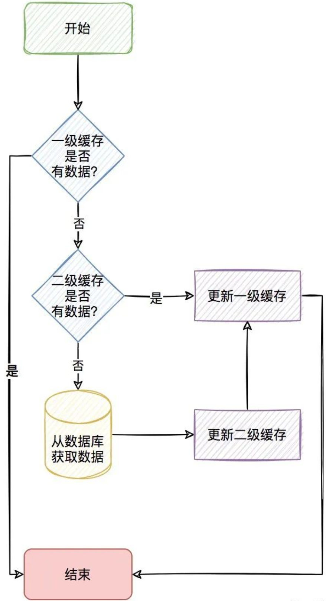
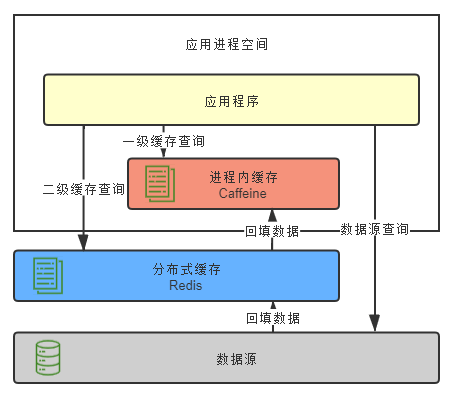
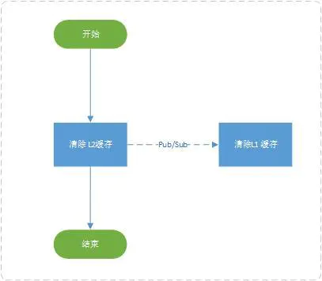

# 二级缓存概念

关系数据库(Mysql)数据最终存储在磁盘上，如果每次都从数据库里去读取，会因为磁盘本身的IO影响读取速度，所以就有了像redis这种的==内存缓存==。

通过内存缓存确实能够很大程度的提高查询速度，但如果同一查询并发量非常的大，频繁的查询redis，也会有明显的==网络IO==上的消耗，那我们针对这种查询非常频繁的数据(==热点key==)，我们是不是可以考虑存到==应用内缓存==，如：caffeine。

当应用内缓存有符合条件的数据时，就可以直接使用，而不用通过网络到redis中去获取，这样就形成了两级缓存。

**应用内缓存叫做一级缓存，远程缓存（如redis）叫做二级缓存**。

应用内缓存可以理解成比redis缓存更珍惜的资源，所以，caffeine 不适用于==数据量大==，并且==缓存命中率极低==的业务场景，如用户维度的缓存。

## 保证分布式节点一级缓存的一致性

当前项目针对应用都部署了多个节点，一级缓存是在应用内的缓存，所以当对数据更新和清除时，需要通知所有节点进行清理缓存的操作。可以有多种方式来实现这种效果，比如：zookeeper、MQ等，但是既然用了redis缓存，redis本身是有支持订阅/发布功能的，所以就不依赖其他组件了，直接使用redis的通道来通知其他节点进行清理缓存的操作。当某个key进行更新删除操作时，通过发布订阅的方式通知其它节点进行删除该key本地的一级缓存就可以了。

## 优势

1. 离用户越近，速度越快；
2. 减少分布式缓存查询频率，降低序列化和反序列化的CPU消耗；
3. 大幅度减少网络IO以及带宽消耗。

如果只使用redis来做缓存我们会有大量的请求到redis，但是每次请求的数据都是一样的，假如这一部分数据就放在应用服务器本地，那么就省去了请求redis的网络开销，请求速度就会快很多。但是使用redis横向扩展很方便。

如果只使用Caffeine来做本地缓存，我们的应用服务器的内存是有限，并且单独为了缓存去扩展应用服务器是非常不划算。所以，只使用本地缓存也是有很大局限性的。[^4]


## 流程

### 查询

整个流程如下：






进程内缓存做为一级缓存，分布式缓存做为二级缓存，首先从一级缓存中查询，若能查询到数据则直接返回，否则从二级缓存中查询，若二级缓存中可以查询到数据，则回填到一级缓存中，并返回数据。若二级缓存也查询不到，则从数据源中查询，将结果分别回填到一级缓存，二级缓存中。

### 删除




# 设计思路

思路一[^2]

1. **MultiLevelCacheManager**：多级缓存管理器；
2. **MultiLevelChannel**：封装Caffeine和RedissonClient；
3. **MultiLevelCache**：实现org.springframework.cache.Cache接口；
4. **MultiLevelCacheConfig**：配置缓存过期时间等

思路二[^2]

1. 定义properties配置属性类：CacheRedisCaffeineProperties

2. 实现AbstractValueAdaptingCache抽象类：RedisCaffeineCache：先清除redis中缓存数据，然后清除caffeine中的缓存——实现具体操作

   ```java
   public RedisCaffeineCache(String name, RedisTemplate<Object, Object> redisTemplate, Cache<Object, Object> caffeineCache, CacheRedisCaffeineProperties cacheRedisCaffeineProperties) {
       super(cacheRedisCaffeineProperties.isCacheNullValues());
       this.name = name;
       this.redisTemplate = redisTemplate;
       this.caffeineCache = caffeineCache;
       this.cachePrefix = cacheRedisCaffeineProperties.getCachePrefix();
       this.defaultExpiration = cacheRedisCaffeineProperties.getRedis().getDefaultExpiration();
       this.expires = cacheRedisCaffeineProperties.getRedis().getExpires();
       this.topic = cacheRedisCaffeineProperties.getRedis().getTopic();
   }
   
   @Override
   public void evict(Object key) {
       // 先清除redis中缓存数据，然后清除caffeine中的缓存，
       // 避免短时间内如果先清除caffeine缓存后其他请求会再从redis里加载到caffeine中
       redisTemplate.delete(getKey(key));
       push(new CacheMessage(this.name, key));
       caffeineCache.invalidate(key);
   }
   ```

3. 实现CacheManager接口：RedisCaffeineCacheManager

4. Redis消息发布/订阅，传输的消息类

5. 配置类：CacheRedisCaffeineAutoConfiguration

   ```java
   @Bean
   @ConditionalOnBean(RedisTemplate.class)
   public RedisCaffeineCacheManager cacheManager(RedisTemplate<Object, Object> redisTemplate) {
       return new RedisCaffeineCacheManager(cacheRedisCaffeineProperties, redisTemplate);
   }
   ```


==思路三（重点参考）==[^4]

1. LayeringCache来实现Cache接口，LayeringCache类中集成对Caffeine和redis的操作。

   LayeringCache类，因为需要集成对Caffeine和Redis的操作，所以至少需要有name（缓存名称）、CaffeineCache和CustomizedRedisCache三个属性，还增加了一个是否使用一级缓存的开关usedFirstCache。在LayeringCache类的方法里面分别去调用操作一级缓存的和操作二级缓存的方法就可以了。

   - 在查询方法如get等，先去查询一级缓存，如果没查到再去查二级缓存。

   - put方法没有顺序要求，但是建议将一级缓存的操作放在前面。

   - 如果是删除方法如evict和clear等，需要先删掉二级缓存的数据，再去删掉一级缓存的数据，否则有并发问题。

   - 删除一级缓存需要用到redis的Pub/Sub（订阅发布）模式，否则集群中其他服服务器节点的一级缓存数据无法删除。

   - redis的Pub/Sub（订阅发布）模式发送消息是无状态的，如果遇到网络等原因有可能导致一些应用服务器上的一级缓存没办法删除，如果对L1和L2数据同步要求较高的话，这里可以使用MQ来做。

   

2. 写一个LayeringCacheManager来管理LayeringCache：这个方法就是根据名称获取缓存，如果没有找到并且动态创建缓存的开关dynamic为true的话，就调用createCache方法动态的创建缓存

# 参考资料

[^1]:[基于Spring Cache实现分布式二级缓存](https://mp.weixin.qq.com/s/2hoDTGd07NtjG5Vanq5wYw)

demo：https://github.com/yudiandemingzi/springboot-redis-caffeine-cache

[^2]:[品味Spring Cache设计之美](https://mp.weixin.qq.com/s/o8RvO14LEzHCB7R44LLZmw)
[^3]:[SpringBoot+SpringCache实现两级缓存(Redis+Caffeine)——大浪不惊涛](https://www.cnblogs.com/cnndevelop/p/13429660.html)
[^4]:[Spring Boot缓存实战 Redis + Caffeine 实现多级缓存—— xiaolyuh（重要）](https://www.jianshu.com/p/ef9042c068fd)

[caffeine + redis自定义二级缓存](https://www.jianshu.com/p/d9358e7a6afc)（重要）

[Redis+Caffeine两级缓存，让访问速度纵享丝滑](https://mp.weixin.qq.com/s/PsOkiH_L4VI_ogvjScWAMA)

[基于Spring接口，集成Caffeine+Redis两级缓存](https://mp.weixin.qq.com/s/aYh9rL5uWsvT6sZqG5C7Dw)

[缓存设计这些你了解吗SpringBoot 快速集成实现一级缓存Redis和二级缓存Caffeine 可自定义扩展](https://mp.weixin.qq.com/s/etWtO66wTeSJV7fVyFcUzg)

[使用Redis实现Spring Cache两级缓存](https://mp.weixin.qq.com/s/vsJihLDYE5eYWJLZn44gjA)

