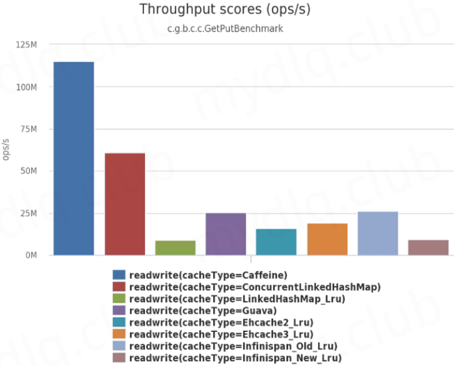

# 本地缓存组件 Caffeine

Redis 这种 NoSql 作为分布式缓存组件，能提供多个服务间的缓存，但是 Redis 需要网络开销，增加时耗。本地缓存是直接从本地内存中读取，没有网络开销，例如秒杀系统或者数据量小的缓存等，比远程缓存更合适。

在下面缓存组件中 Caffeine 性能是其中最好的：



## Caffeine 参数配置

| 参数              |   类型   | 描述                                                         |
| ----------------- | :------: | ------------------------------------------------------------ |
| initialCapacity   | integer  | 初始的缓存空间大小                                           |
| maximumSize       |   long   | 缓存的最大条数                                               |
| maximumWeight     |   long   | 缓存的最大权重                                               |
| expireAfterAccess | duration | 最后一次写入或访问后，指定经过多长的时间过期                 |
| expireAfterWrite  | duration | 最后一次写入后，指定经过多长的时间缓存过期                   |
| refreshAfterWrite | duration | 创建缓存或者最近一次更新缓存后，经过指定的时间间隔后刷新缓存 |
| weakKeys          | boolean  | 打开 key 的弱引用                                            |
| weakValues        | boolean  | 打开 value 的弱引用                                          |
| softValues        | boolean  | 打开 value 的软引用                                          |
| recordStats       |    -     | 开发统计功能                                                 |

**注意：**

- `weakValues` 和 `softValues` 不可以同时使用。
- `maximumSize` 和 `maximumWeight` 不可以同时使用。
- `expireAfterWrite` 和 `expireAfterAccess` 同时存在时，以 `expireAfterWrite` 为准。


## 软引用与弱引用

- **软引用：** 如果一个对象只具有软引用，且内存空间足够，垃圾回收器就不会回收它；如果内存空间不足了，就会回收这些对象的内存。
- **弱引用：** 弱引用的对象拥有更短暂的生命周期。在垃圾回收器线程扫描它所管辖的内存区域的过程中，一旦发现了只具有弱引用的对象，不管当前内存空间足够与否，都会回收它的内存

```java
// 软引用
Caffeine.newBuilder().softValues().build();

// 弱引用
Caffeine.newBuilder().weakKeys().weakValues().build();
```


# 使用 Caffeine 方法实现缓存

直接引入 Caffeine 依赖，然后使用 Caffeine 方法实现缓存。

## 实现步骤

### 依赖

```xml
<dependency>
    <groupId>com.github.ben-manes.caffeine</groupId>
    <artifactId>caffeine</artifactId>
</dependency>
```

完整依赖：

```xml
<?xml version="1.0" encoding="UTF-8"?>
<project xmlns="http://maven.apache.org/POM/4.0.0"
         xmlns:xsi="http://www.w3.org/2001/XMLSchema-instance"
         xsi:schemaLocation="http://maven.apache.org/POM/4.0.0 http://maven.apache.org/xsd/maven-4.0.0.xsd">
    <modelVersion>4.0.0</modelVersion>

    <parent>
        <groupId>org.springframework.boot</groupId>
        <artifactId>spring-boot-starter-parent</artifactId>
        <version>2.3.7.RELEASE</version>
        <relativePath/> <!-- lookup parent from repository -->
    </parent>

    <groupId>org.example</groupId>
    <artifactId>CaffineCache</artifactId>
    <version>1.0-SNAPSHOT</version>

    <properties>
        <java.version>1.8</java.version>
    </properties>
    
    <dependencies>
        <dependency>
            <groupId>org.springframework.boot</groupId>
            <artifactId>spring-boot-starter-web</artifactId>
        </dependency>

        <dependency>
            <groupId>com.github.ben-manes.caffeine</groupId>
            <artifactId>caffeine</artifactId>
        </dependency>

        <dependency>
            <groupId>org.projectlombok</groupId>
            <artifactId>lombok</artifactId>
        </dependency>

        <!-- https://mvnrepository.com/artifact/io.swagger.core.v3/swagger-models -->
        <dependency>
            <groupId>io.springfox</groupId>
            <artifactId>springfox-swagger2</artifactId>
            <version>2.9.2</version>
        </dependency>
        <!-- https://mvnrepository.com/artifact/io.springfox/springfox-swagger-ui -->
        <dependency>
            <groupId>io.springfox</groupId>
            <artifactId>springfox-swagger-ui</artifactId>
            <version>2.9.2</version>
        </dependency>
        <!-- https://mvnrepository.com/artifact/com.github.xiaoymin/knife4j-spring-boot-starter -->
        <dependency>
            <groupId>com.github.xiaoymin</groupId>
            <artifactId>knife4j-spring-boot-starter</artifactId>
            <version>2.0.9</version>
        </dependency>
    </dependencies>
    
    <build>
        <plugins>
            <plugin>
                <groupId>org.springframework.boot</groupId>
                <artifactId>spring-boot-maven-plugin</artifactId>
            </plugin>
        </plugins>
    </build>

</project>
```

### 缓存配置类

可以直接在配置文件中进行配置，也可以使用`JavaConfig`的配置方式来代替配置文件：

```java
package com.example.config;

import com.github.benmanes.caffeine.cache.Cache;
import com.github.benmanes.caffeine.cache.Caffeine;
import org.springframework.context.annotation.Bean;
import org.springframework.context.annotation.Configuration;

import java.util.concurrent.TimeUnit;

@Configuration
public class CaffeineCacheConfig {
    @Bean
    public Cache<String, Object> caffeineCache() {
        return Caffeine.newBuilder()
                // 设置最后一次写入或访问后经过固定时间过期
                .expireAfterWrite(60, TimeUnit.SECONDS)
                // 初始的缓存空间大小
                .initialCapacity(100)
                // 缓存的最大条数
                .maximumSize(100)
                .build();
    }
}
```

### 实体对象和服务接口

实体对象：

```java
package com.example.entity;

import lombok.Data;
import lombok.ToString;

@Data
@ToString
public class UserInfo {
    private Integer id;
    private String name;
    private String sexual;
    private Integer age;
}
```

服务接口：

```java
package com.example.service;

import com.example.entity.UserInfo;

public interface UserInfoService {
    void addUserInfo(UserInfo userInfo);

    UserInfo getUserInfoById(Integer id);

    UserInfo updateUserInfo(UserInfo userInfo);

    void deleteUserInfoById(Integer id);
}
```

### 服务接口实现类

```java
package com.example.service.impl;

import com.example.entity.UserInfo;
import com.example.service.UserInfoService;
import com.github.benmanes.caffeine.cache.Cache;
import lombok.extern.slf4j.Slf4j;
import org.springframework.beans.factory.annotation.Autowired;
import org.springframework.stereotype.Service;

import java.util.HashMap;

@Slf4j
@Service
public class UserInfoServiceImpl implements UserInfoService {

    /**
     * 模拟数据库存储数据
     */
    private HashMap<Integer, UserInfo> userInfoHashMap = new HashMap<>();

    /**
     * 使用 caffeineCache bean
     */
    @Autowired
    private Cache<String, Object> caffeineCache;

    @Override
    public void addUserInfo(UserInfo userInfo) {
        log.info("addUserInfo");
        userInfoHashMap.put(userInfo.getId(), userInfo);
        // 加入缓存中
        caffeineCache.put(String.valueOf(userInfo.getId()), userInfo);
    }

    @Override
    public UserInfo getUserInfoById(Integer id) {
        log.info("试图先从缓存中读取");
        // Object ifPresent = caffeineCache.getIfPresent(String.valueOf(id));
        UserInfo userInfo = (UserInfo) caffeineCache.asMap().get(String.valueOf(id));
        if (userInfo != null) {
            return userInfo;
        }

        // 如果缓存不存在，则从数据库中获取
        log.info("缓存中没有，则从数据库中获取");
        userInfo = userInfoHashMap.get(id);
        // 加入缓存中
        if (userInfo != null) {
            caffeineCache.put(String.valueOf(userInfo.getId()), userInfo);
        }
        return userInfo;
    }

    @Override
    public UserInfo updateUserInfo(UserInfo userInfo) {
        log.info("updateUserInfo");
        if (userInfoHashMap.containsKey(userInfo.getId())) {
            return null;
        }

        UserInfo oldUserInfo = userInfoHashMap.get(userInfo.getId());
        oldUserInfo.setAge(userInfo.getAge());
        oldUserInfo.setName(userInfo.getName());
        oldUserInfo.setSexual(userInfo.getSexual());
        userInfoHashMap.put(oldUserInfo.getId(), oldUserInfo);
        caffeineCache.put(String.valueOf(oldUserInfo.getId()), oldUserInfo);
        return oldUserInfo;
    }

    @Override
    public void deleteUserInfoById(Integer id) {
        log.info("deleteUserInfoById");
        if (caffeineCache.getIfPresent(String.valueOf(id)) != null) {
            userInfoHashMap.remove(id);
            // 从缓存中删除
            caffeineCache.asMap().remove(String.valueOf(id));
        }
    }
}
```

### Controller 和启动类

Controller 类：

```java
package com.example.controller;

import com.example.entity.UserInfo;
import com.example.service.UserInfoService;
import io.swagger.annotations.Api;
import io.swagger.annotations.ApiOperation;
import org.springframework.beans.factory.annotation.Autowired;
import org.springframework.web.bind.annotation.*;

@Api(tags = "caffeine controller")
@RestController
@RequestMapping("/caffeine")
public class UserInfoController {
    @Autowired
    private UserInfoService userInfoService;

    @ApiOperation("get")
    @GetMapping("/userInfo")
    public UserInfo getUserInfoById(@RequestParam Integer id) {
        UserInfo userInfo = userInfoService.getUserInfoById(id);
        return userInfo;
    }

    @ApiOperation("add")
    @PostMapping("/add")
    public String addUserInfo(@RequestBody UserInfo userInfo) {
        userInfoService.addUserInfo(userInfo);
        return "Success";
    }

    @ApiOperation("update")
    @PostMapping("/update")
    public UserInfo updateUserInfo(@RequestBody UserInfo userInfo) {
        return userInfoService.updateUserInfo(userInfo);
    }

    @ApiOperation("delete")
    @GetMapping("/delete")
    public String deleteUserInfoById(@RequestParam Integer id) {
        userInfoService.deleteUserInfoById(id);
        return "SUCCESS";
    }
}
```

启动类：

```java
package com.example;

import org.springframework.boot.SpringApplication;
import org.springframework.boot.autoconfigure.SpringBootApplication;

@SpringBootApplication
public class CaffeineApplication {
    public static void main(String[] args) {
        SpringApplication.run(CaffeineApplication.class, args);
    }
}
```

# 使用 SpringCache 注解实现缓存

## 实现步骤

### 依赖

```xml
<dependency>
    <groupId>org.springframework.boot</groupId>
    <artifactId>spring-boot-starter-cache</artifactId>
</dependency>

<dependency>
    <groupId>com.github.ben-manes.caffeine</groupId>
    <artifactId>caffeine</artifactId>
</dependency>
```

完整依赖：

```xml
<?xml version="1.0" encoding="UTF-8"?>
<project xmlns="http://maven.apache.org/POM/4.0.0"
         xmlns:xsi="http://www.w3.org/2001/XMLSchema-instance"
         xsi:schemaLocation="http://maven.apache.org/POM/4.0.0 http://maven.apache.org/xsd/maven-4.0.0.xsd">
    <modelVersion>4.0.0</modelVersion>

    <parent>
        <groupId>org.springframework.boot</groupId>
        <artifactId>spring-boot-starter-parent</artifactId>
        <version>2.3.7.RELEASE</version>
        <relativePath/> <!-- lookup parent from repository -->
    </parent>

    <groupId>org.example</groupId>
    <artifactId>SpringCaffeineCache</artifactId>
    <version>1.0-SNAPSHOT</version>
    
    <properties>
        <java.version>1.8</java.version>
    </properties>

    <dependencies>
        <dependency>
            <groupId>org.springframework.boot</groupId>
            <artifactId>spring-boot-starter-web</artifactId>
        </dependency>

        <dependency>
            <groupId>org.springframework.boot</groupId>
            <artifactId>spring-boot-starter-cache</artifactId>
        </dependency>

        <dependency>
            <groupId>com.github.ben-manes.caffeine</groupId>
            <artifactId>caffeine</artifactId>
        </dependency>

        <dependency>
            <groupId>org.projectlombok</groupId>
            <artifactId>lombok</artifactId>
        </dependency>

        <!-- https://mvnrepository.com/artifact/io.swagger.core.v3/swagger-models -->
        <dependency>
            <groupId>io.springfox</groupId>
            <artifactId>springfox-swagger2</artifactId>
            <version>2.9.2</version>
        </dependency>
        <!-- https://mvnrepository.com/artifact/io.springfox/springfox-swagger-ui -->
        <dependency>
            <groupId>io.springfox</groupId>
            <artifactId>springfox-swagger-ui</artifactId>
            <version>2.9.2</version>
        </dependency>
        <!-- https://mvnrepository.com/artifact/com.github.xiaoymin/knife4j-spring-boot-starter -->
        <dependency>
            <groupId>com.github.xiaoymin</groupId>
            <artifactId>knife4j-spring-boot-starter</artifactId>
            <version>2.0.9</version>
        </dependency>
    </dependencies>
    
    <build>
        <plugins>
            <plugin>
                <groupId>org.springframework.boot</groupId>
                <artifactId>spring-boot-maven-plugin</artifactId>
            </plugin>
        </plugins>
    </build>

</project>
```

### 缓存配置类

可以直接在配置文件中进行配置，也可以使用`JavaConfig`的配置方式来代替配置文件：

```java
package com.example.config;

import com.github.benmanes.caffeine.cache.Caffeine;
import org.springframework.cache.CacheManager;
import org.springframework.cache.caffeine.CaffeineCacheManager;
import org.springframework.context.annotation.Bean;
import org.springframework.context.annotation.Configuration;

import java.util.concurrent.TimeUnit;

@Configuration
public class CaffeineCacheConfig {
    @Bean("caffeineCacheManager")
    public CacheManager caffeineCacheManager() {
        CaffeineCacheManager caffeineCacheManager = new CaffeineCacheManager();
        caffeineCacheManager.setCaffeine(Caffeine.newBuilder()
                // 设置最后一次写入或访问后经过固定时间过期
                .expireAfterAccess(60, TimeUnit.SECONDS)
                // 初始的缓存空间大小
                .initialCapacity(100)
                // 缓存的最大条数
                .maximumSize(100));
        return caffeineCacheManager;
    }
}
```

### 实体对象和服务接口

实体对象：

```java
package com.example.entity;

import lombok.Data;
import lombok.ToString;

@Data
@ToString
public class UserInfo {
    private Integer id;
    private String name;
    private String sexual;
    private Integer age;
}
```

服务接口：

```java
package com.example.service;

import com.example.entity.UserInfo;

public interface UserInfoService {
    UserInfo addUserInfo(UserInfo userInfo);

    UserInfo getUserInfoById(Integer id);

    UserInfo updateUserInfo(UserInfo userInfo);

    void deleteUserInfoById(Integer id);
}
```

### 接口实现类：注解使用

```java
package com.example.service.impl;

import com.example.entity.UserInfo;
import com.example.service.UserInfoService;
import lombok.extern.slf4j.Slf4j;
import org.springframework.cache.annotation.CacheEvict;
import org.springframework.cache.annotation.CachePut;
import org.springframework.cache.annotation.Cacheable;
import org.springframework.stereotype.Service;

import java.util.HashMap;

@Slf4j
@Service
public class UserInfoServiceImpl implements UserInfoService {

    /**
     * 模拟数据库存储数据
     */
    private HashMap<Integer, UserInfo> userInfoHashMap = new HashMap<>();


    @Override
    @CachePut(key = "#userInfo.id", value = "userInfo")
    public UserInfo addUserInfo(UserInfo userInfo) {
        log.info("addUserInfo");
        userInfoHashMap.put(userInfo.getId(), userInfo);
        return userInfo;
    }

    @Override
    @Cacheable(key = "#id", value = "userInfo")
    public UserInfo getUserInfoById(Integer id) {
        log.info("缓存中没有，则从数据库中获取");
        return userInfoHashMap.get(id);

    }

    @Override
    @CachePut(key = "#userInfo.id", value = "userInfo")
    public UserInfo updateUserInfo(UserInfo userInfo) {
        log.info("updateUserInfo");
        if (userInfoHashMap.containsKey(userInfo.getId())) {
            return null;
        }

        UserInfo oldUserInfo = userInfoHashMap.get(userInfo.getId());
        oldUserInfo.setAge(userInfo.getAge());
        oldUserInfo.setName(userInfo.getName());
        oldUserInfo.setSexual(userInfo.getSexual());
        userInfoHashMap.put(oldUserInfo.getId(), oldUserInfo);
        return oldUserInfo;
    }

    @Override
    @CacheEvict(key = "#id", value = "userInfo")
    public void deleteUserInfoById(Integer id) {
        log.info("deleteUserInfoById");
        userInfoHashMap.remove(id);
    }
}
```

### controller 层

```java
package com.example.controller;

import com.example.entity.UserInfo;
import com.example.service.UserInfoService;
import io.swagger.annotations.Api;
import io.swagger.annotations.ApiOperation;
import org.springframework.beans.factory.annotation.Autowired;
import org.springframework.web.bind.annotation.*;

@Api(tags = "SpringCacheCaffeine controller")
@RestController
@RequestMapping("/springCacheCaffeine")
public class UserInfoController {
    @Autowired
    private UserInfoService userInfoService;

    @ApiOperation("get")
    @GetMapping("/userInfo")
    public UserInfo getUserInfoById(@RequestParam Integer id) {
        UserInfo userInfo = userInfoService.getUserInfoById(id);
        return userInfo;
    }

    @ApiOperation("add")
    @PostMapping("/add")
    public UserInfo addUserInfo(@RequestBody UserInfo userInfo) {
        return userInfoService.addUserInfo(userInfo);
    }

    @ApiOperation("update")
    @PostMapping("/update")
    public UserInfo updateUserInfo(@RequestBody UserInfo userInfo) {
        return userInfoService.updateUserInfo(userInfo);
    }

    @ApiOperation("delete")
    @GetMapping("/delete")
    public String deleteUserInfoById(@RequestParam Integer id) {
        userInfoService.deleteUserInfoById(id);
        return "SUCCESS";
    }
}
```

### 启动类

使用`@EnableCaching`注解让 Spring Boot 开启对缓存的支持：

```java
package com.example;

import org.springframework.boot.SpringApplication;
import org.springframework.boot.autoconfigure.SpringBootApplication;
import org.springframework.cache.annotation.EnableCaching;

@SpringBootApplication
@EnableCaching
public class SpringCacheCaffeineApplication {
    public static void main(String[] args) {
        SpringApplication.run(SpringCacheCaffeineApplication.class, args);
    }
}
```


## 注解详解[^2]

### @Cacheable

@Cacheable可以标记在一个方法上，也可以标记在一个类上。当标记在一个方法上时表示该方法是支持缓存的，当标记在一个类上时则表示该类所有的方法都是支持缓存的。

<font color=red>对于一个支持@Cacheable缓存的方法，Spring 会在其被调用后将其返回值缓存起来，以保证下次利用==同样的参数==来执行该方法时，可以直接从缓存中获取结果，而不需要再次执行该方法</font>。

缓存方法的返回值是以==键值对==进行缓存的，==值==是==方法的返回结果==；对于键，Spring 支持两种策略，默认策略和自定义策略。

注意：

<font color=red>当一个支持缓存的方法，在对象内部被调用时，是不会触发缓存功能的</font>。

| 参数      | 解释                                                         | 示例                                                         |
| --------- | ------------------------------------------------------------ | ------------------------------------------------------------ |
| value     | ==缓存的名称==，可以在 spring 配置文件中定义，==必须指定==至少一个。 | @Cacheable(value=“myCache”)<br/>@Cacheable(value={“cache1”, “cache2”} |
| key       | 缓存的 key，可以为空。如果指定，要按照 SpEL 表达式编写；如果不指定，则缺省按照方法的所有参数进行组合。 | @Cacheable(value=“testcache”, key=“#userName”)               |
| condition | 缓存的条件，可以为空，使用 SpEL 编写，返回 true 或者 false，只有为 true 才进行缓存。 | @Cacheable(value=“testcache”, condition=“#userName.length()>2”) |

#### value 属性

value 属性是==必须指定==的，其表示==当前方法的返回值==会被缓存在哪个Cache上，对应 Cache 的名称。其可以是一个 Cache，也可以是多个Cache，当需要指定多个Cache时，它是一个数组。

```java
// Cache是发生在cache1上的
@Cacheable("cache1")
public User find(Integer id) {
    returnnull;
}

// Cache是发生在cache1和cache2上的
@Cacheable({"cache1", "cache2"})
public User find(Integer id) {
    returnnull;
}
```

#### key 属性

key 属性是用来指定 Spring 缓存==方法的返回结果==对应的 key。该属性支持 SpringEL 表达式。当没有指定该属性时，Spring 将使用默认策略生成 key。

==一、默认策略==[^3]：默认的生成策略是`SimpleKeyGenerator`这个类：

```java
public static Object generateKey(Object... params) {
    // 如果方法没有参数，key就是一个 new SimpleKey()
    if (params.length == 0) {
        return SimpleKey.EMPTY;
    }
    // 如果方法只有一个参数，key就是当前参数
    if (params.length == 1) {
        Object param = params[0];
        if (param != null && !param.getClass().isArray()) {
            return param;
        }
    }
    // 如果key是多个参数，key就是new SimpleKey ，不过这个SimpleKey对象的hashCode 和 Equals 方法是根据方法传入的参数重写的。
    return new SimpleKey(params);
}
```

分为三种情况：

- 方法没有参数，那就new使用一个全局空的`SimpleKey`对象来作为`key`。
- 方法就一个参数，就使用当前参数来作为`key`。
- 方法参数大于`1`个，就`new`一个`SimpleKey`对象来作为`key`，`new` 这个`SimpleKey`的时候用传入的参数重写了`SimpleKey`的`hashCode`和`equals`方法，
  至于为啥需要重写的原因话，就跟`Map`用自定义对象来作为`key`的时候必须要重写`hashCode`和`equals`方法原理是一样的，因为`caffein`也是借助了`ConcurrentHashMap`来实现。

默认生成`key`只跟我们传入的参数有关系，如果我们有一个类里面如果存在多个没有参数的方法，然后我们使用了默认的缓存生成策略的话，就会造成==缓存丢失==。，或者==缓存相互覆盖==，或者还有可能会发生`ClassCastException`。因为都是使用同一个`key`。比如下面这代码就会发生异常(`ClassCastException`)：

```java
@Cacheable(value = "user")
public UserDTO getUser() {
    UserDTO userDTO = new UserDTO();
    userDTO.setUserName("Java金融");
    return userDTO;
}

@Cacheable(value = "user")
public UserDTO2 getUser1() {
    UserDTO2 userDTO2 = new UserDTO2();
    userDTO2.setUserName2("javajr.cn");
    return userDTO2;
}
```

所以一般<font color=red>不推荐使用默认的缓存生成`key`的策略</font>。如果非要用的话，最好重写一下，带上方法名字等。类似于如下代码：

```java
@Component
public class MyKeyGenerator extends SimpleKeyGenerator {
    @Override
    public Object generate(Object target, Method method, Object... params) {
        Object generate = super.generate(target, method, params);
        String format = MessageFormat.format("{0}{1}{2}", method.toGenericString(), generate);
        return format;
    }
}
```


==二、自定义策略==是指，可以通过 SpringEL 表达式来指定key。这里的EL表达式可以使用方法参数及它们对应的属性。使用方法参数时，可以直接使用“`#参数名`”或者“`#p参数index`”：

```java
// 表示传入时的参数
@Cacheable(value = "users", key = "#id")
public User find(Integer id) {
    return null;
}

// 表示第一个参数
@Cacheable(value = "users", key = "#p0")
public User find(Integer id) {
    return null;
}

// 表示User中的id值
@Cacheable(value = "users", key = "#user.id")
public User find(User user) {
    return null;
}

// 表示第一个参数里的id属性值
@Cacheable(value = "users", key = "#p0.id")
public User find(User user) {
    return null;
}
```

除了上述使用方法参数作为 key 之外，Spring 还提供了一个 `root 对象`，可以用来生成 key。通过该root对象，可以获取到以下信息：

| 属性名称    | 描述                        | 示例                  |
| ----------- | --------------------------- | --------------------- |
| methodName  | 当前方法名                  | \#root.methodName     |
| method      | 当前方法                    | \#root.method.name    |
| target      | 当前被调用的对象            | #root.target          |
| targetClass | 当前被调用的对象的class     | \#root.targetClass    |
| args        | 当前方法参数组成的数组      | \#root.args[0]        |
| caches      | 当前被调用的方法使用的Cache | \#root.caches[0].name |

当要使用 root 对象的属性作为 key 时，可以将“`#root`”省略，因为 Spring 默认使用的就是 root 对象的属性。

#### condition 属性

有的时候我们可能并不希望缓存一个方法所有的返回结果。通过 condition 属性可以实现这一功能。

condition 属性默认为空，表示将缓存所有的调用情形。其值是通过 SpringEL 表达式来指定的：

- 当为 true 时表示进行缓存处理；
- 当为 false 时表示不进行缓存处理，即每次调用该方法时，该方法都会执行一次。

如下示例表示只有当 user 的 id 为偶数时才会进行缓存：

```java
// 根据条件判断是否缓存
@Cacheable(value = {"users"}, key = "#user.id", condition = "#user.id%2==0")
public User find(User user) {
    System.out.println("find user by user " + user);
    return user;
}
```


### @CachePut

在支持 Spring Cache 的环境下，对于使用 @Cacheable 标注的方法，Spring 在==每次执行前==都会检查 Cache 中是否存在相同 key 的缓存元素，如果存在就不再执行该方法，而是==直接从缓存中获取结果==进行返回，否则才会==执行==并将返回结果==存入指定的缓存==中。

@CachePut 也可以声明一个方法支持缓存功能，<font color=red>使用 @CachePut 标注的方法在执行前不会去检查缓存中是否存在之前执行过的结果，而是==每次都会执行该方法==，并将执行结果以键值对的形式存入指定的缓存中</font>。


```java
// 每次都会执行方法，并将结果存入指定的缓存中
@CachePut("users")
public User find(Integer id) {
    return null;
}
```


### @CacheEvict

@CacheEvict 是用来标注在==需要清除缓存元素==的方法或类上的。当标记在一个类上时，表示其中所有的方法的执行都会触发缓存的清除操作。

@CacheEvict 可以指定的属性有`value`、`key`、`condition`、`allEntries`和`beforeInvocation`。其中value、key和condition的语义与@Cacheable对应的属性类似：

- value 表示清除操作是发生在哪些Cache上的（对应Cache的名称）；
- key 表示需要清除的是哪个key，如未指定则会使用默认策略生成的key；
- condition 表示清除操作发生的条件。

#### allEntries 属性

allEntries 是 boolean 类型，表示是否需要清除缓存中的==所有元素==。默认为false，表示不需要。当指定了 allEntries 为 true 时，Spring Cache 将忽略指定的 key。

有的时候我们需要一下子清除所有的Cache元素，这比一个一个清除元素更有效率。

```java
@CacheEvict(value="users", allEntries=true)
public void delete(Integer id) {
    System.out.println("delete user by id: " + id);
}
```


#### beforeInvocation 属性

清除操作==默认==是在==对应方法成功执行之后触发==的，即，方法如果因为==抛出异常而未能成功返回==时，就不会触发清除操作。

使用 beforeInvocation 可以==改变触发清除操作的时间==，当我们指定该属性值为 true 时，Spring 会在==调用该方法之前==清除缓存中的指定元素。

```java
@CacheEvict(value = "users", beforeInvocation = true)
public void delete(Integer id) {
    System.out.println("delete user by id: " + id);
}
```


### @Caching

@Caching 注解可以让我们在一个方法或者类上同时指定多个 Spring Cache 相关的注解。其拥有三个属性：cacheable、put 和 evict，分别用于指定@Cacheable、@CachePut和@CacheEvict：

```java
@Caching(
    cacheable = @Cacheable("users"), 
    evict = { @CacheEvict("cache2"),
    @CacheEvict(value = "cache3", allEntries = true) })
public User find(Integer id) {
    return null;
}
```


## 使用自定义注解


# 参考资料

[SpringBoot 使用 Caffeine 本地缓存](http://www.mydlq.club/article/56/)

[^2]:[Spring Boot缓存注解@Cacheable、@CacheEvict、@CachePut使用](https://blog.csdn.net/dreamhai/article/details/80642010)
[^3]:[SpringBoot如何集成Caffeine](https://segmentfault.com/a/1190000040912996)

[Caffeine Cache-高性能Java本地缓存组件](https://www.cnblogs.com/rickiyang/p/11074158.html)：原理


