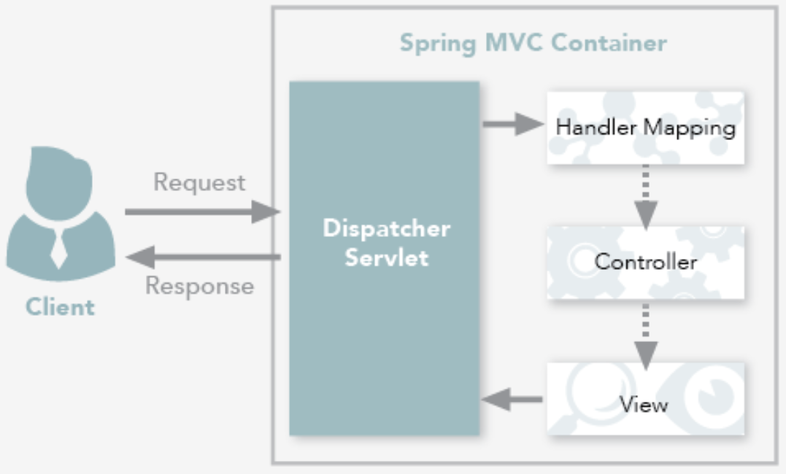
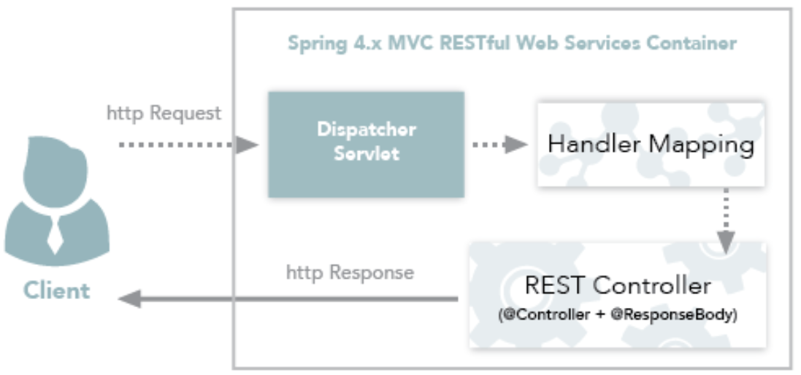
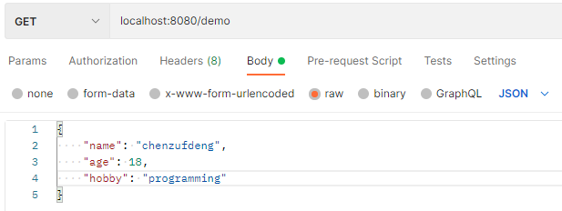
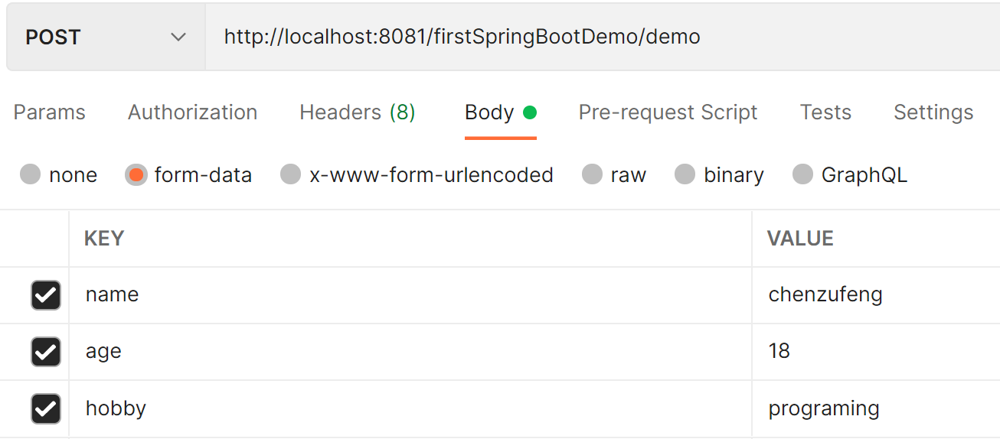

# @RestController 和 @Controller 区别

`@RestController = @Controller + @ResponseBody`

## 区别

- **@Controller 返回一个页面**：

当需要返回一个视图时，单独使用 `@Controller` 不加 `@ResponseBody`。这种情况属于比较传统的Spring MVC 的应用，对应于前后端不分离的情况：



- **@RestController 返回JSON 或 XML 形式数据**：

`@RestController`只返回对象，对象数据直接以 JSON 或 XML 形式写入 HTTP 响应（Response）中，这种情况属于 RESTful Web 服务，这也是目前日常开发所接触的最常用的情况（前后端分离）：



- **@Controller +@ResponseBody 返回 JSON 或 XML 形式数据**：

如果在Spring4之前开发 RESTful Web服务，需要使用`@Controller` 并结合`@ResponseBody`注解，也就是说`@Controller` +`@ResponseBody`= `@RestController`（Spring 4 之后新加的注解）。

`@ResponseBody` 注解的作用是将 `Controller` 的方法返回的对象，通过适当的转换器转换为指定的格式之后，写入到 HTTP 响应（Response）对象的 body 中，通常用来返回 JSON 或者 XML 数据，返回 JSON 数据的情况比较多。


## 示例

### @Controller 返回一个页面

当需要直接在后端返回一个页面的时候，Spring 推荐使用 Thymeleaf 模板引擎。Spring MVC中`@Controller`中的方法可以直接返回==模板名称==，接下来 Thymeleaf 模板引擎会自动进行渲染，模板中的表达式支持 Spring 表达式语言（Spring EL)。如果需要用到 Thymeleaf 模板引擎，注意添加依赖：

```xml
<dependency>
    <groupId>org.springframework.boot</groupId>
    <artifactId>spring-boot-starter-thymeleaf</artifactId>
</dependency>
```

`src/main/java/com/example/demo/controller/HelloController.java`

```java
@Controller
public class HelloController {
    @GetMapping("/hello")
    public String greeting(@RequestParam(name = "name", required = false, defaultValue = "World") String name, Model model) {
        model.addAttribute("name", name);
        return "hello";
    }
}
```

`src/main/resources/templates/hello.html`

Spring 默认会去 resources 目录下 templates 目录下找，所以建议把页面放在 resources/templates 目录下

```java
<!DOCTYPE HTML>
<html xmlns:th="http://www.thymeleaf.org">
    <head>
        <title>Getting Started: Serving Web Content</title>
        <meta http-equiv="Content-Type" content="text/html; charset=UTF-8"/>
    </head>
            
    <body>
        <p th:text="'Hello, ' + ${name} + '!'"/>
    </body>
</html>
```

访问：http://localhost:8999/hello?name=team-c ，你将看到下面的内容：

```markdown
Hello, team-c!
```


### @Controller + @ResponseBody 返回 JSON 格式数据

SpringBoot 默认集成了 jackson，对于此需求你不需要添加任何相关依赖。

`src/main/java/com/example/demo/controller/Person.java`

```java
public class Person {
    private String name;
    private Integer age;
    ......
    省略getter/setter ，有参和无参的construtor方法
}
```

`src/main/java/com/example/demo/controller/HelloController.java`

```java
@Controller
public class HelloController {
    @PostMapping("/hello")
    @ResponseBody
    public Person greeting(@RequestBody Person person) {
        return person;
    }
}
```

使用 post 请求访问 http://localhost:8080/hello ，body 中附带以下参数，后端会以 json 格式将 person 对象返回：

```json
{
    "name": "teamc",
    "age": 1
}
```

### @RestController 返回 JSON 格式数据

使用`@RestController`只需要将`HelloController`改为如下形式：

```java
@RestController
public class HelloController {
    @PostMapping("/hello")
    public Person greeting(@RequestBody Person person) {
        return person;
    }
}
```


## @RestController 源码

```java
package org.springframework.web.bind.annotation;

import java.lang.annotation.Documented;
import java.lang.annotation.ElementType;
import java.lang.annotation.Retention;
import java.lang.annotation.RetentionPolicy;
import java.lang.annotation.Target;
import org.springframework.stereotype.Controller;

@Target({ElementType.TYPE})
@Retention(RetentionPolicy.RUNTIME)
@Documented

@Controller
@ResponseBody
public @interface RestController {
    String value() default "";
}
```

可以看到，它被加上了 @Controller 和 @ResponseBody 注解。

```java
@Target({ElementType.TYPE})
@Retention(RetentionPolicy.RUNTIME)
@Documented
@Component
public @interface Controller {
    String value() default "";
}

@Target({ElementType.TYPE, ElementType.METHOD})
@Retention(RetentionPolicy.RUNTIME)
@Documented
public @interface ResponseBody {
}
```


# @RequestMapping 配置 url 映射

@RequestMapping 此注解既可以作用在控制器的==某个方法==上，也可以作用在此控制器==类==上。

- 当控制器在类级别上添加 @RequestMapping 注解时，这个注解会==应用到控制器的所有处理器方法==上。
- 处理器方法上的 @RequestMapping 注解会对类级别上的 @RequestMapping 的声明进行补充。

## @RequestMapping 仅作用在处理器方法上

```java
@RestController
public class HelloController {

    @RequestMapping(value="/hello", method= RequestMethod.GET)
    public String sayHello() {
        return "hello";
    }
}
```

sayHello 所响应的 url 为 `localhost:8080/hello`。

## @RequestMapping 仅作用在类级别上
```java
@RestController
@RequestMapping("/hello")
public class HelloController {

    @RequestMapping(method= RequestMethod.GET)
    public String sayHello() {
        return "hello";
    }
}
```

sayHello 所响应的 url 为 `localhost:8080/hello`。

## @RequestMapping 作用在类级别和处理器方法上

```java
@RestController
@RequestMapping("/hello")
public class HelloController {

    @RequestMapping(value="/sayHello", method= RequestMethod.GET)
    public String sayHello() {
        return "hello";
    }
    @RequestMapping(value="/sayHi", method= RequestMethod.GET)
    public String sayHi() {
        return "hi";
    }
}
```

sayHello 所响应的 url 为 `localhost:8080/hello/sayHello`；
sayHi 所响应的 url 为 `localhost:8080/hello/sayHi`。


# 接收参数注解

## 请求路径参数

### @PathVaribale 获取 url 中的数据

**`url/{id}`**

如果需要获取 url 为 `localhost:8080/hello/id` 中的 id 值（==路径中的参数==，即**`url/{id}`**这种形式），实现代码如下：
```java
@RestController
public class HelloController {

    @RequestMapping(value="/hello/{id}", method= RequestMethod.GET)
    public String sayHello(@PathVariable("id") Integer id) {
        return "id:" + id;
    }
}
```

如果需要需要获取 url 中==多个参数==：
```java
@RestController
public class HelloController {

    @RequestMapping(value="/hello/{id}/{name}", method= RequestMethod.GET)
    public String sayHello(@PathVariable("id") Integer id, @PathVariable("name") String name) {
        return "id: " + id + " name: " + name;
    }
}
```

### @RequestParam 获取请求参数的值

**`url?name=`**

获取 `localhost:8080/hello?id=98` 中 id 值（即`url?name=`这种形式）：

```java
@RestController
public class HelloController {

    @RequestMapping(value="/hello", method= RequestMethod.GET)
    public String sayHello(@RequestParam("id") Integer id) {
        return "id: " + id;
    }
}
```

如果 url 中没有 id 值：
```java
@RestController
public class HelloController {
    @RequestMapping(value="/hello", method= RequestMethod.GET)
    // required=false 表示 url 中可以不传入 id 参数，此时就使用默认参数
    public String sayHello(@RequestParam(value="id", required = false, defaultValue = "1") Integer id) {
        return "id: " + id;
    }
}
```

## Body参数

### @RequestBody接收单个实体对象

Postman设置：



对应的Java代码：

```java
@PostMapping(path = "/demo")
public void demo(@RequestBody Person person) {
    System.out.println(person.toString());
}
```


### 无注解（可接收多个实体对象）

Postman设置：



对应的Java代码：

```java
@PostMapping("/demo")
public void demo(Person person) {
    System.out.println(person.toString());
}
```


### @RequestBody接收多个实体对象

https://blog.csdn.net/hunt_er/article/details/109678025

一个方法只能写一个`@RequestBody`注解：SpringMVC中@RequestBody是读取的流的方式，在第一个参数取到后，把`request.getInputStream()`关闭，导致后面的@RequestBody的对象拿取不到，就会报错。

- 将前台传过来的json数据单独封装一个类来接收

```java
//前台传输的json对象
data:{name:'admin', pwd:'123', dept: {name:'dept'}}
 
//后台接收参数,UserVo为封装的对象
// user = {name = 'admin' , pwd = '123',dept = {name = 'dept'}}
public void test(@RequestBody UserVO user)
```


https://blog.csdn.net/weixin_28937805/article/details/113683071

- 创建一个类用于接收参数，该类需要有两个public属性的实体：

```java
Class TwoBeans {
    public Users users;
    public Mails mails;
}
```

`controller`：

```java
public void usersAndMailsSave(@RequestBody TwoBeans twoBeans) {
	service.usersAndMailsSave(twoBeans.Users, twoBeans.Mails)
}
```

前台json数据格式：

```json
{
    "Users": {
            "name": "梅老板",
            "telephone": "182352346288",
            "gender": "男",
            "age": "12",
            "address": "d园",
            "username": "messi"
    },

    "Mail": {
            "userId": "222",
            "mail": "aaa@126.com",
            "password": "123123"
    }
}
```


## @GetMapping 组合注解

@GetMapping 是 `@RequestMapping(method = RequestMethod.GET)` 的缩写。该注解将 HTTP Get 映射到特定的处理方法上。

即可以使用 `@GetMapping(value = “/hello”)` 来代替 `@RequestMapping(value=”/hello”, method= RequestMethod.GET)`：
```java
@RestController
public class HelloController {
    // @RequestMapping(value="/hello", method= RequestMethod.GET)
    @GetMapping(value = "/hello")
    // required=false 表示 url 中可以不穿入 id 参数，此时就使用默认参数
    public String sayHello(@RequestParam(value="id", required = false, defaultValue = "1") Integer id) {
        return "id: " + id;
    }
}
```

## @PostMapping

`@PostMapping`注释将 HTTP POST 请求映射到特定的处理程序方法。 它是一个组合的注释，用作`@RequestMapping(method = RequestMethod.POST)`的快捷方式。


## 在不给定注解的情况下，参数是怎样绑定的

通过分析AnnotationMethodHandlerAdapter和RequestMappingHandlerAdapter的源代码发现，方法的参数在不给定参数的情况下：

- 若要绑定的对象是==简单类型==：调用`@RequestParam`来处理。 
- 若要绑定的对象是==复杂类型==：调用`@ModelAttribute`来处理。

调用默认的@RequestParam来处理：

```java
@RequestMapping ({"/", "/home"})
public String showHomePage(String key) {
    logger.debug("key="+key);
    return "home";
}
```

调用@ModelAttribute来处理：

```java
@RequestMapping (method = RequestMethod.POST)
public String doRegister(User user) {
    if(logger.isDebugEnabled()) {
        logger.debug("process url[/user], method[post] in " + getClass());
        logger.debug(user);
    }
    return "user";
}
```


# 参考资料

[1] [@RestController vs @Controller](https://mp.weixin.qq.com/s/-LmYG1tg3rhTC7FRq4TKBg)

[2] [@ResponseBody注解](https://mp.weixin.qq.com/s/n0l2RmfyywuHIK6LPBJAuA)

[3] [SpringBoot 中常用注解@Controller/@RestController/@RequestMapping介绍](https://blog.csdn.net/u010412719/article/details/69710480)

[4] [SpringBoot 中常用注解@PathVaribale/@RequestParam/@GetMapping介绍](https://blog.csdn.net/u010412719/article/details/69788227)

[5] [SpringBoot使用@RequestBody接收多个对象的解决办法](https://blog.csdn.net/hunt_er/article/details/109678025)

[6] [SpringBoot（或SpringMVC）的各种参数绑定方式总结](https://blog.csdn.net/aliyacl/article/details/85089035)

[7] [@RequestParam @RequestBody @PathVariable 等参数绑定注解详解](https://blog.csdn.net/walkerjong/article/details/7946109/)

