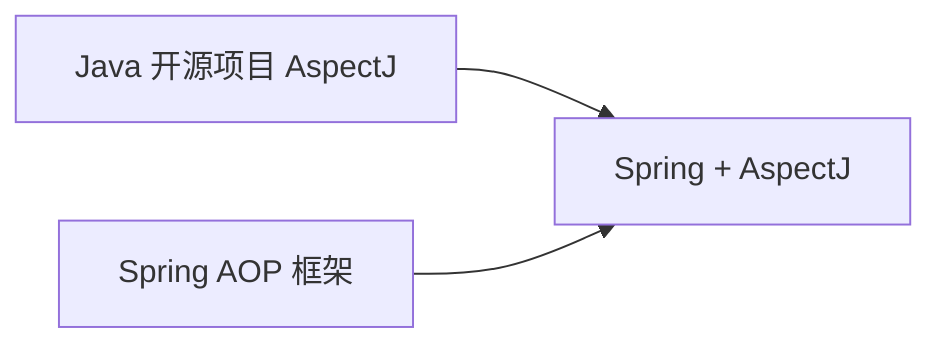

# AOP 概述



## 代理模式

接口：

```java
public interface Greeting {
    void sayHello();
}
```

实现类：

```java
public class GreetingImpl implements Greeting {
    @Override
    public void sayHello() {
        before();
        System.out.println("Hello");
        after();
    }
    
    public void before() {
        System.out.println("Before");
    }
    
    public void after() {
        System.out.println("After");
    }
}
```

代码问题：

before() 与 after() 方法写死在 sayHello() 方法体中了，如果要统计每个方法的执行时间，以对性能作出评估，则需要在每个方法的一头一尾添加代码。

### 静态代理

在程序运行前就已经存在代理类的字节码文件，代理类和原始类的关系在运行前就已经确定。

静态代理特点：
① 目标对象必须要实现接口；
② 代理对象，要实现与目标对象一样的接口。

实现类中实现主要逻辑（目标对象）：

```java
public class GreetingImpl implements Greeting {
    @Override
    public void sayHello() {
        System.out.println("Hello");
    }
}
```

使用静态代理模式：

```java
public class GreetingProxy implements Greeting {
    private GreetingImpl greeting;
    
    public GreetingProxy(GreetingImpl greeting) {
        this.greeting = greeting;
    }
    
    @Override
    public void sayHello() {
        before();
        greeting.sayHello();
        after();
    }

    public void before() {
        System.out.println("Before");
    }

    public void after() {
        System.out.println("After");
    }
}
```

客户端调用：

```java
public class Client {
    public static void main(String[] args) {
        GreetingProxy greetingProxy = new GreetingProxy(new GreetingImpl());
        greetingProxy.sayHello();
    }
}
```

问题：

静态代理保证了业务类只需要关注逻辑本身，代理对象的一个接口只需要服务于一种类型的对象。==如果要代理的方法很多，势必要为每一种方法都进行代理==。再者，==如果增加一个方法，除了实现类需要实现这个方法外，所有的代理类也要实现此方法，增加了代码的维护成本==。那么要如何解决呢？答案是使用==动态代理==。


### JDK 动态代理

```java
public class JDKDynamicProxy implements InvocationHandler {
    private final Object target;

    public JDKDynamicProxy(Object target) {
        this.target = target;
    }

    @SuppressWarnings("unchecked")
    public <T> T getProxy() {
        return (T) Proxy.newProxyInstance(
                target.getClass().getClassLoader(),
                target.getClass().getInterfaces(),
                this
        );
    }

    @Override
    public Object invoke(Object proxy, Method method, Object[] args) throws Throwable {
        before();
        Object result = method.invoke(target, args);
        after();
        return result;
    }

    public void before() {
        System.out.println("Before");
    }

    public void after() {
        System.out.println("After");
    }
}
```

客户端调用：

```java
public class Client {
    public static void main(String[] args) {
        Greeting proxy = new JDKDynamicProxy(new GreetingImpl()).getProxy();
        proxy.sayHello();
    }
}
```

这样==所有的代理类都合并到动态代理类中了==，但这样做仍然存在一个问题：==JDK 提供的动态代理只能代理接口，而不能代理没有接口的类==。

有什么方法可以解决呢？

### CGLib 动态代理

使用开源的 CGLib 类库可以==代理没有接口的类==，这样就弥补了 JDK 的不足。

引入依赖：

```xml
<dependencies>
    <!-- https://mvnrepository.com/artifact/cglib/cglib -->
    <dependency>
        <groupId>cglib</groupId>
        <artifactId>cglib</artifactId>
        <version>3.3.0</version>
    </dependency>
</dependencies>
```


代理对象：

```java
public class GreetingImpl {
    public void sayHello() {
        System.out.println("Hello");
    }
}
```


代理类：

```java
public class CGLibDynamicProxy implements MethodInterceptor {
    private CGLibDynamicProxy() {}

    public static CGLibDynamicProxy getInstance() {
        return new CGLibDynamicProxy();
    }

    @SuppressWarnings("unchecked")
    public <T> T getProxy(Class<T> cls) {
        return (T) Enhancer.create(cls, this);
    }

    @Override
    public Object intercept(Object o, Method method, Object[] objects, MethodProxy methodProxy) throws Throwable {
        before();
        Object result = methodProxy.invokeSuper(o, objects);
        after();
        return result;
    }

    public void before() {
        System.out.println("Before");
    }

    public void after() {
        System.out.println("After");
    }
}
```

客户端调用：

```java
public class Client {
    public static void main(String[] args) {
        GreetingImpl greeting = CGLibDynamicProxy.getInstance().getProxy(GreetingImpl.class);
        greeting.sayHello();
    }
}
```

## Spring AOP

上面例子中提到的 before() 方法，在 Spring AOP 里就叫 Before Advice（==前置增强==，没有通知的含义），是对原有代码功能的一种“增强”。像 after() 这样的方法就叫 **After Advice（后置增强）**，因为它放在后面来增强代码的功能。如果能把 before() 与 after() 合并在一起，那就叫 **Around Advice（环绕增强）**。

### 引入依赖

```xml
<parent>
    <artifactId>spring-boot-starter-parent</artifactId>
    <groupId>org.springframework.boot</groupId>
    <version>2.3.7.RELEASE</version>
</parent>

<dependencies>
    <dependency>
        <groupId>org.springframework.boot</groupId>
        <artifactId>spring-boot-starter-aop</artifactId>
    </dependency>
</dependencies>
```


### 定义前后置增强类

```java
public class GreetingBeforeAndAfterAdvice implements MethodBeforeAdvice, AfterReturningAdvice {
    @Override
    public void afterReturning(Object o, Method method, Object[] objects, Object o1) throws Throwable {
        System.out.println("After");
    }

    @Override
    public void before(Method method, Object[] objects, Object o) throws Throwable {
        System.out.println("Before");
    }
}
```

### 目标对象

```java
public class Greeting {
    public void sayHello() {
        System.out.println("Hello");
    }
}
```


### 客户端

```java
public class Client {
    public static void main(String[] args) {
        // 创建代理工厂
        ProxyFactory proxyFactory = new ProxyFactory();
        // 设置目标类对象
        proxyFactory.setTarget(new Greeting());
        // 添加增强类
        proxyFactory.addAdvice(new GreetingBeforeAndAfterAdvice());
        // 从代理工厂中获取代理
        Greeting proxy = (Greeting) proxyFactory.getProxy();
        // 调用代理方法
        proxy.sayHello();
    }
}
```

### 环绕增强

“环绕增强”可以把“前置增强”与“后置增强”的功能给合并起来，无需同时实现以上两个接口：

```java
import org.aopalliance.intercept.MethodInterceptor;
import org.aopalliance.intercept.MethodInvocation;

public class GreetingAroundAdvice implements MethodInterceptor {
    @Override
    public Object invoke(MethodInvocation methodInvocation) throws Throwable {
        before();
        Object proceed = methodInvocation.proceed();
        after();
        return proceed;
    }

    private void before() {
        System.out.println("Before");
    }

    private void after() {
        System.out.println("After");
    }
}
```

环绕增强类需要实现 `org.aopalliance.intercept.MethodInterceptor` 接口。注意，这个接口不是 Spring 提供的，它是 AOP 联盟提供的，Spring 只是借用了它。

### 抛出增强

程序报错，抛出异常了，一般的做法是打印到控制台或日志文件中，这样很多地方都得去处理，有没有一个一劳永逸的方法呢？那就是 **Throws Advice（抛出增强）**。

```java
public class Greeting {
    public void sayHello(String name) {
        System.out.println("Hello!");
        // 故意抛出一个异常，看看异常信息能否被拦截到
        throw new RuntimeException("Error"); 
    }
}
```

抛出增强类：

```java
public class GreetingThrowAdvice implements ThrowsAdvice {
    public void afterThrowing(Method method, Object[] args, Object target, Exception e) {
        System.out.println("Target Class: " + target.getClass().getName());
        System.out.println("Method Name: " + method.getName());
        System.out.println("Exception Message: " + e.getMessage());
    }
}
```

抛出增强类需要实现` org.springframework.aop.ThrowsAdvice` 接口，在接口方法中可获取方法、参数、目标对象、异常对象等信息。我们可以把这些信息统一写入到日志中，当然也可以持久化到数据库中。

输出：

```markdown
Hello
Target Class: com.example.Greeting
Method Name: sayHello
Exception Message: Error
```


### 引入增强

以上提到的都是对方法的增强，那能否对类进行增强呢？

对方法的增强叫做 Weaving（织入），而对类的增强叫做 Introduction（引入）。而 Introduction Advice（引入增强）就是对类的功能增强。

定义接口：

```java
public interface Apology {
    void saySorry();
}
```

不想在代码中让 GreetingImpl 直接去实现这个接口，而是在程序运行的时候动态地实现它：

```java
import org.aopalliance.intercept.MethodInvocation;
import org.springframework.aop.support.DelegatingIntroductionInterceptor;

public class GreetingIntroAdvice extends DelegatingIntroductionInterceptor implements Apology {
    @Override
    public Object invoke(MethodInvocation mi) throws Throwable {
        return super.invoke(mi);
    }

    @Override
    public void saySorry() {
        System.out.println("Sorry!");
    }
}
```

以上定义了一个引入增强类，扩展了 `org.springframework.aop.support.DelegatingIntroductionInterceptor` 类，同时也实现了新定义的 Apology 接口。

在类中首先覆盖了父类的 invoke() 方法，然后实现了 Apology 接口的方法。由于是想用这个增强类去丰富 Greeting 类的功能，那么这个 Greeting 类无需直接实现 Apology 接口，就可以在程序运行的时候调用 Apology 接口的方法了。

客户端：

```java
public class Client {
    public static void main(String[] args) {
        // 创建代理工厂
        ProxyFactory proxyFactory = new ProxyFactory();
        // 设置目标类对象
        proxyFactory.setTarget(new Greeting());
        // 添加增强类
        proxyFactory.addAdvice(new GreetingIntroAdvice());
        // 从代理工厂中获取代理
        Apology apology = (Apology) proxyFactory.getProxy();
        // 调用代理方法
        apology.saySorry();
    }
}
```

通过代理工厂获取代理之后强制转换成 Apology 接口，调用其方法即可实现增强。


# 参考资料

[mermaid 语法](https://www.cnblogs.com/dao0/p/4489837.html)

[AOP理解及底层原理 - 简书 (jianshu.com)](https://www.jianshu.com/p/0ce892b5ae5e)：AOP理解

[详细解读 Spring AOP 面向切面编程（一） - 掘金 (juejin.cn)](https://juejin.cn/post/6844903976643592205)：代码

[编程式实现Spring AOP 引入（Introduction）和切面（Advisor）_RonTech的博客-CSDN博客](https://blog.csdn.net/zyhlwzy/article/details/70314157)

[深度剖析Spring AOP底层原理源码 - 掘金 (juejin.cn)](https://juejin.cn/post/6965732777962668062)

[【小家Spring】探索Spring AOP中aopalliance的Joinpoint、MethodInvocation、Interceptor、MethodInterceptor... - 云+社区 - 腾讯云 (tencent.com)](https://cloud.tencent.com/developer/article/1497753)

[太好了！总算有人把动态代理、CGlib、AOP都说清楚了！ - 云+社区 - 腾讯云 (tencent.com)](https://cloud.tencent.com/developer/article/1461796)


[8a963cee837e4000b256ca451b96112c~tplv-k3u1fbpfcp-zoom-in-crop-mark:1304:0:0:0.awebp (1304×3262) (byteimg.com)](https://p9-juejin.byteimg.com/tos-cn-i-k3u1fbpfcp/8a963cee837e4000b256ca451b96112c~tplv-k3u1fbpfcp-zoom-in-crop-mark:1304:0:0:0.awebp)


