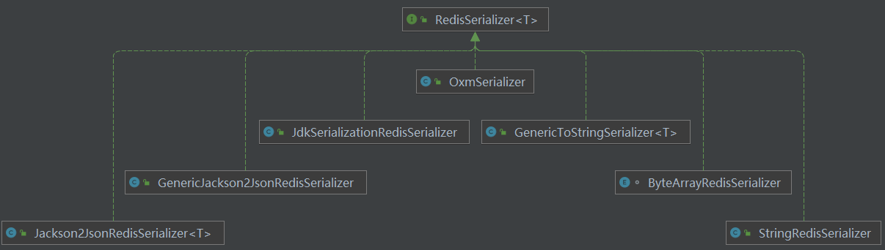

# SpringBoot 整合 Redis[^1]

Spring Data Redis对Redis底层开发包（Jedis、Lettuce、JRedis、RJC）进行了高度封装，其中`lettuce`是Redis连接池未来的发展趋势，2.x开始已经**推荐使用**`lettuce`作为访问`redis`的client客户端。RedisTemplate封装提供了Redis各种操作、异常处理及序列化，完全屏蔽里底层实现（使用者面向Spring Data编程即可，可完全不用关心底层到底使用的是Jedis or Lettuce）[^7]。

## 依赖

```xml
<dependency>
    <groupId>org.springframework.boot</groupId>
    <artifactId>spring-boot-starter-data-redis</artifactId>
</dependency>
```

完整依赖：

```xml
<?xml version="1.0" encoding="UTF-8"?>
<project xmlns="http://maven.apache.org/POM/4.0.0"
         xmlns:xsi="http://www.w3.org/2001/XMLSchema-instance"
         xsi:schemaLocation="http://maven.apache.org/POM/4.0.0 http://maven.apache.org/xsd/maven-4.0.0.xsd">
    <modelVersion>4.0.0</modelVersion>

    <groupId>org.example</groupId>
    <artifactId>SpringBootRedis</artifactId>
    <version>1.0-SNAPSHOT</version>

    <properties>
        <maven.compiler.source>8</maven.compiler.source>
        <maven.compiler.target>8</maven.compiler.target>
    </properties>

    <parent>
        <artifactId>spring-boot-starter-parent</artifactId>
        <groupId>org.springframework.boot</groupId>
        <version>2.6.4</version>
    </parent>

    <dependencies>
        <dependency>
            <groupId>org.springframework.boot</groupId>
            <artifactId>spring-boot-starter-data-redis</artifactId>
        </dependency>

        <dependency>
            <groupId>org.springframework.boot</groupId>
            <artifactId>spring-boot-starter-test</artifactId>
        </dependency>

        <!--Jackson-->
        <dependency>
            <groupId>com.fasterxml.jackson.core</groupId>
            <artifactId>jackson-databind</artifactId>
        </dependency>
    </dependencies>

</project>
```

### RedisAutoConfiguration[^6]

在SpringBoot中，已经自动帮我们在容器中生成了一个RedisTemplate和一个StringRedisTemplate。

引入依赖后，可以查看 RedisAutoConfiguration 自动配置类：

```java
package org.springframework.boot.autoconfigure.data.redis;

@Configuration(
    proxyBeanMethods = false
)
@ConditionalOnClass({RedisOperations.class})
@EnableConfigurationProperties({RedisProperties.class})
@Import({LettuceConnectionConfiguration.class, JedisConnectionConfiguration.class})
public class RedisAutoConfiguration {
    public RedisAutoConfiguration() {
    }

    @Bean
    @ConditionalOnMissingBean(
        name = {"redisTemplate"}
    )
    @ConditionalOnSingleCandidate(RedisConnectionFactory.class)
    public RedisTemplate<Object, Object> redisTemplate(RedisConnectionFactory redisConnectionFactory) {
        RedisTemplate<Object, Object> template = new RedisTemplate();
        template.setConnectionFactory(redisConnectionFactory);
        return template;
    }

    @Bean
    @ConditionalOnMissingBean
    @ConditionalOnSingleCandidate(RedisConnectionFactory.class)
    public StringRedisTemplate stringRedisTemplate(RedisConnectionFactory redisConnectionFactory) {
        return new StringRedisTemplate(redisConnectionFactory);
    }
}
```

从上面的源码中可以看出，开发时会存在2个问题：

- RdisTemplate 的泛型是`<Object,Object>`，我们在进行缓存时写代码不是很方便，因为一般我们的key是String类型，所以我们需要一个`<String,Object>`的泛型。

- RedisTemplate 没有设置数据存储在Redis时，Key和Value的序列化方式（采用默认的JDK序列化方式）。

可以考虑采用下面的思路来解决上述两个问题：

结合@ConditionalOnMissing注解，检查Spring容器中是否已经定义了id为redisTemplate的Bean，
否则自动装配的RedisTemplate不会实例化。

因此我们可以写一个配置类，配置Redisemplate对象，若未自定义RedisTemplate，默认会对key进行jdk序列化。


## 自定义 RedisTemplate

默认情况下的模板只能支持 `RedisTemplate<String,String>`，只能存入字符串，很多时候，我们需要自定义 RedisTemplate ，==设置序列化器==，这样我们可以很方便的操作实例对象[^3]。

RedisTemplate 默认的序列化方式为 JdkSerializationRedisSerializer，会把对象序列化存储到Redis中（二进制形式），StringRedisTemplate 的默认序列化方式为 StringRedisSerializer。

绝大多数情况下，不推荐使用 JdkSerializationRedisSerializer 进行序列化，主要是不方便人工排查数据。所以我们需要切换序列化方式。

Spring Data底层为我们实现了七种不同的序列化方式：



对同一个数据进行序列化时，序列化操作前后的结果如下表所示[^6]：

| 数据结构  | 序列化类                        | 序列化前   | 序列化后查看 |
| --------- | ------------------------------- | ---------- | ------------ |
| key/value | StringRedisSerializer           | test_value | test_value   |
| key/value | Jackson2JsonRedisSerializer     | test_value | “test_value” |
| key/value | JdkSerializationRedisSerializer | test_value | 乱码         |

以Jackson2JsonRedisSerializer为例，展示如何切换序列化方式：

```java
package com.example.config;

import org.springframework.context.annotation.Bean;
import org.springframework.context.annotation.Configuration;
import org.springframework.data.redis.connection.RedisConnectionFactory;
import org.springframework.data.redis.core.RedisTemplate;
import org.springframework.data.redis.core.StringRedisTemplate;
import org.springframework.data.redis.serializer.Jackson2JsonRedisSerializer;

/**
 * @author chenzufeng
 * @date 2022/3/31
 */
@Configuration
public class RedisConfig {

    /**
     * 默认是JDK的序列化策略，这里配置redisTemplate采用的是Jackson2JsonRedisSerializer的序列化策略
     * @param redisConnectionFactory 连接工厂
     * @return redisTemplate
     */
    @Bean
    public RedisTemplate<String, Object> redisTemplate(RedisConnectionFactory redisConnectionFactory) {
        // 使用Jackson2JsonRedisSerializer来序列化和反序列化redis的value值（默认使用JDK的序列化方式）
        Jackson2JsonRedisSerializer<Object> jackson2JsonRedisSerializer = new Jackson2JsonRedisSerializer<>(Object.class);

        RedisTemplate<String, Object> redisTemplate = new RedisTemplate<>();

        // 配置连接工厂
        redisTemplate.setConnectionFactory(redisConnectionFactory);
        // 使用StringRedisSerializer来序列化和反序列化redis的key值
        redisTemplate.setKeySerializer(jackson2JsonRedisSerializer);
        // 值采用json序列化
        redisTemplate.setValueSerializer(jackson2JsonRedisSerializer);
        redisTemplate.setHashKeySerializer(jackson2JsonRedisSerializer);
        redisTemplate.setHashValueSerializer(jackson2JsonRedisSerializer);
        redisTemplate.afterPropertiesSet();

        return redisTemplate;
    }

    /**
     * StringRedisTemplate默认采用的是String的序列化策略
     * @param redisConnectionFactory 连接工厂
     * @return stringRedisTemplate
     */
    @Bean
    public StringRedisTemplate stringRedisTemplate(RedisConnectionFactory redisConnectionFactory) {
        StringRedisTemplate stringRedisTemplate = new StringRedisTemplate();
        stringRedisTemplate.setConnectionFactory(redisConnectionFactory);
        return stringRedisTemplate;
    }
}
```

注：连接池配置可参考[使用Lettuce作为Client操作Redis示例]()[^7]实现：

```java
//@EnableCaching
@Configuration
public class CacheConfig extends CachingConfigurerSupport {

    @Bean
    public RedisConnectionFactory redisConnectionFactory() {
        // RedisStandaloneConfiguration这个配置类是Spring Data Redis2.0后才有
        RedisStandaloneConfiguration configuration = new RedisStandaloneConfiguration();
        // 2.0后的写法
        configuration.setHostName("10.102.132.150");
        configuration.setPort(6379);
        configuration.setDatabase(0);

        LettuceConnectionFactory factory = new LettuceConnectionFactory(configuration);
        return factory;
    }

    @Bean
    public RedisTemplate<String, String> stringRedisTemplate() {
        RedisTemplate<String, String> redisTemplate = new StringRedisTemplate();
        redisTemplate.setConnectionFactory(redisConnectionFactory());
        return redisTemplate;
    }
}
```


## 配置与启动类

### 添加配置

```properties
spring.application.name=springboot-redis

# Redis
## 服务器地址
spring.redis.host=localhost
## 服务器连接端口
spring.redis.port=6379
## 数据库索引（默认为0）
spring.redis.database=0
spring.redis.client-type=lettuce
```

### 启动类

```java
package com.example;

import org.springframework.boot.SpringApplication;
import org.springframework.boot.autoconfigure.SpringBootApplication;

/**
 * @author chenzufeng
 * @date 2022/3/31
 */
@SpringBootApplication
public class RedisApplication {
    public static void main(String[] args) {
        SpringApplication.run(RedisApplication.class, args);
    }
}
```

## 测试类

```java
package com.example;

import org.junit.jupiter.api.Test;
import org.springframework.beans.factory.annotation.Autowired;
import org.springframework.boot.test.context.SpringBootTest;
import org.springframework.data.redis.core.RedisTemplate;
import org.springframework.data.redis.core.StringRedisTemplate;
import org.springframework.data.redis.core.ValueOperations;

/**
 * @author chenzufeng
 * @date 2022/3/31
 */
@SpringBootTest
public class RedisApplicationTest {
    @Autowired
    private RedisTemplate<String, Object> redisTemplate;

    @Autowired
    private StringRedisTemplate stringRedisTemplate;

    @Test
    void testRedis() {
        ValueOperations<String, Object> stringObjectValueOperations = redisTemplate.opsForValue();
        stringObjectValueOperations.set("Hello", "Redis");

        System.out.println(stringObjectValueOperations.get("Hello"));
    }

    @Test
    void testString() {
        stringRedisTemplate.opsForValue().set("StringKey", "Redis");
        System.out.println(stringRedisTemplate.opsForValue().get("StringKey"));
    }
}
```


# SpringCache 整合 Redis[^3]

## 实现步骤

### config

```java
package com.example.config;

import java.time.Duration;

/**
 * 缓存管理器：基于Lettuce操作redis的客户端
 * @date 2022/3/31
 */
@Configuration
@AutoConfigureAfter(RedisAutoConfiguration.class)
@EnableCaching
public class LettuceRedisConfig {
    /**
     * 缓存管理器
     * @param redisConnectionFactory redisConnectionFactory
     * @return cacheManager
     */
    @Bean
    @ConditionalOnSingleCandidate(RedisConnectionFactory.class)
    public CacheManager cacheManager(RedisConnectionFactory redisConnectionFactory) {
        RedisCacheConfiguration cacheConfiguration = RedisCacheConfiguration.defaultCacheConfig();
        RedisCacheConfiguration redisCacheConfiguration = cacheConfiguration
                // 设置缓存管理器管理的缓存的默认过期时间(1小时)
                .entryTtl(Duration.ofHours(1))
                // 设置key为String序列化
                .serializeKeysWith(RedisSerializationContext.SerializationPair.fromSerializer(new StringRedisSerializer()))
                // 设置value为json序列化
                .serializeValuesWith(RedisSerializationContext.SerializationPair.fromSerializer(new GenericJackson2JsonRedisSerializer()))
                // 不缓存空值
                .disableCachingNullValues();
        // 构造一个Redis缓存管理器
        return RedisCacheManager.builder(redisConnectionFactory)
                // 缓存配置
                .cacheDefaults(redisCacheConfiguration)
                .build();
    }

    /**
     * 自定义序列化模板
     * @param lettuceConnectionFactory lettuceConnectionFactory
     * @return redisTemplate
     */
    @Bean
    @ConditionalOnSingleCandidate(LettuceConnectionFactory.class)
    public RedisTemplate<String, String> redisTemplate(LettuceConnectionFactory lettuceConnectionFactory) {
        // 创建一个模板类
        RedisTemplate<String, String> redisTemplate = new RedisTemplate<>();
        // 设置value的序列化规则和key的序列化规则
        redisTemplate.setKeySerializer(new StringRedisSerializer());
        redisTemplate.setValueSerializer(new GenericJackson2JsonRedisSerializer());
        // redis连接工厂，储存到模板类中
        redisTemplate.setConnectionFactory(lettuceConnectionFactory);
        return redisTemplate;
    }
}
```

### 依赖

```xml
<?xml version="1.0" encoding="UTF-8"?>
<project xmlns="http://maven.apache.org/POM/4.0.0"
         xmlns:xsi="http://www.w3.org/2001/XMLSchema-instance"
         xsi:schemaLocation="http://maven.apache.org/POM/4.0.0 http://maven.apache.org/xsd/maven-4.0.0.xsd">
    <modelVersion>4.0.0</modelVersion>

    <groupId>org.example</groupId>
    <artifactId>SpringCacheRedis</artifactId>
    <version>1.0-SNAPSHOT</version>

    <parent>
        <artifactId>spring-boot-starter-parent</artifactId>
        <groupId>org.springframework.boot</groupId>
        <version>2.3.7.RELEASE</version>
    </parent>

    <dependencies>
        <dependency>
            <groupId>org.springframework.boot</groupId>
            <artifactId>spring-boot-starter-web</artifactId>
        </dependency>

        <dependency>
            <groupId>org.springframework.boot</groupId>
            <artifactId>spring-boot-starter-cache</artifactId>
        </dependency>

        <dependency>
            <groupId>org.springframework.boot</groupId>
            <artifactId>spring-boot-starter-data-redis</artifactId>
        </dependency>

        <dependency>
            <groupId>org.springframework.boot</groupId>
            <artifactId>spring-boot-starter-test</artifactId>
        </dependency>

        <!-- https://mvnrepository.com/artifact/io.swagger.core.v3/swagger-models -->
        <dependency>
            <groupId>io.springfox</groupId>
            <artifactId>springfox-swagger2</artifactId>
            <version>2.9.2</version>
        </dependency>
        <!-- https://mvnrepository.com/artifact/io.springfox/springfox-swagger-ui -->
        <dependency>
            <groupId>io.springfox</groupId>
            <artifactId>springfox-swagger-ui</artifactId>
            <version>2.9.2</version>
        </dependency>
        <!-- https://mvnrepository.com/artifact/com.github.xiaoymin/knife4j-spring-boot-starter -->
        <dependency>
            <groupId>com.github.xiaoymin</groupId>
            <artifactId>knife4j-spring-boot-starter</artifactId>
            <version>2.0.9</version>
        </dependency>
    </dependencies>

</project>
```

### controller

```java
package com.example.controller;

import com.example.service.UserService;
import io.swagger.annotations.Api;
import io.swagger.annotations.ApiOperation;
import org.springframework.beans.factory.annotation.Autowired;
import org.springframework.web.bind.annotation.GetMapping;
import org.springframework.web.bind.annotation.RestController;

/**
 * @date 2022/3/31
 */
@RestController
@Api(tags = "SpringCacheRedis")
public class UserController {
    @Autowired
    private UserService userService;

    @ApiOperation("add")
    @GetMapping("/addUserInfo")
    public void addUserInfo(String id) {
        System.out.println(userService.addUserInfo(id));
    }

    @ApiOperation("get")
    @GetMapping("/getUserInfo")
    public void getUserInfo(String id) {
        System.out.println(userService.getUserInfo(id));
    }
}
```

### service

```java
package com.example.service;

import org.springframework.cache.annotation.CachePut;
import org.springframework.cache.annotation.Cacheable;
import org.springframework.stereotype.Service;

/**
 * @date 2022/3/31
 */
@Service
public class UserService {

    @CachePut(key = "#id", value = "userInfo")
    public String addUserInfo(String id) {
        System.out.println("addUserInfo没有走缓存");
        return "addUserInfo";
    }

    @Cacheable(key = "#id", value = "userInfo")
    public String getUserInfo(String id) {
        System.out.println("getUserInfo没有走缓存");
        return "getUserInfo";
    }
}
```

## 请求步骤[^5]

请求进来，在方法上面扫描@Cacheable注解，那么会触发`org.springframework.cache.interceptor.CacheInterceptor`缓存的拦截器。

然后会调用CacheManager的getCache方法，获取Cache，如果没有（第一次访问）就新建一Cache并返回。

根据获取到的Cache去调用get方法获取缓存中的值。RedisCache这里有个bug，源码是先判断key是否存在，再去缓存获取值，在高并发下有bug。

## RedisCacheManager[^7]

```java

```


# 参考资料

[^1]: [SpringBoot整合Redis，一篇解决缓存的所有问题_程序猿小亮的博客-CSDN博客](https://xiaoliang.blog.csdn.net/article/details/118677483)
[^2]: [SpringBoot整合Spring Cache，简化分布式缓存开发](https://blog.csdn.net/jiuqiyuliang/article/details/118794044)
[^3]:[SpringBoot学习(七):集成Redis并结合Spring Cache使用 | 猿码记 (liuqh.icu)](http://liuqh.icu/2020/09/17/springboot-7-redis/)
[^4]:[使用 Spring Cache + Redis 作为缓存 - 简书 (jianshu.com)](https://www.jianshu.com/p/931484bb3fdc)
[^5]:[Spring Boot缓存实战 Redis 设置有效时间和自动刷新缓存，时间支持在配置文件中配置](https://www.jianshu.com/p/275cb42080d9)
[^6]:[SpringBoot2.x系列教程之中利用Redis实现缓存功能详细教程](https://blog.csdn.net/GUDUzhongliang/article/details/122053095)
[^7]:[玩转Spring Cache --- 整合分布式缓存Redis Cache（使用Lettuce、使用Spring Data Redis）](https://fangshixiang.blog.csdn.net/article/details/95047822)(重要)

[SpringBoot实现Redis缓存（SpringCache+Redis的整合）](https://blog.csdn.net/user2025/article/details/106595257)

