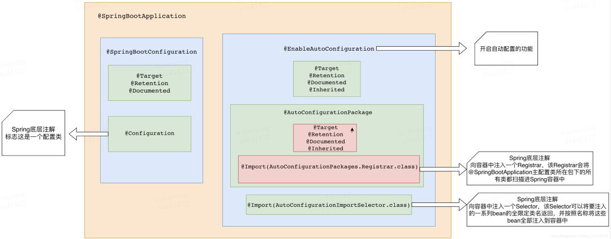
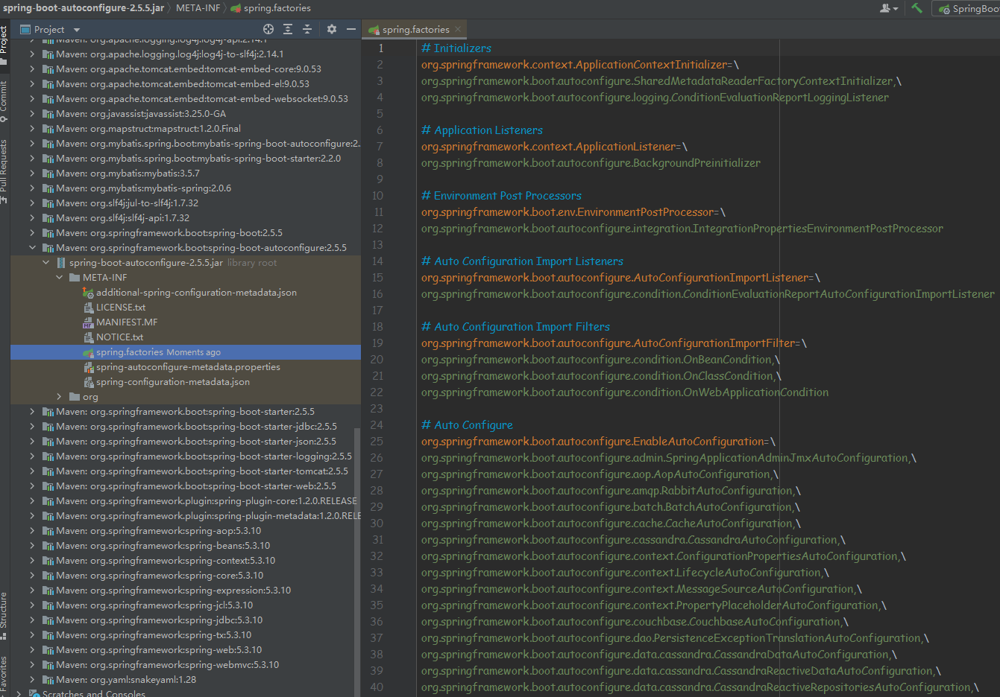
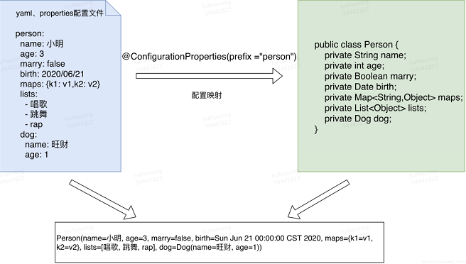
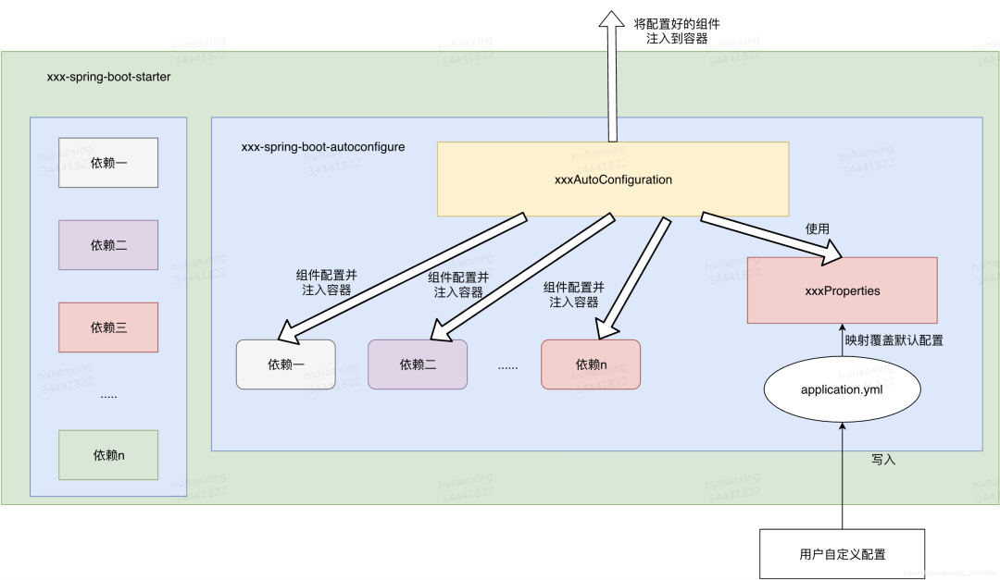

# SpringBoot 的 starter 简介

在SpringBoot出现之前，如果想使用 SpringMVC 来构建 web 项目，必须要做的几件事情如下：

- 首先项目中需要引入 SpringMVC 的依赖

- 在 web.xml 中注册 SpringMVC 的 DispatcherServlet，并配置 url 映射

- 编写 springmcv-servlet.xml，在其中配置 SpringMVC 中几个重要的组件，处理映射器（HandlerMapping）、处理适配器（HandlerAdapter）、视图解析器（ViewResolver）

- 在 applicationcontext.xml 文件中引入 springmvc-servlet.xml 文件

- …

以上这几步只是配置好了 SpringMVC，如果我们还需要与数据库进行交互，就要在 application.xml 中配置数据库连接池 DataSource；如果需要数据库事务，还需要配置 TransactionManager……

这就是使用 Spring 框架开发项目带来的一些的问题：

- ==依赖导入==问题： 每个项目都需要来单独维护自己所依赖的 jar 包，在项目中使用到什么功能就需要引入什么样的依赖。手动导入依赖容易出错，且无法统一集中管理。

- ==配置繁琐==：在引入依赖之后需要做繁杂的配置，并且这些配置是每个项目来说都是必要的，例如 web.xml 配置（Listener 配置、Filter 配置、Servlet 配置）、log4j 配置、数据库连接池配置等等。这些配置重复且繁杂，在不同的项目中需要进行多次重复开发，这在很大程度上降低了我们的开发效率

而在 SpringBoot 出现之后，它为我们提供了一个强大的功能来解决上述的两个痛点，这就是 SpringBoot 的 starters（==场景启动器==）。

Spring Boot 通过将常用的功能场景抽取出来，做成的一系列场景启动器，这些启动器导入实现各个功能所需要依赖的全部组件，我们<font color=red>只需要在项目中引入这些 starters，相关场景的所有依赖就会全部被导入进来</font>，并且我们可以抛弃繁杂的配置，仅需要通过配置文件来进行少量的配置就可以使用相应的功能。

# SpringBoot 场景启动器的原理

在导入 starter 之后，SpringBoot 主要帮我们完成了两件事情：

- 相关组件的自动导入
- 相关组件的自动配置

这两件事情统一称为 ==SpringBoot 的自动配置==。

## 自动配置原理

### 自动配置类的获取与注入

从主程序入口来探索一下整个过程的原理：

```java
@SpringBootApplication // 标注这个类是一个SpringBoot的应用
public class CommunityApplication {
    public static void main(String[] args) {
        // 将SpringBoot应用启动
        SpringApplication.run(CommunityApplication.class, args);
    }
}
```

`@SpringBootApplication`注解内部结构如下图所示：

```java
@Target({ElementType.TYPE})
@Retention(RetentionPolicy.RUNTIME)
@Documented
@Inherited
@SpringBootConfiguration
@EnableAutoConfiguration
@ComponentScan(
    excludeFilters = {@Filter(
    type = FilterType.CUSTOM,
    classes = {TypeExcludeFilter.class}
), @Filter(
    type = FilterType.CUSTOM,
    classes = {AutoConfigurationExcludeFilter.class}
)}
)
public @interface SpringBootApplication {
    ......
}
```




`AutoConfigurationImportSelector` ：重点看该类中重写的`selectImports`方法，看下它返回的==字符串数组==是如何得来的：


可以去到上边提到的`spring.factories`文件中去看一下，找到spring官方提供的`spring-boot-autoconfigure`包，在其下去找一下该文件：



可以看到这个就是SpringBoot官方为我们提供的<font color=red>所有自动配置类的候选列表</font>。我们可以在其中找到一个我们比较熟悉的自动配置类去看一下它内部的实现：

`WebMvcAutoConfiguration`

```java
@Configuration(
    proxyBeanMethods = false
)
@ConditionalOnWebApplication(
    type = Type.SERVLET
)
@ConditionalOnClass({Servlet.class, DispatcherServlet.class, WebMvcConfigurer.class})
@ConditionalOnMissingBean({WebMvcConfigurationSupport.class})
@AutoConfigureOrder(-2147483638)
@AutoConfigureAfter({DispatcherServletAutoConfiguration.class, TaskExecutionAutoConfiguration.class, ValidationAutoConfiguration.class})
public class WebMvcAutoConfiguration {
    public static final String DEFAULT_PREFIX = "";
    public static final String DEFAULT_SUFFIX = "";
    private static final String SERVLET_LOCATION = "/";

    public WebMvcAutoConfiguration() {
    }

    @Bean
    @ConditionalOnMissingBean({HiddenHttpMethodFilter.class})
    @ConditionalOnProperty(
        prefix = "spring.mvc.hiddenmethod.filter",
        name = {"enabled"}
    )
    public OrderedHiddenHttpMethodFilter hiddenHttpMethodFilter() {
        return new OrderedHiddenHttpMethodFilter();
    }

    @Bean
    @ConditionalOnMissingBean({FormContentFilter.class})
    @ConditionalOnProperty(
        prefix = "spring.mvc.formcontent.filter",
        name = {"enabled"},
        matchIfMissing = true
    )
    public OrderedFormContentFilter formContentFilter() {
        return new OrderedFormContentFilter();
    }
    ......
```

可以看到这些一个个的都是==JavaConfig配置类==，而且都通过`@Bean`注解向容器中注入了一些Bean。

结论：

- <font color=red>SpringBoot 在启动的时候从类路径下的 `META-INF/spring.factories`中获取`EnableAutoConfiguration`指定的所有自动配置类的全限定类名</font>；
- 将这些自动配置类导入容器，自动配置类就生效，帮我们进行自动配置工作；
- 整个J2EE的整体解决方案和自动配置都在 `spring-boot-autoconfigure`的jar包中；
- 它会给容器中导入非常多的自动配置类 （xxxAutoConfiguration）, 就是给容器中导入这个场景需要的所有组件，并配置好这些组件 ；
- 有了自动配置类，免去了我们手动编写配置注入功能组件等的工作；


## 自动配置的过程

自动配置类被注入到容器当中后，会帮我们进行组件的自动配置和自动注入的工作，我们以HttpEncodingAutoConfiguration（Http编码自动配置）为例解释这个过程：

首先我们先看下SpringBoot中配置文件与POJO类之间映射的方法，这是进行自动配置的基础。

配置集中化管理：<font color=red>SpringBoot中所有可配置项都集中在一个文件中（application.yml），这个文件中的配置通过`@ConfigurationProperties`注解来与我们程序内部定义的POJO类来产生关联，这些POJO类统一命名为`xxxProperties`，并且这些`xxxProperties`类中各个属性字段都有自己的默认值</font>，这也是SpringBoot约定大于配置理念的体现，尽可能减少用户做选择的次数，但同时又不失灵活性。只要我们想，配置文件中的配置随时可以覆盖默认值。



之后，通过配合`@EnableConfigurationProperties`注解，就可以自动将与配置文件绑定好的这个类注入到容器中供我们使用。

### 自动配置类的工作流程

- 根据限定的条件向容器中注入组件
- 使用xxxProperties对注入的组件的相关属性进行配置


```java
// 表示这是一个配置类，和以前编写的配置文件一样，也可以给容器中添加组件；
@Configuration

// 将与配置文件绑定好的某个类注入到容器中，使其生效
// 进入这个HttpProperties查看，将配置文件中对应的值和HttpProperties绑定起来；并把HttpProperties加入到ioc容器中
@EnableConfigurationProperties(HttpProperties.class) 

// Spring底层@Conditional注解 
// 根据不同的条件判断，如果满足指定的条件，整个配置类里面的配置就会生效；
// 这里的意思就是判断当前应用是否是web应用，如果是，当前配置类生效 
@ConditionalOnWebApplication(type = ConditionalOnWebApplication.Type.SERVLET)

// 判断系统中有没有CharacterEncodingFilter这个类，如果有配置类才生效
@ConditionalOnClass(CharacterEncodingFilter.class) 

// 判断配置文件中是否存在某个配置：spring.http.encoding.enabled；
// matchIfMissing = true表明即使我们配置文件中不配置pring.http.encoding.enabled=true，该配置类也是默认生效的；
@ConditionalOnProperty(prefix = "spring.http.encoding", value = "enabled", matchIfMissing = true)

public class HttpEncodingAutoConfiguration {

    // 该类已经与配置文件绑定了
    private final HttpProperties.Encoding properties;

    // 构建该自动配置类时将与配置文件绑定的配置类作为入参传递进去
    public HttpEncodingAutoConfiguration(HttpProperties properties) {
        this.properties = properties.getEncoding();
    }

    @Bean
    @ConditionalOnMissingBean
    public CharacterEncodingFilter characterEncodingFilter() {
        CharacterEncodingFilter filter = new OrderedCharacterEncodingFilter();
        // 注入bean时使用配置类中属性的值进行初始化，相当于将配置文件中的值映射到了组件的某些属性上
        filter.setEncoding(this.properties.getCharset().name()); 
        filter.setForceRequestEncoding(this.properties.shouldForce(Type.REQUEST));
        filter.setForceResponseEncoding(this.properties.shouldForce(Type.RESPONSE));
        // 注入配置好的bean
        return filter; 
    }
}
```

一句话总结下自动配置类的工作过程 ：

- 首先容器会根据当前不同的条件判断，决定这个配置类是否生效！
- 一但这个配置类生效；这个配置类就会给容器中添加相应组件；
- 这些组件的属性是从对应的==properties类==中获取的，这些类里面的每一个属性又是和配置文件绑定的；
- <font color=red>所有在配置文件中能配置的属性都是在xxxxProperties类中封装着，配置文件可以配置什么内容，可以参照该前缀对应的属性类中的属性字段</font>。


```java
//从配置文件中获取指定的值和bean的属性进行绑定
@ConfigurationProperties(prefix = "spring.http") 
public class HttpProperties {
    // .....
}
```


## SpringBoot 自动配置使用总结

- SpringBoot启动会<font color=red>加载大量的自动配置类</font>
- 我们首先可以看我们需要的功能有没有在SpringBoot默认写好的自动配置类当中；
- 我们再来看这个自动配置类中到底配置了哪些组件；（只要我们要用的组件存在在其中，我们就不需要再手动配置了）
- <font color=red>给容器中自动配置类添加组件的时候，会从properties类中获取某些属性</font>。我们只需要在配置文件中指定这些属性的值即可；
- `xxxxAutoConfigurartion`：自动配置类；给容器中添加组件`xxxxProperties`：封装配置文件中相关属性；

了解完自动装配的原理后，我们来关注一个细节问题，<font color=red>自动配置类必须在一定的条件下才能生效</font>；`@Conditional`派生注解（Spring注解版原生的`@Conditional`作用）

作用：必须是`@Conditional`指定的条件成立，才给容器中添加组件，配置里面的所有内容才生效：

| **@Conditional扩展注解**        | **作用（判断是否满足当前条件）**                 |
| ------------------------------- | ------------------------------------------------ |
| @ConditionalOnNotWebApplication | 当前不是web环境                                  |
| @ConditionalOnWebApplication    | 当前是web环境                                    |
| @ConditionalOnResource          | 类路径下是否有指定资源文件                       |
| @ConditionalOnExpression        | 满足SpEL表达式指定                               |
| @ConditionalOnMissingBean       | 容器中不存在指定的Bean                           |
| @ConditionalOnBean              | 容器中是否存在指定的Bean                         |
| @ConditionalOnSingleCandidate   | 容器中只有一个指定的Bean，或者这个Bean是首选Bean |
| @ConditionalOnJava              | 系统的java版本是否符合要求                       |
| @ConditionalOnJava              | 系统的java版本是否符合要求                       |
| @ConditionalOnClass             | 系统中有指定的类                                 |
| @ConditionalOnProperty          | 系统中指定的属性是否有指定的值                   |

那么多的自动配置类，必须在一定的条件下才能生效；也就是说，我们加载了这么多的配置类，但不是所有的都生效了。

### 如何知道哪些自动配置类生效

我们可以通过启用 `debug=true`属性；来让控制台打印自动配置报告，这样我们就可以很方便的知道哪些自动配置类生效：

```properties
# 在配置文件中开启springboot的调试类
debug=true
```

`Positive matches`:（自动配置类启用的：正匹配）

```markdown
Positive matches:
-----------------

   AopAutoConfiguration matched:
      - @ConditionalOnClass found required classes 'org.springframework.context.annotation.EnableAspectJAutoProxy', 'org.aspectj.lang.annotation.Aspect', 'org.aspectj.lang.reflect.Advice', 'org.aspectj.weaver.AnnotatedElement' (OnClassCondition)
      - @ConditionalOnProperty (spring.aop.auto=true) matched (OnPropertyCondition)

   AopAutoConfiguration.CglibAutoProxyConfiguration matched:
      - @ConditionalOnProperty (spring.aop.proxy-target-class=true) matched (OnPropertyCondition)

   AuditAutoConfiguration#auditListener matched:
      - @ConditionalOnMissingBean (types: org.springframework.boot.actuate.audit.listener.AbstractAuditListener; SearchStrategy: all) did not find any beans (OnBeanCondition)

   AuditAutoConfiguration#authenticationAuditListener matched:
      - @ConditionalOnClass found required class 'org.springframework.security.authentication.event.AbstractAuthenticationEvent' (OnClassCondition)
      - @ConditionalOnMissingBean (types: org.springframework.boot.actuate.security.AbstractAuthenticationAuditListener; SearchStrategy: all) did not find any beans (OnBeanCondition)
```

`Negative matches`:（没有启动，没有匹配成功的自动配置类：负匹配）

```markdown
Negative matches:
-----------------

   ActiveMQAutoConfiguration:
      Did not match:
         - @ConditionalOnClass did not find required class 'javax.jms.ConnectionFactory' (OnClassCondition)

   AopAutoConfiguration.JdkDynamicAutoProxyConfiguration:
      Did not match:
         - @ConditionalOnProperty (spring.aop.proxy-target-class=false) did not find property 'proxy-target-class' (OnPropertyCondition)

   AppOpticsMetricsExportAutoConfiguration:
      Did not match:
         - @ConditionalOnClass did not find required class 'io.micrometer.appoptics.AppOpticsMeterRegistry' (OnClassCondition)

   ArtemisAutoConfiguration:
      Did not match:
         - @ConditionalOnClass did not find required class 'javax.jms.ConnectionFactory' (OnClassCondition)
```

Exclusions、Unconditional classes（排除的、没有限定条件的自动配置类）：

```markdown
Exclusions:
-----------

    org.springframework.boot.autoconfigure.jdbc.DataSourceAutoConfiguration

Unconditional classes:
----------------------

    org.springframework.boot.autoconfigure.context.ConfigurationPropertiesAutoConfiguration

    org.springframework.boot.actuate.autoconfigure.endpoint.jmx.JmxEndpointAutoConfiguration

    org.springframework.boot.actuate.autoconfigure.health.HealthIndicatorAutoConfiguration

    org.springframework.boot.actuate.autoconfigure.info.InfoContributorAutoConfiguration
```


# 自定义场景启动器

现在我们已经了解了场景启动器的概念以及其隐藏在背后的自动配置的原理，我们就可以自己来对SpringBoot进行功能拓展，定义我们自己的场景启动器。

## starter 的命名规范

官方命名空间

- 前缀：spring-boot-starter-
- 模式：spring-boot-starter-模块名
- 举例：spring-boot-starter-web、spring-boot-starter-jdbc

自定义命名空间

- 后缀：-spring-boot-starter
- 模式：模块-spring-boot-starter
- 举例：mybatis-spring-boot-starter


## starter 模块整体结构

通过上边的介绍，可以总结 starter 的整体实现逻辑主要由两个基本部分组成：

`xxxAutoConfiguration`：==自动配置类==，对某个场景下需要使用到的一些组件进行自动注入，并利用xxxProperties类来进行组件相关配置；

`xxxProperties`：某个场景下所有可配置属性的集成，在配置文件中配置可以进行属性值的覆盖。按照 SpringBoot 官方的定义，Starer 的作用就是==依赖聚合==，因此直接在 starter 内部去进行代码实现是不符合规定的，<font color=red>starter 应该只起到依赖导入的作用，而具体的代码实现应该去交给其他模块来实现，然后在 starter 中去引用该模块即可</font>，因此整体的 starter 的构成应该如下图所示：



可见 starter 模块依赖了两部分，一部分是一些==常用依赖==；另一部分就是对==自动配置模块==的依赖，而`xxxAutoConfiguration`与`xxxProperties`的具体实现，都封装在自动配置模块中，starter 实际是通过该模块来对外提供相应的功能。

## autoconfigure 模块开发

### 依赖引入

首先所有的自动配置模块都要引入两个jar包依赖：

```xml
<dependencies>
     <dependency>
         <groupId>org.springframework.boot</groupId>
         <!-- 包含很多与自动配置相关的注解的定义，必须要引入 -->
         <artifactId>spring-boot-autoconfigure</artifactId>
     </dependency>
    
     <dependency>
         <groupId>org.springframework.boot</groupId>
         <!-- 非必须的，引入后可以在配置文件中输入我们自定义配置的时候有相应的提示，
	也可以通过其他.properties文件为相关类进行属性映射（SpringBoot默认使用application.yml)-->
         <artifactId>spring-boot-configuration-processor</artifactId>
         <optional>true</optional>
     </dependency>
 <dependencies>
```

### xxxAutoConfiguration的实现

autoconfigure模块中最重要的就是==自动配置类==的编写，它为我们实现组件的自动配置与自动注入。

在编写自动配置类的时候，我们应该要考虑向容器中注入什么组件，如何去配置它：

```java
@Configuration 
@ConditionalOnxxx
@ConditionalOnxxx // 限定自动配置类生效的一些条件
@EnableConfigurationProperties(xxxProperties.class) 
public class xxxAutoConfiguration {
    @Autowired
    private xxxProperties properties;
    
    @Bean
    public static BeanYouNeed beanYouNeed() {
        BeanYouNeed bean = new BeanYouNeed()
        bean.setField(properties.get(field));
        bean.setField(properties.get(field));
        bean.setField(properties.get(field));
        ......
        return bean;
    }
}
```

### xxxProperties的实现

这是跟配置文件相绑定的类，里边的属性就是我们可以在配置文件中配置的内容，然后通过`@ConfigurationProperties`将其与配置文件绑定：

```java
// 使用 @ConfigurationProperties 注解绑定配置文件
@ConfigurationProperties(prefix = "your properties prefix")
public class xxxProperties {

    private boolean enabled = true;

    private String clientId;

    private String beanName;

    private String scanBasePackage;

    private String path;

    private String token;
}
```

### 配置 spring.factories 文件

在`resource`目录下新建`META-INF`文件夹，在文件夹下新建`spring.factories`文件，并添加写好的`xxxAutoConfiguration`类：

```xml
org.springframework.boot.autoconfigure.EnableAutoConfiguration=\
com.meituan.xframe.boot.mcc.autoconfigure.xxxAutoConfiguration
```

## Starter 模块开发

starter模块中只进行==依赖导入==，在pom文件中添加对autoconfigure模块的依赖，并添加一些其他必要的依赖项：

```xml
<dependencies>
 ================================================================
 <!--添加了对autoconfigure模块的引用-->
 <!--自定义starter-->
     <dependency>
         <groupId>com.test.starter</groupId>
         <artifactId>xxx-spring-boot-autoconfigure</artifactId>
     </dependency>
 ===============================================================
 <!--其他的一些必要依赖项-->
     <dependency>
         <groupId>commons-collections</groupId>
         <artifactId>commons-collections</artifactId>
     </dependency>
 </dependencies>
```

这两个模块都开发完成之后，通过`mvn install`命令或者`deploy`命令将包发布到==本地==或者==中央仓库==，即可直接在其他项目中引用我们自定义的starter模块了。

# 自定义starter示例

# 参考资料

[SpringBoot场景启动器（starter）原理及实践](https://blog.csdn.net/qq_21310939/article/details/107401400)

