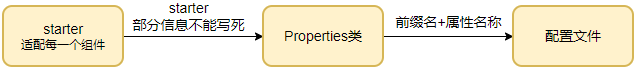

# HelloSpringBoot

## 创建工程


路径：


## 创建 Module


```xml
<!-- SpringBoot 框架 Web 项目起步依赖 -->
<dependency>
    <groupId>org.springframework.boot</groupId>
    <artifactId>spring-boot-starter-web</artifactId>
</dependency>
```

## pom.xml

```xml
<?xml version="1.0" encoding="UTF-8"?>
<project xmlns="http://maven.apache.org/POM/4.0.0" xmlns:xsi="http://www.w3.org/2001/XMLSchema-instance"
         xsi:schemaLocation="http://maven.apache.org/POM/4.0.0 https://maven.apache.org/xsd/maven-4.0.0.xsd">
    <modelVersion>4.0.0</modelVersion>

    <!-- 继承 SpringBoot 框架的一个父项目，所有开发的 SpringBoot 都必须继承 -->
    <parent>
        <groupId>org.springframework.boot</groupId>
        <artifactId>spring-boot-starter-parent</artifactId>
        <version>2.5.5</version>
        <relativePath/> <!-- lookup parent from repository -->
    </parent>

    <!-- 当前项目的 GAV 坐标 -->
    <groupId>com.example</groupId>
    <artifactId>FirstDemo</artifactId>
    <version>0.0.1-SNAPSHOT</version>

    <!-- Maven 项目名称、描述，可以删除-->
    <name>FirstDemo</name>
    <description>FirstDemo</description>

    <!-- Maven 属性配置，可以在其它地方通过 ${} 方式进行引用-->
    <properties>
        <java.version>1.8</java.version>
    </properties>

    <dependencies>
        <!-- SpringBoot 框架 Web 项目起步依赖 -->
        <dependency>
            <groupId>org.springframework.boot</groupId>
            <artifactId>spring-boot-starter-web</artifactId>
        </dependency>

        <dependency>
            <groupId>org.springframework.boot</groupId>
            <artifactId>spring-boot-starter-test</artifactId>
            <scope>test</scope>
        </dependency>
    </dependencies>

    <build>
        <plugins>
            <!-- SpringBoot 项目打包编译插件 -->
            <plugin>
                <groupId>org.springframework.boot</groupId>
                <artifactId>spring-boot-maven-plugin</artifactId>
            </plugin>
        </plugins>
    </build>

</project>
```

## 编写控制层

```java
package com.example.controller;

import org.springframework.web.bind.annotation.RequestMapping;
import org.springframework.web.bind.annotation.ResponseBody;
import org.springframework.web.bind.annotation.RestController;

/**
 * @author chenzufeng
 * @date 2021/10/13
 * @usage HelloController
 */
@RestController
public class HelloController {
    @RequestMapping(value = "/helloSpringBoot")
    public String helloSpringBoot() {
        return "Hello SpringBoot !";
    }
}
```


## 修改配置文件

```properties
# 设置内嵌 Tomcat 端口号
server.port=8081

# 配置项目上下文根
server.servlet.context-path=/firstSpringBootDemo
```

启动项目显示：

```markdown
Tomcat started on port(s): 8081 (http) with context path '/firstSpringBootDemo'
```


# 解析

## 依赖解读

```xml
<parent>
    <groupId>org.springframework.boot</groupId>
    <artifactId>spring-boot-starter-parent</artifactId>
    <version>2.5.5</version>
    <relativePath/> <!-- lookup parent from repository -->
</parent>
```

`<parent>`标签用于==版本控制==：引入的WEB模块`starter`的时候，不用指定版本号

```xml
<!-- SpringBoot 框架 Web 项目起步依赖 -->
<dependency>
    <groupId>org.springframework.boot</groupId>
    <artifactId>spring-boot-starter-web</artifactId>
</dependency>
```


为什么引入`spring-boot-starter-web`就能使用`Spring MVC`的功能？

`spring-boot-starter-web`启动器的依赖（`spring-boot-starter-web-2.5.5.pom`）：

```xml
<dependencies>
    <dependency>
        <groupId>org.springframework.boot</groupId>
        <artifactId>spring-boot-starter</artifactId>
        <version>2.5.5</version>
        <scope>compile</scope>
    </dependency>
    
    <dependency>
        <groupId>org.springframework.boot</groupId>
        <artifactId>spring-boot-starter-json</artifactId>
        <version>2.5.5</version>
        <scope>compile</scope>
    </dependency>
    
    <dependency>
        <groupId>org.springframework.boot</groupId>
        <artifactId>spring-boot-starter-tomcat</artifactId>
        <version>2.5.5</version>
        <scope>compile</scope>
    </dependency>
    
    <dependency>
        <groupId>org.springframework</groupId>
        <artifactId>spring-web</artifactId>
        <version>5.3.10</version>
        <scope>compile</scope>
    </dependency>
    
    <dependency>
        <groupId>org.springframework</groupId>
        <artifactId>spring-webmvc</artifactId>
        <version>5.3.10</version>
        <scope>compile</scope>
    </dependency>
</dependencies>
```

`spring-boot-starter-web`这个starter中内部引入了webmvc、tomcat等相关依赖，因此能够直接使用Spring MVC相关的功能
。

## 配置文件

Spring Boot为了能够适配每一个组件，都会提供一个starter，但是这些==启动器==的一
些信息不能在内部写死，比如数据库的用户名、密码等。于是
就统一写在了一个==Properties类==中，在Spring Boot启动的时候根据==前缀名+属性名称==从配置
文件中读取，比如`WebMvcProperties`，其中定义了一些Spring Mvc相关的配置，前缀是`
spring.mvc`：

```java
@ConfigurationProperties(prefix = "spring.mvc")
public class WebMvcProperties {
    ......
}
```



想要修改Spring Mvc相关的配置，只需要在application.properties文件中指定
`spring.mvc.xxxx=xxxx`即可。

## 启动类

```java
@SpringBootApplication
public class FirstDemoApplication {
    public static void main(String[] args) {
        SpringApplication.run(FirstDemoApplication.class, args);
    }
}
```

`@SpringBootApplication`是SpringBoot 核心注解，主要用于开启 Spring 自动配置：

```java
@Target({ElementType.TYPE})
@Retention(RetentionPolicy.RUNTIME)
@Documented
@Inherited

@SpringBootConfiguration
@EnableAutoConfiguration

@ComponentScan(
    excludeFilters = {@Filter(
    type = FilterType.CUSTOM,
    classes = {TypeExcludeFilter.class}
), @Filter(
    type = FilterType.CUSTOM,
    classes = {AutoConfigurationExcludeFilter.class}
)}
)
public @interface SpringBootApplication {
    ......
}
```

`@SpringBootApplication`由`@SpringBootConfiguration`、`@EnableAutoConfiguration`、`@ComponentScan`三个注解组成。

1.`@ComponentScan`是==包扫描==的注解，这个注解的作用
就是<font color=red>在项目启动的时候扫描==启动类的同类级==以及==下级包==中的Bean</font>。

2.`@SpringBootConfiguration`是`@Configuration`注解：

```java
@Target({ElementType.TYPE})
@Retention(RetentionPolicy.RUNTIME)
@Documented

@Configuration

@Indexed
public @interface SpringBootConfiguration {
    @AliasFor(
        annotation = Configuration.class
    )
    boolean proxyBeanMethods() default true;
}
```

@Configuration是Spring中的注解，表示该类是一个==配置类==，因此我们可以在启动类中做
一些配置类可以做的事，比如注入一个Bean。

3.`@EnableAutoConfiguration`开启自动配置：

```java
@Target({ElementType.TYPE})
@Retention(RetentionPolicy.RUNTIME)
@Documented
@Inherited

@AutoConfigurationPackage
@Import({AutoConfigurationImportSelector.class})
public @interface EnableAutoConfiguration {
    String ENABLED_OVERRIDE_PROPERTY = "spring.boot.enableautoconfiguration";

    Class<?>[] exclude() default {};

    String[] excludeName() default {};
}
```

@EnableAutoConfiguration这个注解的作用无非就是@Import的一种形
式而已，<font color=red>在项目启动的时候向IOC容器中快速注入Bean</font>。
