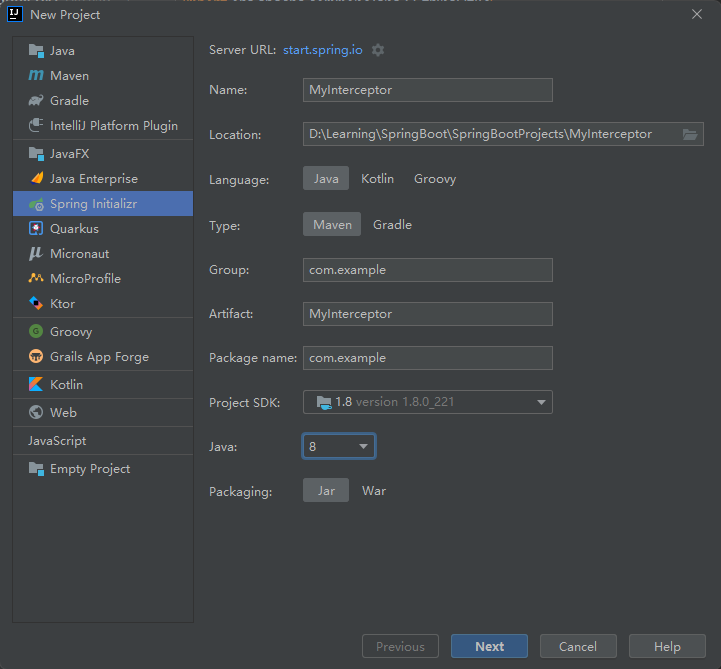

# 搭建环境

## 创建工程



## 添加依赖

```markdown
<dependencies>
    <dependency>
        <groupId>org.springframework.boot</groupId>
        <artifactId>spring-boot-starter-web</artifactId>
    </dependency>

    <dependency>
        <groupId>ch.qos.logback</groupId>
        <artifactId>logback-classic</artifactId>
        <version>1.2.3</version>
    </dependency>

    <!-- https://mvnrepository.com/artifact/io.springfox/springfox-swagger2 -->
    <dependency>
        <groupId>io.springfox</groupId>
        <artifactId>springfox-swagger2</artifactId>
        <version>2.9.2</version>
    </dependency>

    <!-- https://mvnrepository.com/artifact/io.springfox/springfox-swagger-ui -->
    <dependency>
        <groupId>io.springfox</groupId>
        <artifactId>springfox-swagger-ui</artifactId>
        <version>2.9.2</version>
    </dependency>

    <!-- https://mvnrepository.com/artifact/com.github.xiaoymin/knife4j-spring-boot-starter -->
    <dependency>
        <groupId>com.github.xiaoymin</groupId>
        <artifactId>knife4j-spring-boot-starter</artifactId>
        <version>2.0.9</version>
    </dependency>

    <dependency>
        <groupId>org.springframework.boot</groupId>
        <artifactId>spring-boot-starter-test</artifactId>
        <scope>test</scope>
    </dependency>
</dependencies>
```

## Swagger配置文件

```java
package com.example.config;

import org.springframework.context.annotation.Bean;
import org.springframework.context.annotation.Configuration;
import org.springframework.core.env.Environment;
import org.springframework.core.env.Profiles;
import springfox.documentation.builders.ApiInfoBuilder;
import springfox.documentation.builders.ParameterBuilder;
import springfox.documentation.builders.PathSelectors;
import springfox.documentation.builders.RequestHandlerSelectors;
import springfox.documentation.schema.ModelRef;
import springfox.documentation.service.ApiInfo;
import springfox.documentation.service.Parameter;
import springfox.documentation.spi.DocumentationType;
import springfox.documentation.spring.web.plugins.Docket;
import springfox.documentation.swagger2.annotations.EnableSwagger2;

import java.util.ArrayList;
import java.util.List;

/**
 * @author chenzufeng
 * @date 2021/10/12
 * @usage Swagger配置类
 */
@Configuration
@EnableSwagger2
public class SwaggerConfig {
    @Bean
    public Docket createRestApi(Environment environment) {

        // 设置要显示的Swagger环境：是否返回dev，spring.profiles.active=dev（org.springframework.core.env）
        Profiles profiles = Profiles.of("dev");
        // 获取项目的环境
        boolean environmentFlag = environment.acceptsProfiles(profiles);

        return new Docket(DocumentationType.SWAGGER_2)
                .apiInfo(apiInfo())
                // 只能在.select()前添加；配置是否启用Swagger，如果是false，在浏览器将无法访问
                .enable(environmentFlag)
                .groupName("HelloSwagger")

                // 通过 select()方法，去配置扫描接口
                .select()
                // RequestHandlerSelectors 配置如何扫描接口
                .apis(RequestHandlerSelectors.basePackage("com.example.controller"))
                // 配置如何通过path过滤，PathSelectors.ant("/example/**")：只扫描请求以/example开头的接口
                .paths(PathSelectors.any())
                .build()
                .globalOperationParameters(getParameterList());
    }

    private ApiInfo apiInfo() {
        return new ApiInfoBuilder()
                .title("HelloSwagger 接口文档")
                .description("HelloSwagger 接口文档")
                .version("1.0.0.RELEASE")
                // 使用了创建者设计模式
                .build();
    }

    /**
     * 设置请求头
     * @return List<Parameter>
     */
    private List<Parameter> getParameterList() {
        ParameterBuilder headers = new ParameterBuilder();
        List<Parameter> parameters = new ArrayList<>();

        Parameter cookieParam = headers.name("Cookie")
                .description("Cookie").modelRef(new ModelRef("String"))
                .parameterType("header").required(false)
                .build();

        Parameter authorization = headers.name("Authorization")
                .description("IAM Token").modelRef(new ModelRef("String"))
                .parameterType("header").required(false)
                .build();

        Parameter contentTypeParam = headers.name("Content-Type")
                .description("Content-Type").modelRef(new ModelRef("String"))
                .parameterType("header").required(false)
                .defaultValue("application/json;charset=UTF-8")
                .build();

        parameters.add(cookieParam);
        parameters.add(authorization);
        parameters.add(contentTypeParam);
        return parameters;
    }
}
```

## 多环境配置

`application.properties`

```properties
spring.profiles.active=dev
```

`application-dev.properties`

```properties
server.port=8081
```

## 实体类

```java
package com.example.entity;

import io.swagger.annotations.ApiModel;
import io.swagger.annotations.ApiModelProperty;

/**
 * @author chenzufeng
 * @date 2021/11/15
 * @usage User
 */
@ApiModel(value = "实体类：User")
public class User {
    @ApiModelProperty(value = "用户ID")
    private Integer id;

    @ApiModelProperty(value = "用户名", required = true)
    private String userName;

    public Integer getId() {
        return id;
    }

    public void setId(Integer id) {
        this.id = id;
    }

    public String getUserName() {
        return userName;
    }

    public void setUserName(String userName) {
        this.userName = userName;
    }
}
```

# 自定义拦截器

## 登录拦截器

```java
package com.example.interceptor;

import com.example.entity.User;
import org.slf4j.Logger;
import org.slf4j.LoggerFactory;
import org.springframework.web.servlet.HandlerInterceptor;
import org.springframework.web.servlet.ModelAndView;

import javax.servlet.http.HttpServletRequest;
import javax.servlet.http.HttpServletResponse;

/**
 * @author chenzufeng
 * @date 2021/11/15
 * @usage UserInterceptor 登录拦截器
 */
public class UserInterceptor implements HandlerInterceptor {
    private static final Logger logger = LoggerFactory.getLogger(UserInterceptor.class);

    @Override
    public boolean preHandle(HttpServletRequest request, HttpServletResponse response, Object handler) throws Exception {
        logger.info("===========进入拦截器===========");
        // 从session中获取结果
        User user = (User) request.getSession().getAttribute("user");
        if (null == user) {
            response.sendRedirect(request.getContextPath() + "/user/error");
            return false;
        }

        return true;
    }

    @Override
    public void postHandle(HttpServletRequest request, HttpServletResponse response, Object handler, ModelAndView modelAndView) throws Exception {

    }

    @Override
    public void afterCompletion(HttpServletRequest request, HttpServletResponse response, Object handler, Exception ex) throws Exception {

    }
}
```

## 注册拦截器

```java
package com.example.config;

import com.example.interceptor.UserInterceptor;
import org.springframework.context.annotation.Configuration;
import org.springframework.web.servlet.config.annotation.InterceptorRegistry;
import org.springframework.web.servlet.config.annotation.WebMvcConfigurer;

/**
 * @author chenzufeng
 * @date 2021/11/15
 * @usage InterceptorConfig 注册拦截器
 */
@Configuration
public class InterceptorConfig implements WebMvcConfigurer {
    @Override
    public void addInterceptors(InterceptorRegistry registry) {
        // 定义需要拦截的路径：拦截user下的所有必须登录后才能访问的接口
        String[] addPathPatterns = {"/user/**"};

        //定义不需要拦截的路径
        String[] excludePathPatterns = {
                "/user/admin",
                "/user/error",
                "/user/login"
        };

        // 添加需要注册的拦截器对象
        registry.addInterceptor(new UserInterceptor())
                // 添加需要拦截的路径
                .addPathPatterns(addPathPatterns)
                // 添加不需要拦截的路径
                .excludePathPatterns(excludePathPatterns);
    }
}
```

## 接口

```java
package com.example.controller;

import com.example.entity.User;
import io.swagger.annotations.Api;
import io.swagger.annotations.ApiOperation;
import org.springframework.web.bind.annotation.*;

import javax.servlet.http.HttpServletRequest;

/**
 * @author chenzufeng
 * @date 2021/11/15
 * @usage UserController
 */
@Api(tags = "拦截器接口")
@RestController
@RequestMapping("/user")
public class UserController {

    @ApiOperation(value = "用户登录")
    @PostMapping("/login")
    public String login(
            @RequestBody User user,
            HttpServletRequest request) {
        // 将用户信息存放在session中（setAttribute(String var1, Object var2)）
        request.getSession().setAttribute("user", user);
        return "用户登录认证成功！";
    }

    @ApiOperation(value = "用户登录后访问用户中心")
    @GetMapping("/userCenter")
    public String userCenter() {
        return "访问用户中心！";
    }

    @ApiOperation(value = "管理员直接访问")
    @GetMapping("/admin")
    public String admin() {
        return "管理员直接访问！";
    }

    @ApiOperation(value = "用户访问失败")
    @GetMapping("/error")
    public String error() {
        return "用户访问失败！";
    }
}
```


# 参考资料

[1] [动力节点——拦截器](https://www.bilibili.com/video/BV1rv411k7RD?p=58)

