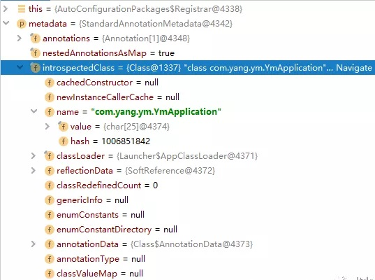
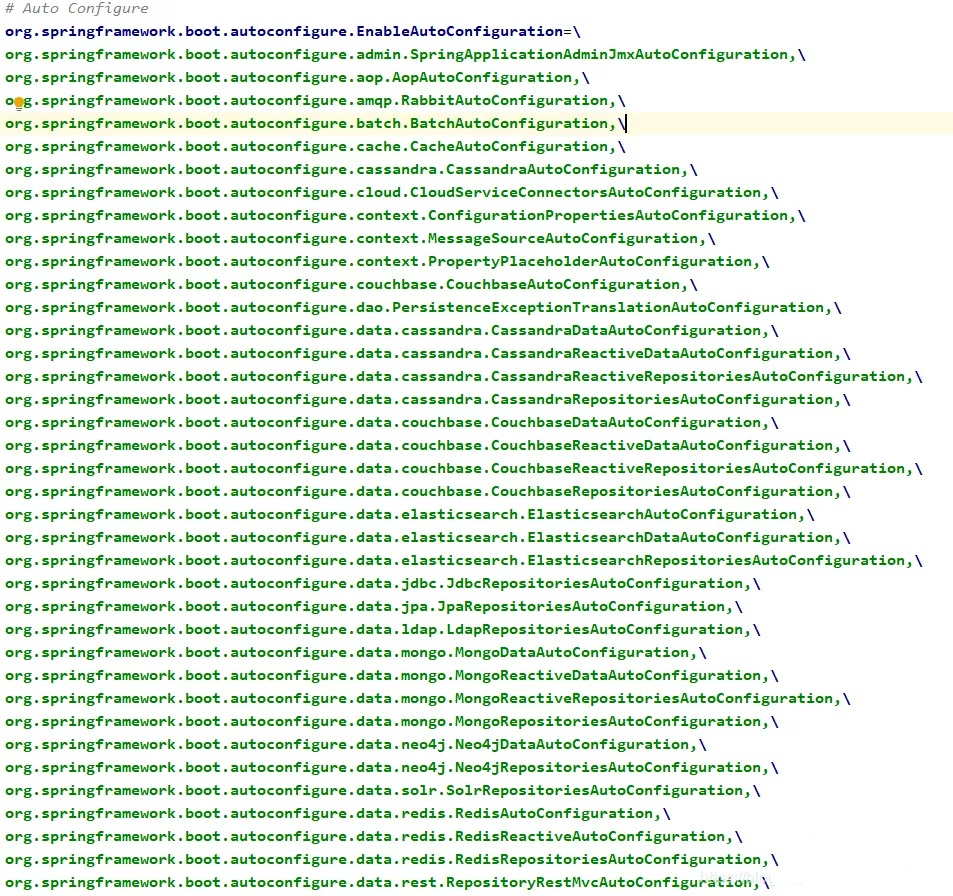
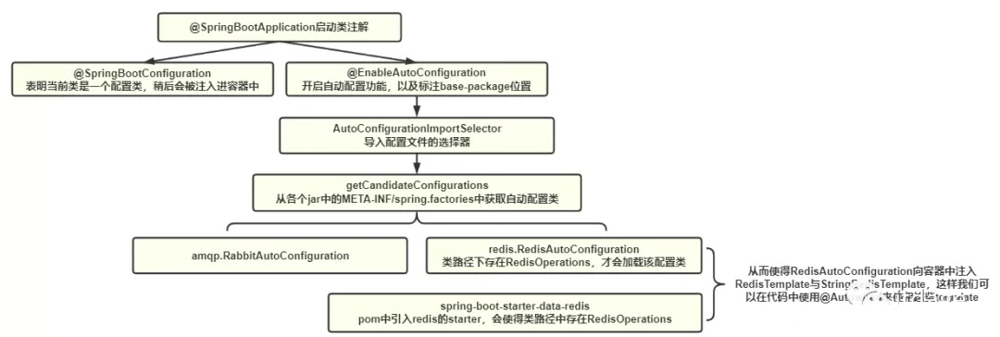

# 前言

Spring 是 Java 企业级应用开发人员的春天，我们可以通过 Spring 提供的 IOC 容器，避免==硬编码==带来的程序过度==耦合==。

但是，启动一个 Spring 应用程序也绝非易事，需要大量且繁琐的 ==xml 配置==，开发人员压根不能全身心的投入到业务中去。

因此，SpringBoot 诞生了，虽然本质上还是属于 Spring，但是 SpringBoot 的优势在于以下两个特点：

- 约定大于配置

  SpringBoot 定义了项目的基本骨架，例如各个环境的配置文件统一放到 resource 中，使用 active 来启用其中一个。配置文件默认为 `application.properties`，或者``yaml`、`yml`都可以。

- 自动装配

  - 以前在 Spring 使用到某个组件的时候，需要在 xml 中对配置好各个属性，之后被 Spring 扫描后注入进容器。

  - 而有了 SpringBoot 后，仅仅需要引入一个 ==starter==，就可以直接使用该组件，如此方便、快捷，得益于==自动装配==机制。

# 自动装配原理

从 SpringBoot 的主入口开始：

```java
@SpringBootApplication
public class YmApplication {
    public static void main(String[] args) {
        SpringApplication.run(YmApplication.class, args);
    }
}
```

这个类最大的特点就是使用了`@SpringBootApplication`注解，该注解用于==标注主配置类==。

这样 SpringBoot 在启动的时候，就会运行这个类的 run 方法。

## @SpringBootApplication

`@SpringBootApplication`注解是一个组合注解：

```java
@Target(ElementType.TYPE)
@Retention(RetentionPolicy.RUNTIME)
@Documented
@Inherited

@SpringBootConfiguration
@EnableAutoConfiguration
@ComponentScan(excludeFilters = {
  @Filter(type = FilterType.CUSTOM, classes = TypeExcludeFilter.class),
  @Filter(type = FilterType.CUSTOM,
    classes = AutoConfigurationExcludeFilter.class) })
public @interface SpringBootApplication {...}
```

其中`@Target`、 `@Retention`、`@Documented`与`@Inherited`是元注解，还包含了`@SpringBootConfiguration`与`@EnableAutoConfiguration`。

以下注解都将省略这些元注解。

### @SpringBootConfiguration

```java
@Configuration
public @interface SpringBootConfiguration {
}
 
@Component
public @interface Configuration {
    @AliasFor(
        annotation = Component.class
    )
    String value() default "";
}
```

`@SpringBootConfiguration`注解本质上是一个`@Configuration`注解，表明该类是一个==配置类==。

而@Configuration又被`@Component`注解修饰，代表任何<font color=red>加了@Configuration注解的配置类，都会被注入进Spring容器中</font>。

### @EnableAutoConfiguration

该注解<font color=red>开启了自动配置的功能</font>：

```java
@AutoConfigurationPackage
@Import(AutoConfigurationImportSelector.class)
public @interface EnableAutoConfiguration {...}
```

#### @AutoConfigurationPackage

```java
@Import({Registrar.class})
public @interface AutoConfigurationPackage {
    String[] basePackages() default {};
    Class<?>[] basePackageClasses() default {};
}
```

以前我们直接使用 Spring 的时候，需要在 xml 中的`context:component-scan`中定义好`base-package`。Spring 在启动的时候，就会<font color=red>扫描该包下及其子包下，被@Controller、@Service与@Component标注的类，并将这些类注入到容器中</font>。

`@AutoConfigurationPackage`则会<font color=red>将主配置类（被注解标注的类）所在的包当作`base-package`，而不用我们自己去手动配置了</font>。

这也就是为什么我们需要<font color=red>将主配置类放在项目的最外层目录中</font>的原因。

那么容器是怎么知道主配置当前所在的包呢？

<font color=red>@Import注解会直接向容器中注入指定的组件！</font>

##### @Import({Registrar.class})

引入了`AutoConfigurationPackages`类中内部类`Registrar`：

```java
static class Registrar implements ImportBeanDefinitionRegistrar, DeterminableImports {
    Registrar() {
    }

    public void registerBeanDefinitions(AnnotationMetadata metadata, BeanDefinitionRegistry registry) {
        AutoConfigurationPackages.register(registry, (String[])(new AutoConfigurationPackages.PackageImports(metadata)).getPackageNames().toArray(new String[0]));
    }

    public Set<Object> determineImports(AnnotationMetadata metadata) {
        return Collections.singleton(new AutoConfigurationPackages.PackageImports(metadata));
    }
}
```

debug后可以看到，metadata是主配置类：



而`getPackageNames`将会返回主配置类所在的==包路径==：

```java
List<String> getPackageNames() {
    return this.packageNames;
}
```

这样，容器就知道了主配置类所在的包，之后就会扫描该包及其子包。

#### @Import(AutoConfigurationImportSelector.class)

**@Import(AutoConfigurationImportSelector.class)**该注解又引入了**AutoConfigurationImportSelector**类

而**AutoConfigurationImportSelector**中有一个可以==获取候选配置==的方法，即**getCandidateConfigurations**：

```java
protected List<String> getCandidateConfigurations(AnnotationMetadata metadata, AnnotationAttributes attributes) {
    List<String> configurations = SpringFactoriesLoader.loadFactoryNames(this.getSpringFactoriesLoaderFactoryClass(), this.getBeanClassLoader());
    Assert.notEmpty(configurations, "No auto configuration classes found in META-INF/spring.factories. If you are using a custom packaging, make sure that file is correct.");
    return configurations;
}

protected Class<?> getSpringFactoriesLoaderFactoryClass() {
    return EnableAutoConfiguration.class;
}
```

其中核心方法**SpringFactoriesLoader.loadFactoryNames**，第一个参数是**EnableAutoConfiguration.class**

##### SpringFactoriesLoader.loadFactoryNames

```java
public static final String FACTORIES_RESOURCE_LOCATION = "META-INF/spring.factories";

public static List<String> loadFactoryNames(Class<?> factoryType, @Nullable ClassLoader classLoader) {
    ClassLoader classLoaderToUse = classLoader;
    if (classLoader == null) {
        classLoaderToUse = SpringFactoriesLoader.class.getClassLoader();
    }

    String factoryTypeName = factoryType.getName();
    return (List)loadSpringFactories(classLoaderToUse).getOrDefault(factoryTypeName, Collections.emptyList());
}

private static Map<String, List<String>> loadSpringFactories(ClassLoader classLoader) {
    Map<String, List<String>> result = (Map)cache.get(classLoader);
    if (result != null) {
        return result;
    } else {
        HashMap result = new HashMap();

        try {
            Enumeration urls = classLoader.getResources("META-INF/spring.factories");

            while(urls.hasMoreElements()) {
                URL url = (URL)urls.nextElement();
                UrlResource resource = new UrlResource(url);
                Properties properties = PropertiesLoaderUtils.loadProperties(resource);
                Iterator var6 = properties.entrySet().iterator();

                while(var6.hasNext()) {
                    Entry<?, ?> entry = (Entry)var6.next();
                    String factoryTypeName = ((String)entry.getKey()).trim();
                    String[] factoryImplementationNames = StringUtils.commaDelimitedListToStringArray((String)entry.getValue());
                    String[] var10 = factoryImplementationNames;
                    int var11 = factoryImplementationNames.length;

                    for(int var12 = 0; var12 < var11; ++var12) {
                        String factoryImplementationName = var10[var12];
                        ((List)result.computeIfAbsent(factoryTypeName, (key) -> {
                            return new ArrayList();
                        })).add(factoryImplementationName.trim());
                    }
                }
            }

            result.replaceAll((factoryType, implementations) -> {
                return (List)implementations.stream().distinct().collect(Collectors.collectingAndThen(Collectors.toList(), Collections::unmodifiableList));
            });
            cache.put(classLoader, result);
            return result;
        } catch (IOException var14) {
            throw new IllegalArgumentException("Unable to load factories from location [META-INF/spring.factories]", var14);
        }
    }
}
```

可以看得出，<font color=red>**loadSpringFactorie**方法，会从`META-INF/spring.factories`文件中读取配置，将其封装为Properties对象，将每个key作为返回的map的key，将key对应的配置集合作为该map的value</font>。

而**loadFactoryNames**则是取出key为**EnableAutoConfiguration.class**的配置集合

我们查看**META-INF/spring.factories**的内容（完整路径：org\springframework\boot\spring-boot-autoconfigure\2.1.4.RELEASE\spring-boot-autoconfigure-2.1.4.RELEASE.jar!\META-INF\spring.factories）：



可以看到，EnableAutoConfiguration对应的value，则是我们在开发中经常用到的组件，比如Rabbit、Elasticsearch与Redis等中间件。

到这里，我们可以知道<font color=red>**getCandidateConfigurations**方法会从**META-INF/spring.factories**中获取各个组件的自动配置类的全限定名</font>。

这么多自动配置类，难道是一启动SpringBoot项目，就会全部加载吗？

显然不是！

## RedisAutoConfiguration

该自动装配类：

```java
@Configuration(proxyBeanMethods = false)
@ConditionalOnClass({RedisOperations.class})
@EnableConfigurationProperties({RedisProperties.class})
@Import({LettuceConnectionConfiguration.class, JedisConnectionConfiguration.class})
public class RedisAutoConfiguration {
    public RedisAutoConfiguration() {
    }

    @Bean
    @ConditionalOnMissingBean(name = {"redisTemplate"})
    @ConditionalOnSingleCandidate(RedisConnectionFactory.class)
    public RedisTemplate<Object, Object> redisTemplate(RedisConnectionFactory redisConnectionFactory) {
        RedisTemplate<Object, Object> template = new RedisTemplate();
        template.setConnectionFactory(redisConnectionFactory);
        return template;
    }

    @Bean
    @ConditionalOnMissingBean
    @ConditionalOnSingleCandidate(RedisConnectionFactory.class)
    public StringRedisTemplate stringRedisTemplate(RedisConnectionFactory redisConnectionFactory) {
        StringRedisTemplate template = new StringRedisTemplate();
        template.setConnectionFactory(redisConnectionFactory);
        return template;
    }
}
```

可以看到，该自动配置类中，确实提供了RedisTemplate与StringRedisTemplate的Bean。

### @EnableConfigurationProperties

但是我们注意到上面的注解，<font color=red>**@EnableConfigurationProperties(RedisProperties.class)**使得被**@ConfigurationProperties**修饰的类生效</font>。

### @ConfigurationProperties

**RedisProperties**就是被**@ConfigurationProperties**修饰，即会将**RedisProperties**类注入到容器中：

```java
@ConfigurationProperties(prefix = "spring.redis")
public class RedisProperties {
    private int database = 0;
    private String url;
    private String host = "localhost";
    private String username;
    private String password;
    private int port = 6379;
    ......
}
```

<font color=red>**@ConfigurationProperties(prefix = "spring.redis")**则会将`application.yml`中以`spring.redis`开头的配置映射到该类中</font>。

### @ConditionalOnClass(RedisOperations.class)

<font color=red>当前的类路径下存在**RedisOperations.class**时，才会加载**RedisAutoConfiguration**配置类</font>。

同样的注解还有

**@ConditionalOnBean：**当容器里有指定Bean的条件下

**@ConditionalOnMissingBean：**当容器里没有指定Bean的情况下

**@ConditionalOnMissingClass：**当容器里没有指定类的情况下

### 如何才能加载**RedisAutoConfiguration**类

<font color=red>需要在pom中引入redis的starter，即**spring-boot-starter-data-redis**</font>。

我们以2.1.4.RELEASE版本为例。该版本的starter又会引入2.1.6.RELEASE版本的**spring-data-redis**的依赖，**spring-data-redis**中会有**RedisOperations**类。

全路径为spring-data-redis\2.1.6.RELEASE\spring-data-redis-2.1.6.RELEASE.jar!\

4org\springframework\data\redis\core\RedisOperations.class

## SpringBoot的自动装配流程

结合redis总结下SpringBoot的自动装配流程



# 参考资料

[1] [SpringBoot的自动装配原理](https://mp.weixin.qq.com/s/I4qc77yDPHgP6crV04bp6w)