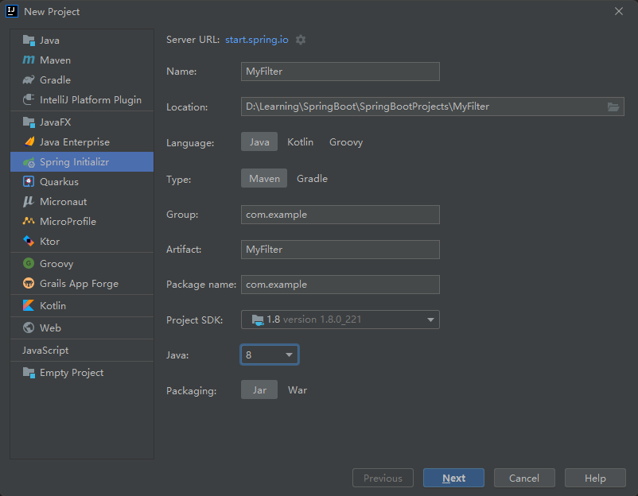

# 搭建环境

## 创建项目



## 添加依赖

```xml
<dependencies>
    <dependency>
        <groupId>org.springframework.boot</groupId>
        <artifactId>spring-boot-starter-web</artifactId>
    </dependency>

    <dependency>
        <groupId>ch.qos.logback</groupId>
        <artifactId>logback-classic</artifactId>
        <version>1.2.3</version>
    </dependency>

    <dependency>
        <groupId>org.springframework.boot</groupId>
        <artifactId>spring-boot-starter-test</artifactId>
        <scope>test</scope>
    </dependency>
</dependencies>
```

# 实例

## 通过注解创建Filter

### 创建MyFilter

```java
package com.example.filter;

import org.slf4j.Logger;
import org.slf4j.LoggerFactory;

import javax.servlet.*;
import javax.servlet.annotation.WebFilter;
import java.io.IOException;

/**
 * @author chenzufeng
 * @date 2021/11/16
 * @usage MyFilter
 */
@WebFilter(urlPatterns = "/myFilter")
public class MyFilter implements Filter {
    private static final Logger logger = LoggerFactory.getLogger(MyFilter.class);

    @Override
    public void doFilter(ServletRequest servletRequest, ServletResponse servletResponse, FilterChain filterChain) throws IOException, ServletException {
        logger.info("==========进入过滤器==========");

        filterChain.doFilter(servletRequest,servletResponse);
    }
}
```

注意使用注解：`@WebFilter(urlPatterns = "/myFilter")`！

### 在启动类上添加注解

```java
package com.example;

import org.springframework.boot.SpringApplication;
import org.springframework.boot.autoconfigure.SpringBootApplication;
import org.springframework.boot.web.servlet.ServletComponentScan;

@SpringBootApplication
@ServletComponentScan(basePackages = "com.example.filter")
public class MyFilterApplication {
    public static void main(String[] args) {
        SpringApplication.run(MyFilterApplication.class, args);
    }
}
```

注意使用注解：`@ServletComponentScan(basePackages = "com.example.filter")`

### 测试

在浏览器输入[http://localhost:8080/myFilter](http://localhost:8080/myFilter)，控制台输出：

```markdown
com.example.filter.MyFilter   : ==========进入过滤器==========
```

## 通过配置类注册

### 创建MyFilter

```java
package com.example.filter;

import org.slf4j.Logger;
import org.slf4j.LoggerFactory;

import javax.servlet.*;
import javax.servlet.annotation.WebFilter;
import java.io.IOException;

/**
 * @author chenzufeng
 * @date 2021/11/16
 * @usage MyFilter
 */
// @WebFilter(urlPatterns = "/myFilter")
public class MyFilter implements Filter {
    private static final Logger logger = LoggerFactory.getLogger(MyFilter.class);

    @Override
    public void doFilter(ServletRequest servletRequest, ServletResponse servletResponse, FilterChain filterChain) throws IOException, ServletException {
        logger.info("==========进入过滤器==========");

        filterChain.doFilter(servletRequest,servletResponse);
    }
}
```


### 创建FilterConfig配置类

```java
package com.example.config;

import com.example.filter.MyFilter;
import org.springframework.boot.web.servlet.FilterRegistrationBean;
import org.springframework.context.annotation.Bean;
import org.springframework.context.annotation.Configuration;

/**
 * @author chenzufeng
 * @date 2021/11/16
 * @usage FilterConfig
 */
@Configuration
public class FilterConfig {

    @Bean
    public FilterRegistrationBean myFilterRegistration() {
        // 注册过滤器
        FilterRegistrationBean filterRegistrationBean = new FilterRegistrationBean(new MyFilter());
        // 添加过滤路径
        filterRegistrationBean.addUrlPatterns("/user/*");

        return filterRegistrationBean;
    }
}
```

### 接口

```java
package com.example.controller;

import org.springframework.web.bind.annotation.GetMapping;
import org.springframework.web.bind.annotation.RestController;

/**
 * @author chenzufeng
 * @date 2021/11/16
 * @usage UserController
 */
@RestController
public class UserController {
    @GetMapping("/user/detail")
    public String userDetail() {
        return "/user/detail";
    }

    @GetMapping("/userCenter")
    public String userCenter() {
        return "/userCenter";
    }
}
```

