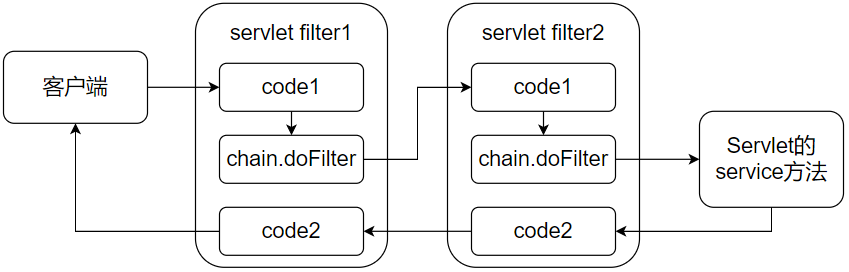

# 过滤器简介

**Filter**过滤器是对数据进行过滤，预处理。开发人员可以对客户端==提交的数据==进行过滤处理，比如==敏感词==，也可以对服务端==返回的数据==进行处理。还可以验证用户的登录情况，==权限验证==，对静态资源进行访问控制，没有登录或者是没有权限时是不能让用户直接访问这些资源的。类似的过滤器还有很多的功能，比如说编码，压缩服务端给客户端返回的各种数据，等等。

## 过滤器原理

Java提供了一个**Filter**接口，只需要==实现这个接口==就能实现自定义过滤器，然后添加一些必要的配置让过滤器生效。过滤器只能初始化一次，并且过滤器只会在项目停止或者是重新部署的时候才销毁。

Filter接口中最重要的是**doFilter**方法，当我们编写好Filter，并配置好==对哪个URL资源进行拦截==时，每一次请求这个资源之前就会调用这个doFilter方法。在这个doFilter方法里面有一个**FilterChain**的对象参数，这个对象里面也有一个doFilter方法，是否调用这个方法，<font color=red>决定了这个过滤器是否能调用后面的资源或者是执行后面的过滤器</font>。

在过滤器里面可以进行一些什么操作呢？

可以在调用目标资源之前，进行权限等的处理；判断是否调用目标资源；也可以在调用目标资源之后进行一些响应消息进行处理。

## 执行原理

服务器会按照过滤器定义的先后循序组装成一条==链==，然后依次执行其中的doFilter()方
法（这一点Filter和Servlet是不一样的）。

执行的顺序就如下图所示，①执行第一个
过滤器的chain.doFilter()之前的代码，②再执行第二个过滤器的chain.doFilter()之前的代
码，③请求的资源，④执行第二个过滤器的chain.doFilter()之后的代码，⑤接着第一个过滤器的
chain.doFilter()之后的代码，⑥最后返回响应：



# 搭建环境

## 创建项目


## 添加依赖

```xml
<dependencies>
    <dependency>
        <groupId>org.springframework.boot</groupId>
        <artifactId>spring-boot-starter-web</artifactId>
    </dependency>

    <dependency>
        <groupId>ch.qos.logback</groupId>
        <artifactId>logback-classic</artifactId>
        <version>1.2.3</version>
    </dependency>

    <dependency>
        <groupId>org.springframework.boot</groupId>
        <artifactId>spring-boot-starter-test</artifactId>
        <scope>test</scope>
    </dependency>
</dependencies>
```

# 实例

## 通过注解创建Filter

### 创建MyFilter

```java
package com.example.filter;

import org.slf4j.Logger;
import org.slf4j.LoggerFactory;

import javax.servlet.*;
import javax.servlet.annotation.WebFilter;
import java.io.IOException;

/**
 * @author chenzufeng
 * @date 2022/3/2
 * @usage MyFilter
 */
@Order(1)
@WebFilter(filterName = "myFilter", urlPatterns = "/*")
public class MyFilter implements Filter {

    private static final Logger logger = LoggerFactory.getLogger(MyFilter.class);

    @Override
    public void doFilter(ServletRequest servletRequest, ServletResponse servletResponse, FilterChain filterChain) throws IOException, ServletException {
        logger.info("我是过滤器的执行方法，客户端向Servlet发送的请求被我拦截到了！");
        filterChain.doFilter(servletRequest, servletResponse);
        logger.info("我是过滤器的执行方法，Servlet向客户端发送的响应被我拦截到了！");
    }

    /**
     * 初始化方法只会执行一次
     * @param filterConfig filterConfig
     * @throws ServletException ServletException
     */
    @Override
    public void init(FilterConfig filterConfig) throws ServletException {
        String filterName = filterConfig.getFilterName();
        logger.info("过滤器初始化方法！过滤器叫作：" + filterName);
    }

    /**
     * 在销毁Filter时自动调用
     */
    @Override
    public void destroy() {
        logger.info("过滤器被销毁！");
    }
}
```

注意使用注解：`@WebFilter`！

- @Order(1)：表示过滤器的顺序。假设我们有多个过滤器，你如何确定过滤器的执行顺序？这个注解就是规定过滤器的顺序。数字越小，越先执行。
- @WebFilter：表示这个class是过滤器。`
  filterName` 为过滤器名字，`urlPatterns` 为过滤器的范围（表示==要过滤的URL资源==，可以是一个或者多个），`initParams` 为过滤器初始化参数。
- 过滤器里面的三个方法
  - init：filter对象只会创建一次，init方法也只会执行一次。
  - doFilter：主要的业务代码编写方法，可以多次重复调用
  - destroy：在销毁Filter时自动调用（==程序关闭==或者主动销毁Filter）。


### 在启动类上添加注解

```java
package com.example;

import org.springframework.boot.SpringApplication;
import org.springframework.boot.autoconfigure.SpringBootApplication;
import org.springframework.boot.web.servlet.ServletComponentScan;

@ServletComponentScan(basePackages = "com.example.filter")
@SpringBootApplication
public class WebFilterApplication {
    public static void main(String[] args) {
        SpringApplication.run(WebFilterApplication.class, args);
    }
}
```

注意使用注解：`@ServletComponentScan(basePackages = "com.example.filter")`

### 接口

```java
package com.example.controller;

import org.slf4j.Logger;
import org.slf4j.LoggerFactory;
import org.springframework.web.bind.annotation.RequestMapping;
import org.springframework.web.bind.annotation.RestController;

/**
 * @author chenzufeng
 * @date 2022/3/2
 * @usage FilterController
 */
@RestController
public class FilterController {
    private static final Logger logger = LoggerFactory.getLogger(FilterController.class);

    @RequestMapping("/webFilter")
    public void testWebFilter() {
        logger.info("测试WebFilter！");
    }
}
```


### 测试

Postman调用接口：`http://localhost:8080/webFilter`，控制台返回：

```markdown
Initializing Spring embedded WebApplicationContext
Root WebApplicationContext: initialization completed in 1504 ms
# 执行init方法
过滤器初始化方法！过滤器叫作：myFilter
Tomcat started on port(s): 8080 (http) with context path ''
Started WebFilterApplication in 3.285 seconds (JVM running for 5.629)
Initializing Spring DispatcherServlet 'dispatcherServlet'
Initializing Servlet 'dispatcherServlet'
Completed initialization in 1 ms
# 执行doFilter#filterChain.doFilter(servletRequest, servletResponse)前，客户端请求被拦截
我是过滤器的执行方法，客户端向Servlet发送的请求被我拦截到了！
# 执行controller中方法
测试WebFilter！
# 执行doFilter#filterChain.doFilter(servletRequest, servletResponse)后，客户端响应被拦截
我是过滤器的执行方法，Servlet向客户端发送的响应被我拦截到了！
# 程序停止运行
过滤器被销毁！
```


## 通过配置类注册

为了演示优先级，创建2个测试过滤器类：**Test1Filter**、**Test2Filter**

### 创建MyFilter

```java
package com.example.filter;

import org.slf4j.Logger;
import org.slf4j.LoggerFactory;

import javax.servlet.*;
import javax.servlet.http.HttpServletRequest;
import java.io.IOException;

/**
 * @author chenzufeng
 * @date 2022/3/2
 * @usage MyFilter
 */

public class Test1Filter implements Filter {

    private static final Logger logger = LoggerFactory.getLogger(Test1Filter.class);

    @Override
    public void doFilter(ServletRequest servletRequest, ServletResponse servletResponse, FilterChain filterChain) throws IOException, ServletException {
        HttpServletRequest httpServletRequest = (HttpServletRequest) servletRequest;
        logger.info("Test1Filter拦截到客户端向Servlet发送的请求：" + httpServletRequest.getRequestURI());
        filterChain.doFilter(httpServletRequest, servletResponse);
        logger.info("Test1Filter拦截到Servlet向客户端发送的响应！");
    }

    /**
     * 初始化方法只会执行一次
     * @param filterConfig filterConfig
     * @throws ServletException ServletException
     */
    @Override
    public void init(FilterConfig filterConfig) throws ServletException {
        String filterName = filterConfig.getFilterName();
        logger.info("Test1Filter过滤器初始化方法！过滤器叫作：" + filterName);
    }

    /**
     * 在销毁Filter时自动调用
     */
    @Override
    public void destroy() {
        logger.info("Test1Filter过滤器被销毁！");
    }
}
```


### 创建FilterConfig配置类

```java
package com.example.config;

import com.example.filter.Test1Filter;
import com.example.filter.Test2Filter;
import org.springframework.boot.web.servlet.FilterRegistrationBean;
import org.springframework.context.annotation.Bean;
import org.springframework.context.annotation.Configuration;

/**
 * @author chenzufeng
 * @date 2021/11/16
 * @usage FilterConfig
 */
@Configuration
public class FilterConfiguration {

    @Bean
    public FilterRegistrationBean<Test1Filter> test1FilterRegistration() {
        // 注册过滤器
        FilterRegistrationBean<Test1Filter> bean = new FilterRegistrationBean<Test1Filter>();
        bean.setFilter(new Test1Filter());
        // 过滤器名称
        bean.setName("filter1");
        // 过滤所有路径
        bean.addUrlPatterns("/*");
        // 设置优先级
        bean.setOrder(10);
        return bean;
    }

    @Bean
    public FilterRegistrationBean<Test2Filter> test2FilterRegistration() {
        // 注册过滤器
        FilterRegistrationBean<Test2Filter> bean = new FilterRegistrationBean<Test2Filter>();
        bean.setFilter(new Test2Filter());
        // 过滤器名称
        bean.setName("filter2");
        // 过滤所有路径
        bean.addUrlPatterns("/test/*");
        // 设置优先级
        bean.setOrder(6);
        return bean;
    }
}
```

### 接口

```java
package com.example.controller;

import org.slf4j.Logger;
import org.slf4j.LoggerFactory;
import org.springframework.web.bind.annotation.RequestMapping;
import org.springframework.web.bind.annotation.RestController;

/**
 * @author chenzufeng
 * @date 2022/3/3
 * @usage FilterController
 */
@RestController
public class FilterController {
    private static final Logger logger = LoggerFactory.getLogger(FilterController.class);

    @RequestMapping("/filter")
    public void testFilter() {
        logger.info("testFilter()：测试路径/filter！");
    }

    @RequestMapping("/test/filter")
    public void testFilter1() {
        logger.info("testFilter1()：测试路径/test/filter！");
    }
}
```

### 测试

Postman调用接口：`http://localhost:8080/webFilter`，控制台返回：

```markdown
# 设置优先级不影响初始化顺序
Test1Filter过滤器初始化方法！过滤器叫作：filter1
Test2Filter过滤器初始化方法！过滤器叫作：filter2
Tomcat started on port(s): 8080 (http) with context path ''
Started JavaConfigFilterApplication in 1.886 seconds (JVM running for 2.706)
Initializing Spring DispatcherServlet 'dispatcherServlet'
Initializing Servlet 'dispatcherServlet'
Completed initialization in 1 ms
# 过滤器2的优先级更高
Test2Filter拦截到客户端向Servlet发送的请求：/test/filter
Test1Filter拦截到客户端向Servlet发送的请求：/test/filter
# 调用接口
testFilter1()：测试路径/test/filter！
# 优先级低的先被拦截响应
Test1Filter拦截到Servlet向客户端发送的响应！
Test2Filter拦截到Servlet向客户端发送的响应！
# 优先级设置不影响销毁顺序
Test1Filter过滤器被销毁！
Test2Filter过滤器被销毁！
```


# 参考资料

[1] [SpringBoot过滤器FilterRegistrationBean](https://www.cnblogs.com/ixixi/p/11685269.html)

