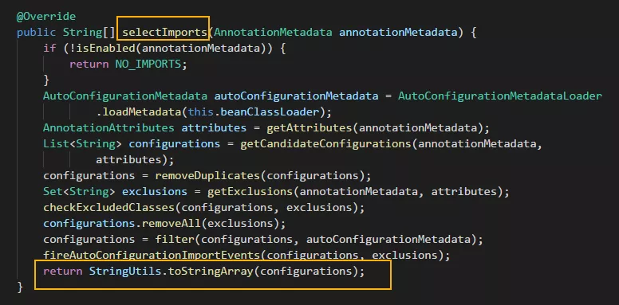

# SpringBootApplication 注解

```java
import org.springframework.boot.SpringApplication;
import org.springframework.boot.autoconfigure.SpringBootApplication;

@SpringBootApplication
public class SpringBootDemoApplication {
    public static void main(String[] args) {
        SpringApplication.run(SpringBootDemoApplication.class, args);
    }
}
```

`@SpringBootApplication`注解实际上是Spring Boot提供的一个==复合注解==：

```java
@Target(ElementType.TYPE)
@Retention(RetentionPolicy.RUNTIME)
@Documented
@Inherited
@SpringBootConfiguration
@EnableAutoConfiguration
@ComponentScan(excludeFilters = {
  @Filter(type = FilterType.CUSTOM, classes = TypeExcludeFilter.class),
  @Filter(type = FilterType.CUSTOM, classes = AutoConfigurationExcludeFilter.class) })
public @interface SpringBootApplication {
 ...
}
```

## SpringBootConfiguration

```java
@Target(ElementType.TYPE)
@Retention(RetentionPolicy.RUNTIME)
@Documented
@Configuration
public @interface SpringBootConfiguration {
    ......
}
```

`@SpringBootConfiguration` 来源于 `@Configuration`，二者功能都是<font color=red>将==当前类==标注为==配置类==，并将当前类里==以 @Bean 注解标记的方法的实例==注入到Spring容器中，==方法名==即为==实例名==</font>。

## EnableAutoConfiguration

```java
@Target(ElementType.TYPE)
@Retention(RetentionPolicy.RUNTIME)
@Documented
@Inherited
@AutoConfigurationPackage
@Import(AutoConfigurationImportSelector.class)
public @interface EnableAutoConfiguration {
    ......
}
```

`@EnableAutoConfiguration` 注解==启用自动配置==，其可以帮助 Spring Boot 应用将所有符合条件的 `@Configuration` 配置都加载到当前 IoC 容器之中：


`@EnableAutoConfiguration` 借助 `AutoConfigurationImportSelector` 的帮助，而后者通过实现 `selectImports()` 方法来==导出 Configuration==：



具体的流程为：`AutoConfigurationImportSelector` 类的 `selectImports()` 方法里面调用了 `Spring Core` 包里 `SpringFactoriesLoader` 类的 `loadFactoryNames()` 方法：


通过`SpringFactoriesLoader.loadFactoryNames()`，在内部的函数调用里读取了 `ClassPath` 下面的 `META-INF/spring.factories` 文件来获取所有导出类！

### spring.factories

`spring.factories`文件里关于 `EnableAutoConfiguration`的配置其实就是一个 **“键值对”** 结构：


### 流程总结

从 `ClassPath`下扫描所有的 `META-INF/spring.factories` 配置文件，并将`spring.factories`文件中的 `EnableAutoConfiguration`对应的==配置项==，通过反射机制==实例化==为对应标注了 `@Configuration` 的形式的 IoC ==配置类==，然后==注入 IoC 容器==。

## ComponentScan

`@ComponentScan` 对应于XML配置形式中的 `<context:component-scan>`，用于将一些标注了特定注解的 bean 定义，批量采集注册到 Spring 的 IoC 容器之中，这些特定的注解大致包括：

- @Controller
- @Entity
- @Component
- @Service
- @Repository
- 等等

对于该注解，还可以通过 `basePackages` 属性来更细粒度的控制该注解的自动扫描范围：

```java
@ComponentScan(basePackages = {"com.example.controller", "com.example.entity"})
```


# 参考资料

[1] [扒一扒 @SpringBootApplication 注解背后的奥秘！](https://mp.weixin.qq.com/s/NqG7GzsPhwI76h3nujTCgQ)