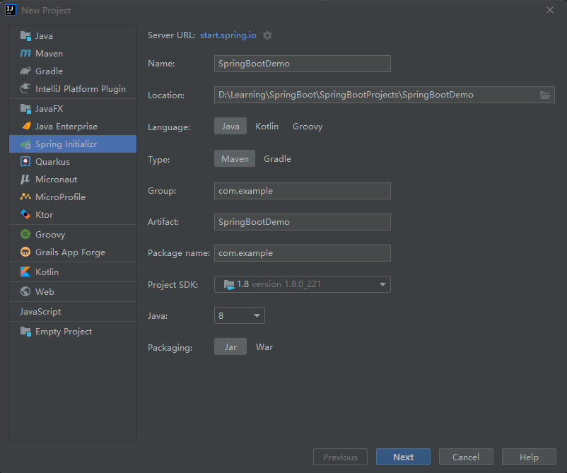

# 创建项目




## 添加依赖

```xml
<dependency>
    <groupId>org.springframework.boot</groupId>
    <artifactId>spring-boot-starter-web</artifactId>
</dependency>
```

## 多环境配置

`application.properties`：

```properties
spring.profiles.active=dev
```

`application-dev.properties`：

```properties
server.port=8081
```

`application-uat.properties`：

```properties
server.port=8082
```


# 添加数据库

## 添加依赖

```xml
<!-- MySQL驱动 -->
<dependency>
    <groupId>mysql</groupId>
    <artifactId>mysql-connector-java</artifactId>
</dependency>

<!-- MyBatis整合SpringBoot的起步依赖 -->
<dependency>
    <groupId>org.mybatis.spring.boot</groupId>
    <artifactId>mybatis-spring-boot-starter</artifactId>
    <version>2.2.0</version>
</dependency>
```


## 创建表

```mysql
drop table if exists t_student;
create table t_student 
(
   id          int(10)           not null auto_increment,
   name     varchar(20)   null,
   age        int(10)           null,
   constraint PK_T_STUDENT primary key clustered (id)
);
 
insert into t_student(name, age) values("zhangsan", 25);
insert into t_student(name, age) values("lisi", 28);
insert into t_student(name, age) values("wangwu", 23);
insert into t_student(name, age) values("Tom", 21);
insert into t_student(name, age) values("Jck", 55);
insert into t_student(name, age) values("Lucy", 27);
insert into t_student(name, age) values("zhaoliu", 75);
```


## 配置文件

```properties
# 连接数据的配置
spring.datasource.driver-class-name=com.mysql.cj.jdbc.Driver
spring.datasource.url=jdbc:mysql://localhost:3306/springboot_mybatis?useSSL=false&serverTimezone=Asia/Shanghai&characterEncoding=utf-8&autoReconnect=true
spring.datasource.username=root
spring.datasource.password=120618

# 指定MyBatis映射文件的路径
mybatis.mapper-locations=classpath:mapper/*.xml
```


# 添加Swagger


## 添加依赖

```xml
<!-- https://mvnrepository.com/artifact/io.springfox/springfox-swagger2 -->
<dependency>
    <groupId>io.springfox</groupId>
    <artifactId>springfox-swagger2</artifactId>
    <version>2.9.2</version>
</dependency>

<!-- https://mvnrepository.com/artifact/io.springfox/springfox-swagger-ui -->
<dependency>
    <groupId>io.springfox</groupId>
    <artifactId>springfox-swagger-ui</artifactId>
    <version>2.9.2</version>
</dependency>

<!-- https://mvnrepository.com/artifact/com.github.xiaoymin/knife4j-spring-boot-starter -->
<dependency>
    <groupId>com.github.xiaoymin</groupId>
    <artifactId>knife4j-spring-boot-starter</artifactId>
    <version>2.0.9</version>
</dependency>
```


## 配置

```java
package com.example.config;

import org.springframework.context.annotation.Bean;
import org.springframework.context.annotation.Configuration;
import org.springframework.core.env.Environment;
import org.springframework.core.env.Profiles;
import springfox.documentation.builders.ApiInfoBuilder;
import springfox.documentation.builders.ParameterBuilder;
import springfox.documentation.builders.PathSelectors;
import springfox.documentation.builders.RequestHandlerSelectors;
import springfox.documentation.schema.ModelRef;
import springfox.documentation.service.ApiInfo;
import springfox.documentation.service.Parameter;
import springfox.documentation.spi.DocumentationType;
import springfox.documentation.spring.web.plugins.Docket;
import springfox.documentation.swagger2.annotations.EnableSwagger2;

import java.util.ArrayList;
import java.util.List;

/**
 * @author chenzufeng
 * @date 2021/11/11
 * @usage SwaggerConfig
 */
@Configuration
@EnableSwagger2
public class SwaggerConfig {
    @Bean
    public Docket createRestApi(Environment environment) {

        // 设置要显示的Swagger环境：是否返回dev，spring.profiles.active=dev（org.springframework.core.env）
        Profiles profiles = Profiles.of("dev");
        // 获取项目的环境
        boolean environmentFlag = environment.acceptsProfiles(profiles);

        return new Docket(DocumentationType.SWAGGER_2)
                .apiInfo(apiInfo())
                // 只能在.select()前添加；配置是否启用Swagger，如果是false，在浏览器将无法访问
                .enable(environmentFlag)
                .groupName("HelloSwagger")

                // 通过 select()方法，去配置扫描接口
                .select()
                // RequestHandlerSelectors 配置如何扫描接口
                .apis(RequestHandlerSelectors.basePackage("com.example.controller"))
                // 配置如何通过path过滤，PathSelectors.ant("/example/**")：只扫描请求以/example开头的接口
                .paths(PathSelectors.any())
                .build()
                .globalOperationParameters(getParameterList());
    }

    private ApiInfo apiInfo() {
        return new ApiInfoBuilder()
                .title("SpringBootDemo接口文档")
                .description("SpringBootDemo接口文档")
                .version("1.0.0.RELEASE")
                // 使用了创建者设计模式
                .build();
    }

    /**
     * 设置请求头
     * @return List<Parameter>
     */
    private List<Parameter> getParameterList() {
        ParameterBuilder headers = new ParameterBuilder();
        List<Parameter> parameters = new ArrayList<>();

        Parameter cookieParam = headers.name("Cookie")
                .description("Cookie").modelRef(new ModelRef("String"))
                .parameterType("header").required(false)
                .build();

        Parameter authorization = headers.name("Authorization")
                .description("IAM Token").modelRef(new ModelRef("String"))
                .parameterType("header").required(false)
                .build();

        Parameter contentTypeParam = headers.name("Content-Type")
                .description("Content-Type").modelRef(new ModelRef("String"))
                .parameterType("header").required(false)
                .defaultValue("application/json;charset=UTF-8")
                .build();

        parameters.add(cookieParam);
        parameters.add(authorization);
        parameters.add(contentTypeParam);
        return parameters;
    }
}
```

## 测试地址

http://localhost:8080/doc.html#/home

# 添加日志 SLF4J+LogBack

## 导入依赖

```xml
<!-- https://mvnrepository.com/artifact/ch.qos.logback/logback-classic
  实现了Slf4j的API，当想配合Slf4j使用时，需要引入logback-classic-->
<dependency>
    <groupId>ch.qos.logback</groupId>
    <artifactId>logback-classic</artifactId>
    <version>1.2.3</version>
</dependency>
```

## 添加配置文件

```xml
<?xml version="1.0" encoding="UTF-8"?>
<configuration debug="false">

    <!--定义日志文件的存储地址：当前项目HelloIOStream下log文件夹-->
    <property name="LOG_HOME" value="log" />

    <!--控制台日志， 控制台输出 -->
    <appender name="CONSOLE" class="ch.qos.logback.core.ConsoleAppender">
        <encoder class="ch.qos.logback.classic.encoder.PatternLayoutEncoder">
            <!--格式化输出：%d表示日期，%thread表示线程名，%-5level：级别从左显示5个字符宽度，%msg：日志消息，%n是换行符-->
            <pattern>%d{yyyy-MM-dd HH:mm:ss.SSS} [%thread] %-5level %logger{50} - %msg%n</pattern>
        </encoder>
    </appender>

    <!--文件日志， 按照每天生成日志文件 -->
    <appender name="FILE" class="ch.qos.logback.core.rolling.RollingFileAppender">
        <rollingPolicy class="ch.qos.logback.core.rolling.TimeBasedRollingPolicy">
            <!--日志文件输出的文件名-->
            <FileNamePattern>${LOG_HOME}/HelloIOStream.%d{yyyy-MM-dd}.log</FileNamePattern>
            <!--日志文件保留天数-->
            <MaxHistory>30</MaxHistory>
        </rollingPolicy>

        <encoder class="ch.qos.logback.classic.encoder.PatternLayoutEncoder">
            <!--格式化输出：%d表示日期，%thread表示线程名，%-5level：级别从左显示5个字符宽度，%msg：日志消息，%n是换行符-->
            <pattern>%d{yyyy-MM-dd HH:mm:ss.SSS} [%thread] %-5level %logger{50} - %msg%n</pattern>
        </encoder>

        <!--日志文件最大的大小-->
        <triggeringPolicy class="ch.qos.logback.core.rolling.SizeBasedTriggeringPolicy">
            <MaxFileSize>10MB</MaxFileSize>
        </triggeringPolicy>
    </appender>

    <!-- 日志输出级别 -->
    <root level="I">
        <appender-ref ref="CONSOLE" />
        <appender-ref ref="FILE"/>
    </root>
</configuration>
```

## SpringBoot设置日志

```properties
logging.level.root=info
```


# 统一数据处理

`D:\MyNotes\SpringBootDemo\src\main\java\com\example\utils\Constants.java`

```java
package com.example.utils;

/**
 * @date 2021/11/11
 */
public class Constants {
    /**
     * Result类使用常量
     */
    public enum ResultConstants {
        ;
        /**
         * 操作成功编码
         */
        public static final String CODE_SUCCESS = "200";
        /**
         * 操作成功提示信息
         */
        public static final String MSG_SUCCESS = "操作成功";

        /**
         * 操作失败编码
         */
        public static final String CODE_FAIL = "400";
        /**
         * 操作失败提示信息
         */
        public static final String MSG_FAIL = "操作失败";

        /**
         * 操作失败编码
         */
        public static final String CODE_INVALID_FAIL = "401";
        /**
         * 操作失败提示信息
         */
        public static final String MSG_INVALID_FAIL = "校验未通过";

        /**
         * 未登录编码
         */
        public static final String CODE_FAIL_NOT_LOGIN = "305";

        /**
         * 未登录提示信息
         */
        public static final String MSG_FAIL_NOT_LOGIN = "未登录";
    }
}

```

`D:\MyNotes\SpringBootDemo\src\main\java\com\example\utils\Result.java`

```java
package com.example.utils;

/**
 * @date 2021/11/11
 */
public class Result {
    private String code;
    private Boolean success;
    private String message;
    private Object data;

    private Result(Boolean success, String code, String message, Object data) {
        this.success = success;
        this.code = code;
        this.message = message;
        this.data = data;
    }

    /**
     * 调用成功
     * @param code 编码
     * @param message 详细信息
     * @param data 数据
     * @return 统一结果格式
     */
    public static Result success(String code, String message, Object data) {
        return new Result(true, code, message, data);
    }

    public static Result success(String code, Object data) {
        return success(code, Constants.ResultConstants.MSG_SUCCESS, data);
    }

    public static Result success(Object data) {
        return success(Constants.ResultConstants.CODE_SUCCESS, data);
    }

    public static Result success(String code, String message) {
        return success(code, message, null);
    }

    public static Result success(String message) {
        return success(Constants.ResultConstants.CODE_SUCCESS, message, null);
    }

    public static Result success() {
        return success(Constants.ResultConstants.MSG_SUCCESS);
    }

    /**
     * 调用失败
     * @param code 编码
     * @param message 详细信息
     * @param data 数据
     * @return 统一结果格式
     */
    public static Result fail(String code, String message, Object data) {
        return new Result(false, code, message, data);
    }

    public static Result fail(String code, String message) {
        return fail(code, message, null);
    }

    public static Result fail(String code, Object data) {
        return fail(code, Constants.ResultConstants.MSG_FAIL, data);
    }

    public static Result failCode(String code) {
        return fail(code, Constants.ResultConstants.MSG_FAIL);
    }

    public static Result failMessage(String message) {
        return fail(Constants.ResultConstants.CODE_FAIL, message);
    }

    public static Result fail() {
        return fail(Constants.ResultConstants.CODE_FAIL, Constants.ResultConstants.MSG_FAIL);
    }

    public String getCode() {
        return code;
    }

    public void setCode(String code) {
        this.code = code;
    }

    public Boolean getSuccess() {
        return success;
    }

    public void setSuccess(Boolean success) {
        this.success = success;
    }

    public String getMessage() {
        return message;
    }

    public void setMessage(String message) {
        this.message = message;
    }

    public Object getData() {
        return data;
    }

    public void setData(Object data) {
        this.data = data;
    }
}
```

# 全局异常处理

## 自定义异常

`D:\MyNotes\SpringBootDemo\src\main\java\com\example\exception\CustomException.java`

```java
package com.example.exception;

import com.example.utils.Constants;

/**
 * @date 2021/11/11
 */
public class CustomException extends RuntimeException {
    private String code = Constants.ResultConstants.MSG_FAIL;

    private String message;

    public CustomException(String message) {
        super(message);
        this.message = message;
    }

    public CustomException(String code, String message) {
        super(message);
        this.code = code;
        this.message = message;
    }

    public String getCode() {
        return code;
    }

    public void setCode(String code) {
        this.code = code;
    }

    @Override
    public String getMessage() {
        return message;
    }

    public void setMessage(String message) {
        this.message = message;
    }
}

```


`D:\MyNotes\SpringBootDemo\src\main\java\com\example\exception\GlobalExceptionHandler.java`

```java
package com.example.exception;

import com.example.utils.Result;
import org.slf4j.Logger;
import org.slf4j.LoggerFactory;
import org.springframework.web.bind.annotation.ExceptionHandler;
import org.springframework.web.bind.annotation.RestControllerAdvice;

/**
 * 全局异常处理
 * @date 2021/11/11
 */
@RestControllerAdvice
public class GlobalExceptionHandler {
    private static final Logger logger = LoggerFactory.getLogger(GlobalExceptionHandler.class);

    /**
     * 处理 Exception 异常
     * @param exception Exception 异常
     * @return Result
     */
    @ExceptionHandler(Exception.class)
    public Result handlerException(Exception exception) {
        logger.warn("GlobalExceptionHandler handlerException：{}", exception);
        return Result.failMessage("系统异常！");
    }

    /**
     * 处理空指针异常
     * @param nullPointerException 空指针异常
     * @return Result
     */
    @ExceptionHandler(NullPointerException.class)
    public Result handlerNullPointerException(NullPointerException nullPointerException) {
        logger.warn("GlobalExceptionHandler handlerNullPointerException：{}", nullPointerException);
        return Result.failMessage("空指针异常！");
    }

    /**
     * 处理运行时异常
     * @param runtimeException 运行时异常
     * @return Result
     */
    @ExceptionHandler(RuntimeException.class)
    public Result handlerRuntimeException(RuntimeException runtimeException) {
        logger.warn("GlobalExceptionHandler handlerRuntimeException：{}", runtimeException);
        return Result.failMessage(runtimeException.getMessage());
    }

    /**
     * 处理自定义异常
     * @param customException 自定义异常
     * @return Result
     */
    @ExceptionHandler(CustomException.class)
    public Result handlerCustomException(CustomException customException) {
        logger.warn("GlobalExceptionHandler handlerCustomException：{}", customException);
        return Result.fail(customException.getCode(), customException.getMessage());
    }
}
```

## 测试

```java
package com.example.controller;

import com.example.exception.CustomException;
import com.example.utils.Constants;
import io.swagger.annotations.Api;
import io.swagger.annotations.ApiOperation;
import org.springframework.web.bind.annotation.GetMapping;
import org.springframework.web.bind.annotation.RequestMapping;
import org.springframework.web.bind.annotation.RestController;

/**
 * @date 2021/11/11
 */
@Api(tags = "StudentInfo")
@RestController
@RequestMapping("/StudentInfo")
public class StudentInfoController {

    @ApiOperation(value = "testCustomException")
    @GetMapping("/testCustomException")
    public void testCustomException(Integer integer) {
        if (integer == null) {
            throw new CustomException(Constants.ResultConstants.CODE_FAIL, "入参不能为空！");
        }
    }

    @ApiOperation(value = "testNullPointException")
    @GetMapping("/testNullPointException")
    public void testNullPointException() {
        String str = null;
        str.equals("str");
    }

    @ApiOperation(value = "testException")
    @GetMapping("/testException")
    public void testException() {
        Integer.parseInt("a");
    }
}
```


# 完善项目

## 分页查询

### 添加依赖

```xml
<!-- https://mvnrepository.com/artifact/com.github.pagehelper/pagehelper-spring-boot-starter -->
<dependency>
    <groupId>com.github.pagehelper</groupId>
    <artifactId>pagehelper-spring-boot-starter</artifactId>
    <version>1.4.0</version>
</dependency>
```

### controller

```java
package com.example.controller;

@Api(tags = "StudentInfo")
@RestController
@RequestMapping("/StudentInfo")
public class StudentInfoController {

    @Autowired
    private StudentService studentService;

    @GetMapping("/getStudentInfoByPage")
    @ApiOperation(value = "分页查询学生信息")
    @ApiImplicitParams({
            @ApiImplicitParam(name = "pageNum", value = "第几页", required = true),
            @ApiImplicitParam(name = "pageSize", value = "每页展示条数", required = true)
    })
    public Result getStudentInfoByPage(
            @RequestParam(defaultValue = "1") Integer pageNum,
            @RequestParam(defaultValue = "2") Integer pageSize
    ) {
        PageHelper.startPage(pageNum, pageSize);
        List<Student> students = studentService.getStudentInfoByPage();
        PageInfo<Student> studentPageInfo = new PageInfo<>(students);
        return Result.success(studentPageInfo);
    }
}
```

### service

```java
package com.example.service;

import com.example.entity.Student;

import java.util.List;

/**
 * @date 2021/11/11
 */
public interface StudentService {
    /**
     * 分页查询学生信息
     * @return List<Student>
     */
    List<Student> getStudentInfoByPage();
}


package com.example.service.impl;

import com.example.dao.StudentDao;
import com.example.entity.Student;
import com.example.service.StudentService;
import org.springframework.beans.factory.annotation.Autowired;
import org.springframework.stereotype.Service;

import java.util.List;

/**
 * @date 2021/11/11
 */
@Service
public class StudentServiceImpl implements StudentService {
    @Autowired
    private StudentDao studentDao;

    /**
     * 分页查询学生信息
     * @return List<Student>
     */
    @Override
    public List<Student> getStudentInfoByPage() {
        return studentDao.getStudentInfoByPage();
    }
}
```

### dao

```java
package com.example.dao;

import com.example.entity.Student;
import org.apache.ibatis.annotations.Mapper;

import java.util.List;

/**
 * @date 2021/11/11
 */
@Mapper
public interface StudentDao {
    /**
     * 分页查询学生信息
     * @return List<Student>
     */
    List<Student> getStudentInfoByPage();
}
```


# 添加切面

## 添加依赖

```xml
<dependency>
    <groupId>org.springframework.boot</groupId>
    <artifactId>spring-boot-starter-aop</artifactId>
</dependency>
```