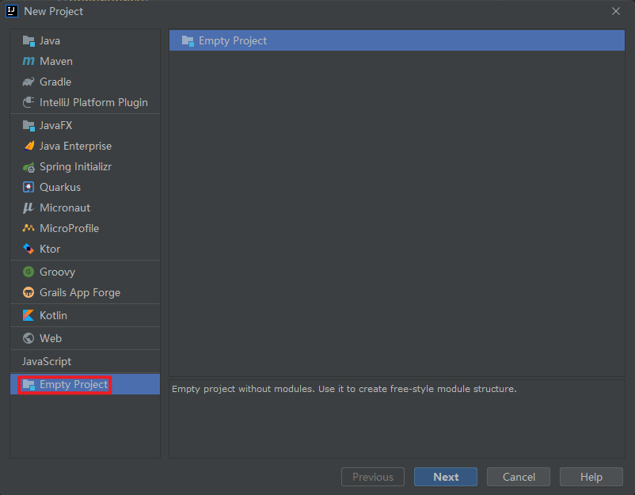
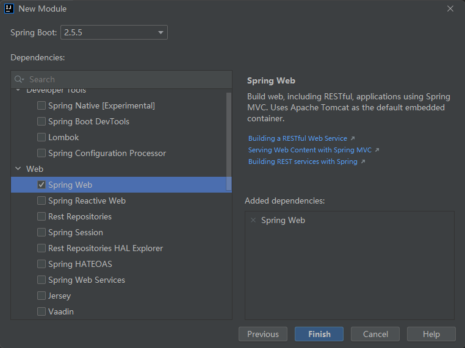

# HelloSpringBoot

## 创建工程



路径：


## 创建 Module




```xml
<!-- SpringBoot 框架 Web 项目起步依赖 -->
<dependency>
    <groupId>org.springframework.boot</groupId>
    <artifactId>spring-boot-starter-web</artifactId>
</dependency>
```

## pom.xml

```xml
<?xml version="1.0" encoding="UTF-8"?>
<project xmlns="http://maven.apache.org/POM/4.0.0" xmlns:xsi="http://www.w3.org/2001/XMLSchema-instance"
         xsi:schemaLocation="http://maven.apache.org/POM/4.0.0 https://maven.apache.org/xsd/maven-4.0.0.xsd">
    <modelVersion>4.0.0</modelVersion>

    <!-- 继承 SpringBoot 框架的一个父项目，所有开发的 SpringBoot 都必须继承 -->
    <parent>
        <groupId>org.springframework.boot</groupId>
        <artifactId>spring-boot-starter-parent</artifactId>
        <version>2.5.5</version>
        <relativePath/> <!-- lookup parent from repository -->
    </parent>

    <!-- 当前项目的 GAV 坐标 -->
    <groupId>com.example</groupId>
    <artifactId>FirstDemo</artifactId>
    <version>0.0.1-SNAPSHOT</version>

    <!-- Maven 项目名称、描述，可以删除-->
    <name>FirstDemo</name>
    <description>FirstDemo</description>

    <!-- Maven 属性配置，可以在其它地方通过 ${} 方式进行引用-->
    <properties>
        <java.version>1.8</java.version>
    </properties>

    <dependencies>
        <!-- SpringBoot 框架 Web 项目起步依赖 -->
        <dependency>
            <groupId>org.springframework.boot</groupId>
            <artifactId>spring-boot-starter-web</artifactId>
        </dependency>

        <dependency>
            <groupId>org.springframework.boot</groupId>
            <artifactId>spring-boot-starter-test</artifactId>
            <scope>test</scope>
        </dependency>
    </dependencies>

    <build>
        <plugins>
            <!-- SpringBoot 项目打包编译插件 -->
            <plugin>
                <groupId>org.springframework.boot</groupId>
                <artifactId>spring-boot-maven-plugin</artifactId>
            </plugin>
        </plugins>
    </build>

</project>
```

## 编写控制层

```java
package com.example.controller;

import org.springframework.web.bind.annotation.RequestMapping;
import org.springframework.web.bind.annotation.ResponseBody;
import org.springframework.web.bind.annotation.RestController;

/**
 * @author chenzufeng
 * @date 2021/10/13
 * @usage HelloController
 */
@RestController
public class HelloController {
    @RequestMapping(value = "/helloSpringBoot")
    public String helloSpringBoot() {
        return "Hello SpringBoot !";
    }
}
```


## 修改配置文件

```properties
# 设置内嵌 Tomcat 端口号
server.port=8081

# 配置项目上下文根
server.servlet.context-path=/firstSpringBootDemo
```

启动项目显示：

```markdown
Tomcat started on port(s): 8081 (http) with context path '/firstSpringBootDemo'
```

