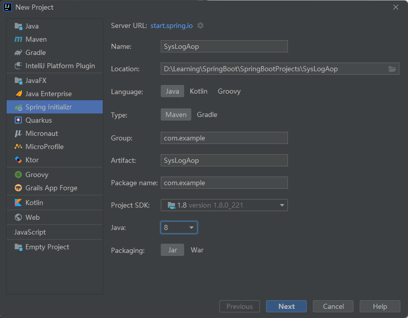
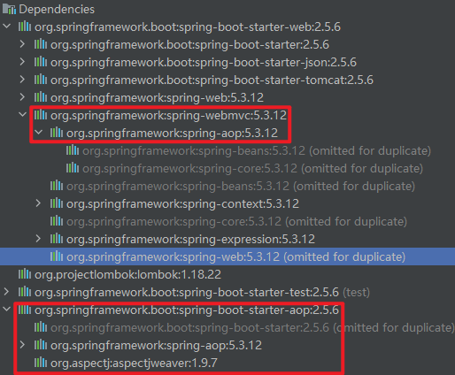

# 实例

参考链接：

[https://blog.csdn.net/zhuzhezhuzhe1/article/details/80565067](https://blog.csdn.net/zhuzhezhuzhe1/article/details/80565067)

[https://cloud.tencent.com/developer/article/1457465](https://cloud.tencent.com/developer/article/1457465)

面向切面编程可以让开发更加低耦合，大大减少代码量，同时让程序员更专注于业务模块的开发，把那些与业务无关的东西提取出去，便于后期的维护和迭代。

## 搭建环境



## 引入依赖

```xml
<dependency>
    <groupId>org.springframework.boot</groupId>
    <artifactId>spring-boot-starter-web</artifactId>
</dependency>

<dependency>
    <groupId>org.springframework.boot</groupId>
    <artifactId>spring-boot-starter-aop</artifactId>
</dependency>
```



## 日志实体类、service、controller和日志注解

### 实体类

```java
package com.example.entity;

import lombok.Data;
controller
/**
 * @author chenzufeng
 * @date 2021/11/2
 * @usage SysLogBO
 */
@Data
public class SysLogBO {
    
    private String className;

    private String methodName;

    private String params;

    private Long executeTime;

    private String remark;

    private String createDate;
}
```

### service

```java
package com.example.service;

import com.example.entity.SysLogBO;
import lombok.extern.slf4j.Slf4j;
import org.springframework.stereotype.Service;

/**
 * @author chenzufeng
 * @date 2021/11/2
 * @usage SysLogService
 * @Slf4j 相当于 private final Logger logger = LoggerFactory.getLogger(X.class);
 */
@Slf4j
@Service
public class SysLogService {
    public boolean save(SysLogBO sysLogBO) {
        log.info(sysLogBO.getParams());
        return true;
    }
}
```

### controller

```java
package com.example.controller;

import com.example.annotation.SysLog;
import org.springframework.web.bind.annotation.GetMapping;
import org.springframework.web.bind.annotation.RequestMapping;
import org.springframework.web.bind.annotation.RequestParam;
import org.springframework.web.bind.annotation.RestController;

/**
 * @author chenzufeng
 * @date 2021/11/2
 * @usage SysLogAopController
 */
@RestController
@RequestMapping("/aop")
public class SysLogAopController {
    @SysLog("测试AOP")
    @GetMapping("/test")
    public String test(
            @RequestParam("name") String name, 
            @RequestParam("age") Integer age) {
        return name + " " + age;
    }
}
```


### 注解

```java
package com.example.annotation;

import java.lang.annotation.*;

/**
 * @author chenzufeng
 * @date 2021/11/2
 * @usage SysLog 定义系统日志注解
 */
@Target(ElementType.METHOD)
@Retention(RetentionPolicy.RUNTIME)
@Documented
public @interface SysLog {
    String value() default "";
}
```

## 声明切面

```java
package com.example.aspect;

import com.example.annotation.SysLog;
import com.example.entity.SysLogBO;
import com.example.service.SysLogService;
import org.aspectj.lang.ProceedingJoinPoint;
import org.aspectj.lang.annotation.Around;
import org.aspectj.lang.annotation.Aspect;
import org.aspectj.lang.annotation.Pointcut;
import org.aspectj.lang.reflect.MethodSignature;
import org.springframework.beans.factory.annotation.Autowired;
import org.springframework.stereotype.Component;

import java.lang.reflect.Method;
import java.text.SimpleDateFormat;
import java.util.ArrayList;
import java.util.Date;

/**
 * @author chenzufeng
 * @date 2021/11/2
 * @usage SysLogAspect 系统日志切面
 * 使用@Aspect注解声明一个切面
 */
@Aspect
@Component
public class SysLogAspect {

    @Autowired
    private SysLogService sysLogService;

    @Pointcut("@annotation(com.example.annotation.SysLog)")
    public void logPointCut() {}

    @Around("logPointCut()")
    public Object around(ProceedingJoinPoint proceedingJoinPoint) throws Throwable {
        long beginTime = System.currentTimeMillis();
        Object result = proceedingJoinPoint.proceed();
        long time = System.currentTimeMillis() - beginTime;
        saveLog(proceedingJoinPoint, time);
        return  result;
    }

    private void saveLog(ProceedingJoinPoint proceedingJoinPoint, long time) {
        MethodSignature signature = (MethodSignature) proceedingJoinPoint.getSignature();
        Method method = signature.getMethod();

        SysLogBO sysLogBO = new SysLogBO();

        sysLogBO.setExecuteTime(time);

        SimpleDateFormat simpleDateFormat = new SimpleDateFormat("yyyy-MM-dd hh:mm:ss");
        sysLogBO.setCreateDate(simpleDateFormat.format(new Date()));

        SysLog sysLog = method.getAnnotation(SysLog.class);
        if (sysLog != null) {
            sysLogBO.setRemark(sysLog.value());
        }

        String className = proceedingJoinPoint.getTarget().getClass().getName();
        String methodName = signature.getName();
        sysLogBO.setClassName(className);
        sysLogBO.setMethodName(methodName);

        Object[] args = proceedingJoinPoint.getArgs();
        ArrayList<String> list = new ArrayList<>();
        for (Object arg : args) {
            list.add(arg.toString());
        }
        sysLogBO.setParams(list.toString());

        sysLogService.save(sysLogBO);
    }
}
```

