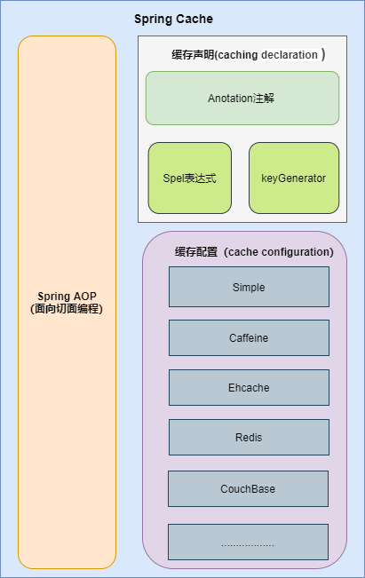
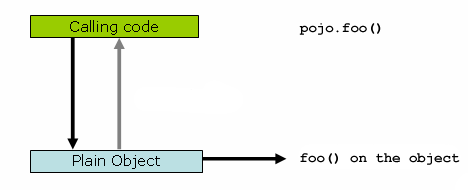
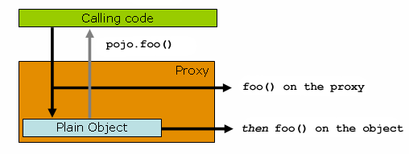
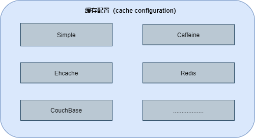

# SpringCache 介绍[^1]

## 硬编码使用缓存[^4]

为了提升用户信息的查询效率，我们对用户信息使用了缓存，示例代码如下：

```java
@Autowire
private UserMapper userMapper;

@Autowire
private RedisCache redisCache;

// 查询用户
public User getUserById(Long userId) {
    // 定义缓存key
    String cacheKey = "userId_" + userId;
    // 先查询redis缓存
    User user = redisCache.get(cacheKey);
    // 如果缓存中有就直接返回，不再查询数据库
    if (user != null) {
        return user;
    }
    // 没有再查询数据库
    user = userMapper.getUserById(userId);

    // 数据存入缓存，这样下次查询就能到缓存中获取
    if (user != null) {
        stringCommand.set(cacheKey, user);
    }

    return user;
}
```

这种风格符合面向过程的编程思维，非常容易理解。但它也有一些缺点：

代码不够优雅。业务逻辑有四个典型动作：**「存储，读取，修改，删除」**。每次操作都需要定义缓存Key ，调用缓存命令的API，产生较多的重复代码；

缓存操作和业务逻辑之间的代码耦合度高，对业务逻辑有较强的侵入性。侵入性主要体现如下两点：

- **开发联调阶段，需要去掉缓存，只能注释或者临时删除缓存操作代码，也容易出错**；
- **某些场景下，需要更换缓存组件，每个缓存组件有自己的API，更换成本颇高**。

优化：

```java
@Mapper
public interface UserMapper  {
    /**
    * 根据用户id获取用户信息
    * 如果缓存中有直接返回缓存数据，如果没有那么就去数据库查询，查询完再插入缓存中
    * 这里缓存的key前缀为cache_user_id_，+传入的用户ID
    */
    @Cacheable(key = "'cache_user_id_' + #userId")
    User getUserById(Long userId);
}
```

实现类：

```java
@Autowire
private UserMapper userMapper;

// 查询用户
public User getUserById(Long userId) {
    return userMapper.getUserById(userId);
}
```

这种实现方式完全和缓存分离开来，如果开发联调阶段，需要去掉缓存那么直接注释掉注解就好了！

这一整套实现都不要自己手动写，Spring Cache就已经定义好相关注解和接口，我们可以轻易实现上面的功能。

## Spring Cache简介

Spring Cache 不是一个具体的缓存实现方案，而是一个对缓存使用的抽象(**Cache Abstraction**)：



| 概念/注解      | 作用                                                         |
| :------------- | :----------------------------------------------------------- |
| @Cacheable     | 主要针对方法配置，能够根据方法的请求参数对其结果进行缓存     |
| @CacheEvict    | 清空缓存                                                     |
| @CachePut      | 保证方法被调用，又希望结果被缓存。                           |
| @EnableCaching | 开启基于注解的缓存                                           |
| Cache          | ==缓存接口，定义缓存操作==。实现有：RedisCache、EhCacheCache、ConcurrentMapCache等 |
| CacheManager   | ==缓存管理器，管理各种缓存(Cache)组件==。                    |
| keyGenerator   | 缓存数据时key生成策略                                        |
| serialize      | 缓存数据时value序列化策略                                    |

Spring Cache是Spring-context包中提供的基于注解方式使用的缓存组件，定义了一些标准接口，通过实现这些接口，就可以通过在方法上增加注解来实现缓存。这样就能够避免缓存代码与业务处理耦合在一起的问题。

## Spring Cache核心接口

Spring Cache核心的接口就两个：`Cache`和`CacheManager`[^4]

### Cache接口

除了RedisCache是在`spring-data-redis`包中，其他的基本都是在`spring-context-support`包中。

该接口定义提供缓存的具体操作，比如缓存的放入、读取、清理：

```java
package org.springframework.cache;

import java.util.concurrent.Callable;
import org.springframework.lang.Nullable;

/**
 * Interface that defines common cache operations.
 */
public interface Cache {

	/**
	 * Return the cache name.
	 * cacheName，缓存的名字，默认实现中一般是CacheManager创建Cache的bean时传入cacheName
	 */
	String getName();

	/**
	 * Return the underlying native cache provider.
	 * 得到底层使用的缓存，如Ehcache
	 */
	Object getNativeCache();

	/**
	 * Return the value to which this cache maps the specified key.
	 * 通过key获取缓存值，返回的是ValueWrapper，
	 * 为了兼容存储空值的情况，将返回值包装了一层，通过get方法获取实际值
	 */
	@Nullable
	ValueWrapper get(Object key);

	/**
	 * Return the value to which this cache maps the specified key,
	 * generically specifying a type that return value will be cast to.
	 * 通过key获取缓存值，返回的是实际值，即方法的返回值类型
	 */
	@Nullable
	<T> T get(Object key, @Nullable Class<T> type);

	/**
	 * 通过key获取缓存值，可以使用valueLoader.call()来调使用@Cacheable注解的方法。
	 * 当@Cacheable注解的sync属性配置为true时使用此方法。
	 * 因此方法内需要保证回源到数据库的同步性。避免在缓存失效时大量请求回源到数据库。
	 */
	@Nullable
	<T> T get(Object key, Callable<T> valueLoader);

	/**
	 * Associate the specified value with the specified key in this cache.
	 * 将@Cacheable注解方法返回的数据放入缓存中
	 */
	void put(Object key, @Nullable Object value);

	/**
	 * 当缓存中不存在key时才放入缓存。返回值是当key存在时原有的数据
	 */
	@Nullable
	default ValueWrapper putIfAbsent(Object key, @Nullable Object value) {
		ValueWrapper existingValue = get(key);
		if (existingValue == null) {
			put(key, value);
		}
		return existingValue;
	}

	/**
	 * Evict the mapping for this key from this cache if it is present.
	 * 删除缓存
	 */
	void evict(Object key);

	/**
	 * Evict the mapping for this key from this cache if it is present
	 */
	default boolean evictIfPresent(Object key) {
		evict(key);
		return false;
	}

	/**
	 * 清空缓存
	 */
	void clear();

	/**
	 * Invalidate the cache through removing all mappings, expecting all
	 * entries to be immediately invisible for subsequent lookups.
	 */
	default boolean invalidate() {
		clear();
		return false;
	}


	/**
	 * A (wrapper) object representing a cache value.
	 * 缓存返回值的包装
	 */
	@FunctionalInterface
	interface ValueWrapper {
		/**
		 * Return the actual value in the cache.
		 */
		@Nullable
		Object get();
	}
}
```

### CacheManager接口

主要提供Cache实现bean的创建，每个应用里可以通过cacheName来对Cache进行隔离，每个cacheName对应一个Cache实现。

```java
package org.springframework.cache;

import java.util.Collection;
import org.springframework.lang.Nullable;

public interface CacheManager {

	/**
	 * 通过cacheName创建Cache的实现bean，具体实现中需要存储已创建的Cache实现bean，避免重复创建，
	 * 也避免内存缓存对象（如Caffeine）重新创建后原来缓存内容丢失的情况
	 */
	@Nullable
	Cache getCache(String name);

	/**
	 * 返回所有的cacheName
	 */
	Collection<String> getCacheNames();

}
```


## Spring AOP

Spring AOP是基于代理模式（**proxy-based**）。

通常情况下，定义一个对象，调用它的方法的时候，方法是直接被调用的：

```java
Pojo pojo = new SimplePojo();
pojo.foo();
```



将代码做一些调整，pojo对象的引用修改成代理类：

```java
ProxyFactory factory = new ProxyFactory(new SimplePojo());
factory.addInterface(Pojo.class);
factory.addAdvice(new RetryAdvice());

Pojo pojo = (Pojo) factory.getProxy(); 
//this is a method call on the proxy!
pojo.foo();
```



如上图所示，这个时候，实际客户端拥有的是一个代理的引用，那么在调用 foo() 方法的时候，会首先调用 proxy 的 foo() 方法，这个时候 proxy 可以整体控制实际的 pojo.foo() 方法的入参和返回值，比如缓存结果，比如直接略过执行实际的 foo() 方法等，都是可以轻松做到的。即，<font color=red>Spring Cache 的注解会帮忙在方法上创建一个切面（aspect），并触发缓存注解的切点（poinitcut）</font>[^5]。

代理类在方法调用前可以获取方法的参数，当调用方法结束后，可以获取调用该方法的返回值，通过这种方式就可以实现缓存的逻辑。


## 缓存配置

Spring Cache是一个对缓存使用的抽象，它提供了多种存储集成：



要使用它们，需要简单地声明一个适当的`CacheManager`：一个控制和管理`Cache`的实体。

CacheManager非常简单：

```java
public interface CacheManager {
    @Nullable
    Cache getCache(String name);

    Collection<String> getCacheNames();
}
```

在`CacheConfigurations`配置类中，可以看到不同集成类型有不同的缓存配置类：

```java
static {
    Map<CacheType, String> mappings = new EnumMap(CacheType.class);
    mappings.put(CacheType.GENERIC, GenericCacheConfiguration.class.getName());
    mappings.put(CacheType.EHCACHE, EhCacheCacheConfiguration.class.getName());
    mappings.put(CacheType.HAZELCAST, HazelcastCacheConfiguration.class.getName());
    mappings.put(CacheType.INFINISPAN, InfinispanCacheConfiguration.class.getName());
    mappings.put(CacheType.JCACHE, JCacheCacheConfiguration.class.getName());
    mappings.put(CacheType.COUCHBASE, CouchbaseCacheConfiguration.class.getName());
    mappings.put(CacheType.REDIS, RedisCacheConfiguration.class.getName());
    mappings.put(CacheType.CAFFEINE, CaffeineCacheConfiguration.class.getName());
    mappings.put(CacheType.SIMPLE, SimpleCacheConfiguration.class.getName());
    mappings.put(CacheType.NONE, NoOpCacheConfiguration.class.getName());
    MAPPINGS = Collections.unmodifiableMap(mappings);
}
```

在配置文件(application.properties)中可以设置选择使用哪一个缓存：

```properties
spring.cache.type=caffeine
```


缓存配置需要实现两个接口：

- **org.springframework.cache.CacheManager**
- **org.springframework.cache.Cache**


# 注解[^2]

## @Cacheable

```java
package org.springframework.cache.annotation;

@Target({ElementType.TYPE, ElementType.METHOD})
@Retention(RetentionPolicy.RUNTIME)
@Inherited
@Documented
public @interface Cacheable {

	/**
	 * cacheNames，CacheManager就是通过这个名称创建对应的Cache实现bean
	 */
	@AliasFor("cacheNames")
	String[] value() default {};

	@AliasFor("value")
	String[] cacheNames() default {};

	/**
	 * 缓存的key，支持SpEL表达式。
	 * 默认是使用所有参数及其计算的hashCode包装后的对象（SimpleKey）
	 */
	String key() default "";

	/**
	 * 缓存key生成器，默认实现是SimpleKeyGenerator
	 */
	String keyGenerator() default "";

	/**
	 * The bean name of the custom {@link org.springframework.cache.CacheManager} to use to
	 * create a default {@link org.springframework.cache.interceptor.CacheResolver} if none
	 * is set already.
	 * 指定使用哪个CacheManager，如果只有一个可以不用指定
	 */
	String cacheManager() default "";

	/**
	 * 缓存解析器
	 */
	String cacheResolver() default "";

	/**
	 * 缓存的条件，支持SpEL表达式，当达到满足的条件时才缓存数据。在调用方法前后都会判断
	 */
	String condition() default "";

	/**
	 * 满足条件时不更新缓存，支持SpEL表达式，只在调用方法后判断
	 */
	String unless() default "";

	/**
	 * 回源到实际方法获取数据时，是否要保持同步，如果为false，调用的是Cache.get(key)方法；
	 * 如果为true，调用的是Cache.get(key, Callable)方法
	 */
	boolean sync() default false;
}
```


@Cacheable可以标记在一个方法上，也可以标记在一个类上。当标记在一个方法上时表示该方法是支持缓存的，当标记在一个类上时则表示该类所有的方法都是支持缓存的。

<font color=red>对于一个支持@Cacheable缓存的方法，Spring 会在其被调用后将其返回值缓存起来，以保证下次利用==同样的参数==来执行该方法时，可以直接从缓存中获取结果，而不需要再次执行该方法</font>。

缓存方法的返回值是以==键值对==进行缓存的，==值==是==方法的返回结果==；对于键，Spring 支持两种策略，默认策略和自定义策略。

注意：

<font color=red>当一个支持缓存的方法，在对象内部被调用时，是不会触发缓存功能的</font>。

示例：

```java
@Cacheable(value="user_cache", key="#userId", unless="#result == null")
public User getUserById(Long userId) {
    User user = userMapper.getUserById(userId);
    return user;
}
```

上面的代码片段里，`getUserById`方法和缓存`user_cache` 关联起来，若方法返回的User对象不为空，则缓存起来。第二次相同参数userId调用该方法的时候，直接从缓存中获取数据，并返回[^1]。

| 参数      | 解释                                                         | 示例                                                         |
| --------- | ------------------------------------------------------------ | ------------------------------------------------------------ |
| value     | ==缓存的名称==，可以在 spring 配置文件中定义，==必须指定==至少一个。 | @Cacheable(value=“myCache”)<br/>@Cacheable(value={“cache1”, “cache2”} |
| key       | 缓存的 key，可以为空。如果指定，要按照 SpEL 表达式编写；如果不指定，则缺省按照方法的所有参数进行组合。 | @Cacheable(value=“testcache”, key=“#userName”)               |
| condition | 缓存的条件，可以为空，使用 SpEL 编写，返回 true 或者 false，只有为 true 才进行缓存。 | @Cacheable(value=“testcache”, condition=“#userName.length()>2”) |

### value 属性

value 属性是==必须指定==的，其表示==当前方法的返回值==会被缓存在哪个Cache上，对应 Cache 的名称。其可以是一个 Cache，也可以是多个Cache，当需要指定多个Cache时，它是一个数组。

```java
// Cache是发生在cache1上的
@Cacheable("cache1")
public User find(Integer id) {
    returnnull;
}

// Cache是发生在cache1和cache2上的
@Cacheable({"cache1", "cache2"})
public User find(Integer id) {
    returnnull;
}
```

### key 属性

缓存的本质是`key-value`存储模式，每一次方法的调用都需要生成相应的Key，才能操作缓存[^1]。

key 属性是用来指定 Spring 缓存==方法的返回结果==对应的 key。该属性支持 SpringEL 表达式。当没有指定该属性时，Spring 将使用默认策略生成 key。

#### 默认策略

==一、默认策略==[^3]：默认的生成策略是`SimpleKeyGenerator`这个类：

```java
public class SimpleKeyGenerator implements KeyGenerator {
    public SimpleKeyGenerator() {
    }

    public Object generate(Object target, Method method, Object... params) {
        return generateKey(params);
    }

    public static Object generateKey(Object... params) {
        // 如果方法没有参数，key就是一个 new SimpleKey()
        if (params.length == 0) {
            return SimpleKey.EMPTY;
        } else {
            // 如果方法只有一个参数，key就是当前参数
            if (params.length == 1) {
                Object param = params[0];
                if (param != null && !param.getClass().isArray()) {
                    return param;
                }
            }
	    // 如果key是多个参数，key就是new SimpleKey ，不过这个SimpleKey对象的hashCode 和 Equals 方法是根据方法传入的参数重写的。
            return new SimpleKey(params);
        }
    }
}
```

分为三种情况：

- 方法没有参数，那就new使用一个全局空的`SimpleKey`对象来作为`key`。
- 方法就一个参数，就使用当前参数来作为`key`。
- 方法参数大于`1`个，就`new`一个`SimpleKey`对象来作为`key`，`new` 这个`SimpleKey`的时候用传入的参数重写了`SimpleKey`的`hashCode`和`equals`方法，
  至于为啥需要重写的原因，就跟`Map`用自定义对象来作为`key`的时候必须要重写`hashCode`和`equals`方法原理是一样的，因为`caffein`也是借助了`ConcurrentHashMap`来实现。

默认生成`key`只跟我们传入的参数有关系，如果我们有一个类里面如果存在多个没有参数的方法，然后我们使用了默认的缓存生成策略的话，就会造成==缓存丢失==。，或者==缓存相互覆盖==，或者还有可能会发生`ClassCastException`。因为都是使用同一个`key`。比如下面这代码就会发生异常(`ClassCastException`)：

```java
@Cacheable(value = "user")
public UserDTO getUser() {
    UserDTO userDTO = new UserDTO();
    userDTO.setUserName("Java金融");
    return userDTO;
}

@Cacheable(value = "user")
public UserDTO2 getUser1() {
    UserDTO2 userDTO2 = new UserDTO2();
    userDTO2.setUserName2("javajr.cn");
    return userDTO2;
}
```

所以一般<font color=red>不推荐使用默认的缓存生成`key`的策略</font>。如果非要用的话，最好重写一下，带上方法名字等。类似于如下代码：

```java
@Component
public class MyKeyGenerator extends SimpleKeyGenerator {
    @Override
    public Object generate(Object target, Method method, Object... params) {
        Object generate = super.generate(target, method, params);
        String format = MessageFormat.format("{0}{1}{2}", method.toGenericString(), generate);
        return format;
    }
}
```

#### 自定义策略

==二、自定义策略==是指，可以通过 SpringEL 表达式来指定key。这里的EL表达式可以使用方法参数及它们对应的属性。使用方法参数时，可以直接使用“`#参数名`”或者“`#p参数index`”：

```java
// 表示传入时的参数
@Cacheable(value = "users", key = "#id")
public User find(Integer id) {
    return null;
}

// 表示第一个参数
@Cacheable(value = "users", key = "#p0")
public User find(Integer id) {
    return null;
}

// 表示User中的id值
@Cacheable(value = "users", key = "#user.id")
public User find(User user) {
    return null;
}

// 表示第一个参数里的id属性值
@Cacheable(value = "users", key = "#p0.id")
public User find(User user) {
    return null;
}
```

除了上述使用方法参数作为 key 之外，Spring 还提供了一个 `root 对象`，可以用来生成 key。通过该root对象，可以获取到以下信息：

| 属性名称    | 描述                        | 示例                  |
| ----------- | --------------------------- | --------------------- |
| methodName  | 当前方法名                  | \#root.methodName     |
| method      | 当前方法                    | \#root.method.name    |
| target      | 当前被调用的对象            | #root.target          |
| targetClass | 当前被调用的对象的class     | \#root.targetClass    |
| args        | 当前方法参数组成的数组      | \#root.args[0]        |
| caches      | 当前被调用的方法使用的Cache | \#root.caches[0].name |

当要使用 root 对象的属性作为 key 时，可以将“`#root`”省略，因为 Spring 默认使用的就是 root 对象的属性。

### condition 属性

有的时候我们可能并不希望缓存一个方法所有的返回结果。通过 condition 属性可以实现这一功能。

condition 属性默认为空，表示将缓存所有的调用情形。其值是通过 SpringEL 表达式来指定的：

- 当为 true 时表示进行缓存处理；
- 当为 false 时表示不进行缓存处理，即每次调用该方法时，该方法都会执行一次。

如下示例表示只有当 user 的 id 为偶数时才会进行缓存：

```java
// 根据条件判断是否缓存
@Cacheable(value = {"users"}, key = "#user.id", condition = "#user.id%2==0")
public User find(User user) {
    System.out.println("find user by user " + user);
    return user;
}
```

除了condition，`unless`属性也可以决定结果是否缓存，不过是==在执行方法后==[^1]：

```java
@Cacheable(value="user_cache",key="#userId", unless="#result == null")
public User getUserById(Long userId) {......}
```

上面的代码片段里，<font color=red>当返回的结果为null则不缓存</font>。

## @CachePut

在支持 Spring Cache 的环境下，对于使用 @Cacheable 标注的方法，Spring 在==每次执行前==都会检查 Cache 中是否存在相同 key 的缓存元素，如果存在就不再执行该方法，而是==直接从缓存中获取结果==进行返回，否则才会==执行==并将返回结果==存入指定的缓存==中。

@CachePut 也可以声明一个方法支持缓存功能，<font color=red>使用 @CachePut 标注的方法在执行前不会去检查缓存中是否存在之前执行过的结果，而是==每次都会执行该方法==，并将执行结果以键值对的形式存入指定的缓存中</font>。

```java
// 每次都会执行方法，并将结果存入指定的缓存中
@CachePut("users")
public User find(Integer id) {
    return null;
}
```


## @CacheEvict

```java
package org.springframework.cache.annotation;

@Target({ElementType.TYPE, ElementType.METHOD})
@Retention(RetentionPolicy.RUNTIME)
@Inherited
@Documented
public @interface CacheEvict {

	@AliasFor("cacheNames")
	String[] value() default {};

	@AliasFor("value")
	String[] cacheNames() default {};

	String key() default "";

	String keyGenerator() default "";

	String cacheManager() default "";

	String cacheResolver() default "";

	String condition() default "";

	/**
	 * 是否要清除所有缓存的数据
	 * 为false时调用的是Cache.evict(key)方法；
	 * 为true时调用的是Cache.clear()方法
	 */
	boolean allEntries() default false;

	/**
	 * 调用方法之前或之后清除缓存
	 */
	boolean beforeInvocation() default false;
}
```


@CacheEvict 是用来标注在==需要清除缓存元素==的方法或类上的。当标记在一个类上时，表示其中所有的方法的执行都会触发缓存的清除操作。

@CacheEvict 可以指定的属性有`value`、`key`、`condition`、`allEntries`和`beforeInvocation`。其中value、key和condition的语义与@Cacheable对应的属性类似：

- value 表示清除操作是发生在哪些Cache上的（对应Cache的名称）；
- key 表示需要清除的是哪个key，如未指定则会使用默认策略生成的key；
- condition 表示清除操作发生的条件。

### allEntries 属性

allEntries 是 boolean 类型，表示是否需要清除缓存中的==所有元素==。默认为false，表示不需要。当指定了 allEntries 为 true 时，Spring Cache 将忽略指定的 key。

有的时候我们需要一下子清除所有的Cache元素，这比一个一个清除元素更有效率。

```java
@CacheEvict(value="users", allEntries=true)
public void delete(Integer id) {
    System.out.println("delete user by id: " + id);
}
```


### beforeInvocation 属性

清除操作==默认==是在==对应方法成功执行之后触发==的，即，方法如果因为==抛出异常而未能成功返回==时，就不会触发清除操作。

使用 beforeInvocation 可以==改变触发清除操作的时间==，当我们指定该属性值为 true 时，Spring 会在==调用该方法之前==清除缓存中的指定元素。

```java
@CacheEvict(value = "users", beforeInvocation = true)
public void delete(Integer id) {
    System.out.println("delete user by id: " + id);
}
```


## @Caching

@Caching 注解可以让我们在一个方法或者类上同时指定多个 Spring Cache 相关的注解。其拥有三个属性：cacheable、put 和 evict，分别用于指定@Cacheable、@CachePut和@CacheEvict：

```java
@Caching(
    cacheable = @Cacheable("users"), 
    evict = { @CacheEvict("cache2"),
    @CacheEvict(value = "cache3", allEntries = true) })
public User find(Integer id) {
    return null;
}
```

# 参考资料

[^1]:[品味Spring Cache设计之美](https://mp.weixin.qq.com/s/o8RvO14LEzHCB7R44LLZmw)
[^2]: [Spring Boot缓存注解@Cacheable、@CacheEvict、@CachePut使用](https://blog.csdn.net/dreamhai/article/details/80642010)
[^3]: [SpringBoot如何集成Caffeine](https://segmentfault.com/a/1190000040912996)
[^4]:[基于Spring Cache实现分布式二级缓存](https://mp.weixin.qq.com/s/2hoDTGd07NtjG5Vanq5wYw)
[^5]:[实战 Spring Cache](https://mp.weixin.qq.com/s/Jab1erOqAVVuYli8sR_RjA)

[SpringBoot基础系列-SpringCache使用](https://www.jianshu.com/p/6db623355e11)

[Spring Boot缓存实战 Redis + Caffeine 实现多级缓存_xiaolyuh123的博客-CSDN博客](https://blog.csdn.net/xiaolyuh123/article/details/78866184)

[缓存使用的思考：Spring Cache Vs Caffeine](https://juejin.cn/post/6844904016615309326)
