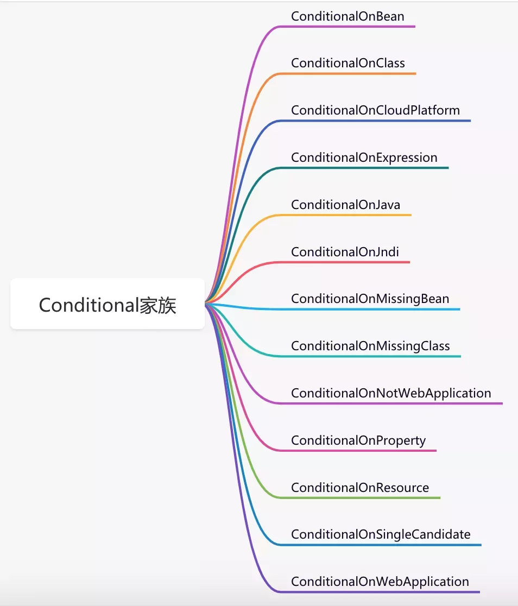
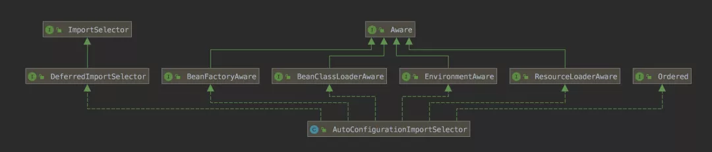
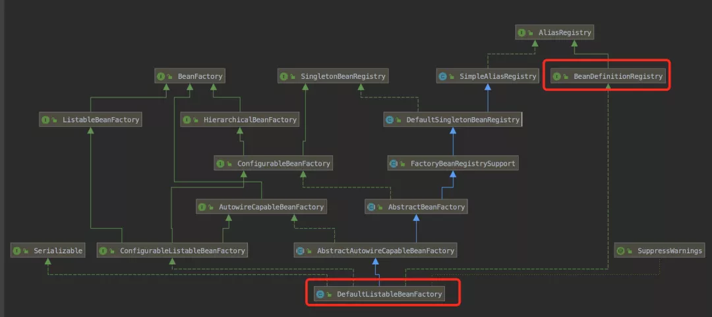
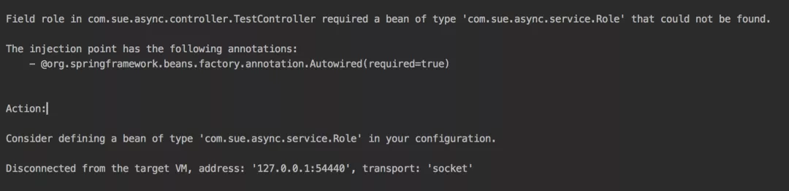
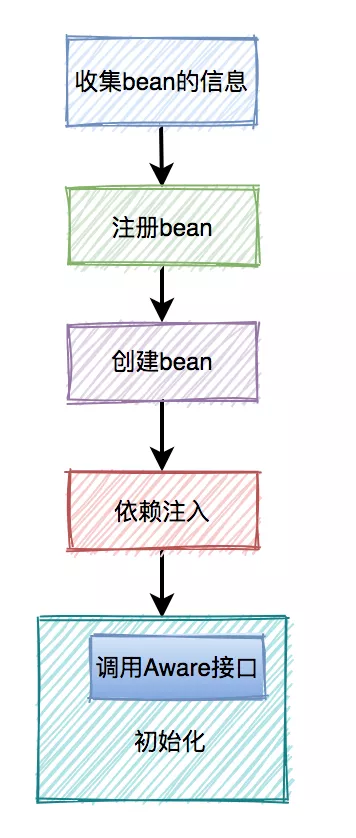

# 引言

Spring是创建和管理bean的工厂，它提供了多种定义bean的方式。

# xml文件配置bean

`xml配置bean`是Spring最早支持的方式。随着 SpringBoot 的发展，该方法目前已经用得很少了。

## 构造器

使用无参构造器创建bean：

```xml
<bean id="personService" class="com.sue.cache.service.test7.PersonService"></bean>
```

使用有参的构造器创建bean，可以通过`<constructor-arg>`标签来完成配置：

```xml
<bean id="personService" class="com.sue.cache.service.test7.PersonService">
    <constructor-arg index="0" value="susan"></constructor-arg>
    <constructor-arg index="1" ref="baseInfo"></constructor-arg>
</bean>
```

其中：

- `index`表示下标，从0开始；
- `value`表示常量值；
- `ref`表示引用另一个bean。

## setter方法

通过setter方法设置bean所需参数，这种方式耦合性相对较低，比有参构造器使用更为广泛。

先定义Person实体：

```java
@Data
public class Person {
    private String name;
    private int age;
}
```

里面包含：成员变量name和age，getter/setter方法。

然后在`bean.xml`文件中配置bean时，加上`<property>`标签设置bean所需参数：

```xml
<bean id="person" class="com.sue.cache.service.test7.Person">
   <property name="name" value="susan"></constructor-arg>
   <property name="age" value="18"></constructor-arg>
</bean>
```

## 静态工厂

这种方式的关键是需要==定义一个工厂类==，它里面包含一个==创建bean的静态方法==：

```java
public class SusanBeanFactory {
    // 静态工厂方法
    public static Person createPerson(String name, int age) {
        return new Person(name, age);
    }
}
```

接下来定义Person类：

```java
@AllArgsConstructor
@NoArgsConstructor
@Data
public class Person {
    private String name;
    private int age;
}
```

里面包含：成员变量name和age，getter/setter方法，无参构造器和全参构造器。

然后在`bean.xml`文件中配置bean时，通过`factory-method`参数==指定静态工厂方法==，同时通过`<constructor-arg>`设置相关参数：

```xml
<bean class="com.sue.cache.service.test7.SusanBeanFactory" factory-method="createPerson">
   <constructor-arg index="0" value="susan"></constructor-arg>
   <constructor-arg index="1" value="18"></constructor-arg>
</bean>
```

## 实例工厂方法

这种方式也需要定义一个工厂类，但里面包含==非静态的创建bean==的方法：

```java
public class SusanBeanFactory {
    public Person createPerson(String name, int age) {
        return new Person(name, age);
    }
}
```

接下来定义Person类：

```java
@AllArgsConstructor
@NoArgsConstructor
@Data
public class Person {
    private String name;
    private int age;
}
```

里面包含：成员变量name和age，getter/setter方法，无参构造器和全参构造器。

然后`bean.xml`文件中配置bean时，需要==先配置工厂bean==。接着，在==配置实例bean==时，通过`factory-bean`参数指定该工厂bean的引用：

```xml
<bean id="susanBeanFactory" class="com.sue.cache.service.test7.SusanBeanFactory"></bean>

<bean factory-bean="susanBeanFactory" factory-method="createPerson">
   <constructor-arg index="0" value="susan"></constructor-arg>
   <constructor-arg index="1" value="18"></constructor-arg>
</bean>
```

## FactoryBean

上面的实例工厂方法<font color=red>每次都需要创建一个工厂类，不方面统一管理</font>。

这时可以使用`FactoryBean`接口：

```java
public class UserFactoryBean implements FactoryBean<User> {
    @Override
    public User getObject() throws Exception {
        return new User();
    }

    @Override
    public Class<?> getObjectType() {
        return User.class;
    }
}
```

在它的`getObject`方法中可以实现我们自己的逻辑创建对象，并且在`getObjectType`方法中我们可以定义对象的类型。

然后在`bean.xml`文件中配置bean时，只需像普通的bean一样配置即可：

```xml
<bean id="userFactoryBean" class="com.sue.async.service.UserFactoryBean">
</bean>
```

> 注意：
>
> - `getBean("userFactoryBean");`获取的是getObject方法中返回的对象。
> - 而`getBean("&userFactoryBean");`获取的才是真正的UserFactoryBean对象。

## 总结

通过上面五种方式，<font color=red>在bean.xml文件中把bean配置好之后，Spring就会自动扫描和解析相应的标签，并且创建和实例化bean，然后放入spring容器中</font>。

基于xml文件的方式配置bean，简单而且非常灵活，比较适合一些小项目。如果遇到比较复杂的项目，则需要配置大量的bean，而且bean之间的关系错综复杂，这样久而久之会导致xml文件迅速膨胀，非常不利于bean的管理。

# Component注解

通用的注解，可标注任意类为 Spring 的组件。<font color=red>如果一个 Bean 不知道属于哪个层，可以使用 `@Component` 注解标注</font>。

为了解决bean太多时，xml文件过大，从而导致膨胀不好维护的问题。在Spring 2.5中开始支持：`@Component`、`@Repository`、`@Service`、`@Controller`等注解定义bean。从注解的源码可知，后三种注解也是`@Component`。

`@Component`系列注解的出现，使得我们不需要像以前那样在bean.xml文件中配置bean了。现在只用<font color=red>在类上加Component、Repository、Service、Controller，这四种注解中的任意一种</font>，就能轻松完成==bean的定义==：

```java
@Service
public class PersonService {
    public String get() {
        return "data";
    }
}
```

这四种注解在功能上没有特别的区别：

- Controller 一般用在控制层；
- Service 一般用在业务层；
- Repository 一般用在数据层，对应持久层即 Dao 层，主要用于数据库相关操作。；
- Component 一般用在==公共组件==上。

通过这种`@Component`扫描注解的方式定义bean的前提是：**需要先<font color=red>配置扫描路径</font>**。

目前常用的<font color=red>配置扫描路径的方式</font>如下：

1. 在`applicationContext.xml`文件中使用`<context:component-scan>`标签：

```xml
<context:component-scan base-package="com.sue.cache" />
```


2. 在Springboot的启动类上加上`@ComponentScan`注解：

```java
@ComponentScan(basePackages = "com.sue.cache")
@SpringBootApplication
public class Application {
    public static void main(String[] args) {
        new SpringApplicationBuilder(Application.class).web(WebApplicationType.SERVLET).run(args);
    }
}
```


3. 直接在`SpringBootApplication`注解上加，它支持`ComponentScan`功能：

```java
@SpringBootApplication(scanBasePackages = "com.sue.cache")
public class Application {
    public static void main(String[] args) {
        new SpringApplicationBuilder(Application.class).web(WebApplicationType.SERVLET).run(args);
    }
}
```

如果<font color=red>==需要扫描的类==与Springboot的==入口类==，在==同一级或者子级==的包下面，无需指定`scanBasePackages`参数，Spring默认会从入口类的同一级或者子级的包去找</font>：

```java
@SpringBootApplication
public class Application {
    public static void main(String[] args) {
        new SpringApplicationBuilder(Application.class).web(WebApplicationType.SERVLET).run(args);
    }
}
```

除了上述四种`@Component`注解之外，Springboot还增加了`@RestController`注解，它是一种特殊的`@Controller`注解，所以也是`@Component`注解。

`@RestController`还支持`@ResponseBody`注解的功能，即<font color=red>将接口响应数据的格式自动转换成json</font>。


# JavaConfig(Configuration+Bean)

`@Component`系列注解虽说使用起来非常方便，但是<font color=red>bean的创建过程完全交给Spring容器来完成</font>，我们没办法自己控制。

Spring从3.0以后，开始支持JavaConfig的方式定义bean。它可以==看作Spring的配置文件==，但并非真正的配置文件，我们需要通过==编码==的方式创建bean：

```java
@Configuration
public class MyConfiguration {
    @Bean
    public Person person() {
        return new Person();
    }
}
```

在JavaConfig==类==上加`@Configuration`注解，相当于配置了`<beans>`标签。而在==方法==上加`@Bean`注解，相当于配置了`<bean>`标签。

此外，Springboot还引入了一些列的`@Conditional`注解，用来==控制bean的创建==：

```java
@Configuration
public class MyConfiguration {
    @ConditionalOnClass(Country.class)
    @Bean
    public Person person() {
        return new Person();
    }
}
```

`@ConditionalOnClass`注解的功能是<font color=red>当项目中存在Country类时，才实例化Person类</font>。换句话说就是，如果项目中不存在Country类，就不实例化Person类。

这个功能非常有用，<font color=red>相当于一个开关控制着Person类，只有满足一定条件才能实例化</font>。

Spring中使用比较多的Conditional还有：

- ConditionalOnBean
- ConditionalOnProperty
- ConditionalOnMissingClass
- ConditionalOnMissingBean
- ConditionalOnWebApplication

下面用一张图整体认识一下@Conditional家族:



## @Bean 注解详解<sup><a href="#ref2">[2]</a></sup>

### 使用说明
- @Bean 注解作用在方法上；
- @Bean 指示一个方法返回一个 Spring 容器管理的 Bean
- <font color=red>@Bean 方法名与返回类名一致，首字母小写</font>
- @Bean 一般和 @Component 或者 @Configuration 一起使用
- @Bean 注解默认作用域为单例 singleton 作用域，可通过 @Scope(“prototype”) 设置为原型作用域

## @Configration 注解详解<span><a href="#ref2">[2]</a></span>

`@Configuration` 表明在一个类里可以声明一个或多个 `@Bean` 方法，并且可以由 Spring 容器处理，以便在运行时为这些 bean 生成 bean 定义和服务请求

# Import注解

通过前面介绍的@Configuration和@Bean相结合的方式，我们可以通过代码定义bean。

但这种方式有一定的局限性，它<font color=red>只能创建该类中定义的bean实例，不能创建其他类的bean实例</font>，如果我们想创建其他类的bean实例该怎么办呢？

这时可以使用`@Import`注解导入。

## 普通类

Spring4.2之后`@Import`注解可以==实例化普通类的bean实例==。

先定义Role类：

```java
@Data
public class Role {
    private Long id;
    private String name;
}
```

接下来使用@Import注解导入Role类：

```java
@Import(Role.class)
@Configuration
public class MyConfig {
}
```

然后在调用的地方通过`@Autowired`注解注入所需的bean：

```java
@RequestMapping("/")
@RestController
public class TestController {

    @Autowired
    private Role role;

    @GetMapping("/test")
    public String test() {
        System.out.println(role);
        return "test";
    }
}
```

我们没有在任何地方定义过Role的bean，但spring却能自动创建该类的bean实例，这是为什么呢？

这正是`@Import`注解的强大之处。

`@Import`注解能==定义单个类的bean==，但如果==有多个类需要定义bean==该怎么办呢？

```java
@Import({Role.class, User.class})
@Configuration
public class MyConfig {
}
```

如果你想偷懒，不想写这种`MyConfig`类，可以将@Import加到SpringBoot的启动类上：

```java

@Import({Role.class, User.class})
@SpringBootApplication(exclude = {DataSourceAutoConfiguration.class,
        DataSourceTransactionManagerAutoConfiguration.class})
public class Application {
    public static void main(String[] args) {
        new SpringApplicationBuilder(Application.class).web(WebApplicationType.SERVLET).run(args);
    }
}
```

SpringBoot的启动类一般都会加@SpringBootApplication注解，该注解上加了@SpringBootConfiguration注解。而@SpringBootConfiguration注解，上面又加了@Configuration注解。

所以，SpringBoot启动类本身带有@Configuration注解的功能。

## Configuration类

上面介绍了@Import注解导入普通类的方法，它同时也支持导入Configuration类。

先定义一个Configuration类：

```java
@Configuration
public class MyConfig2 {

    @Bean
    public User user() {
        return  new User();
    }

    @Bean
    public Role role() {
        return new Role();
    }
}
```

然后在另外一个Configuration类中引入前面的Configuration类：

```java
@Import({MyConfig2.class})
@Configuration
public class MyConfig {
}
```

这种方式，如果MyConfig2类已经在Spring指定的扫描目录或者子目录下，则MyConfig类会显得有点多余。因为MyConfig2类本身就是一个配置类，它里面就能定义bean。

但如果MyConfig2类不在指定的Spring扫描目录或者子目录下，则通过MyConfig类的导入功能，也能把MyConfig2类识别成配置类。

### Swagger

Swagger作为一个优秀的文档生成框架，在Spring项目中越来越受欢迎。接下来，我们以Swagger2为例，介绍一下它是如何导入相关类的。

引入Swagger相关jar包之后，只需要在SpringBoot的启动类上加上`@EnableSwagger2`注解，就能开启Swagger的功能。

其中@EnableSwagger2注解中导入了`Swagger2DocumentationConfiguration`类：

```java
@Retention(RetentionPolicy.RUNTIME)
@Target({ElementType.TYPE})
@Documented
@Import({Swagger2DocumentationConfiguration.class})
public @interface EnableSwagger2 {
}
```

该类是一个Configuration类，它又导入了另外两个类：

- SpringfoxWebMvcConfiguration
- SwaggerCommonConfiguration

```java
@Configuration
@Import({SpringfoxWebMvcConfiguration.class, SwaggerCommonConfiguration.class})
@ComponentScan(
    basePackages = {"springfox.documentation.swagger2.mappers"}
)
@ConditionalOnWebApplication
public class Swagger2DocumentationConfiguration {
    public Swagger2DocumentationConfiguration() {
    }

    @Bean
    public JacksonModuleRegistrar swagger2Module() {
        return new Swagger2JacksonModule();
    }

    @Bean
    public HandlerMapping swagger2ControllerMapping(Environment environment, DocumentationCache documentationCache, ServiceModelToSwagger2Mapper mapper, JsonSerializer jsonSerializer) {
        return new PropertySourcedRequestMappingHandlerMapping(environment, new Swagger2Controller(environment, documentationCache, mapper, jsonSerializer));
    }
}
```

`SpringfoxWebMvcConfiguration`类又会导入新的Configuration类，并且通过`@ComponentScan`注解扫描了一些其他的路径：

```java
@Configuration
@Import({ModelsConfiguration.class})
@ComponentScan(
    basePackages = {"springfox.documentation.spring.web.scanners", 
                    "springfox.documentation.spring.web.readers.operation", 
                    "springfox.documentation.spring.web.readers.parameter", 
                    "springfox.documentation.spring.web.plugins", 
                    "springfox.documentation.spring.web.paths"}
)
@EnablePluginRegistries({DocumentationPlugin.class, 
                         ApiListingBuilderPlugin.class, OperationBuilderPlugin.class, 
                         ParameterBuilderPlugin.class, ExpandedParameterBuilderPlugin.class, 
                         ResourceGroupingStrategy.class, OperationModelsProviderPlugin.class, 
                         DefaultsProviderPlugin.class, PathDecorator.class, ApiListingScannerPlugin.class})
public class SpringfoxWebMvcConfiguration {
    public SpringfoxWebMvcConfiguration() {
    }

    @Bean
    public Defaults defaults() {
        return new Defaults();
    }
    ......
}
```

`SwaggerCommonConfiguration`同样也通过@ComponentScan注解扫描了一些额外的路径：

```java
@Configuration
@ComponentScan(
    basePackages = {"springfox.documentation.swagger.schema", 
                    "springfox.documentation.swagger.readers", 
                    "springfox.documentation.swagger.web"}
)
public class SwaggerCommonConfiguration {
    public SwaggerCommonConfiguration() {
    }
}
```

如此一来，我们通过一个简单的`@EnableSwagger2`注解，就能轻松的导入swagger所需的一系列bean，并且拥有swagger的功能。

## ImportSelector

上面提到的Configuration类，它的功能非常强大。但它不太适合==加复杂的判断条件==，<font color=red>根据某些条件定义这些bean，根据另外的条件定义那些bean</font>。

那么，这种需求该怎么实现呢？

这时就可以使用`ImportSelector`接口了。

首先定义一个类实现`ImportSelector`接口：

```java
public class DataImportSelector implements ImportSelector {
    @Override
    public String[] selectImports(AnnotationMetadata importingClassMetadata) {
        return new String[]{"com.sue.async.service.User", "com.sue.async.service.Role"};
    }
}
```

重写`selectImports`方法，在该方法中指定需要定义bean的类名，注意要包含完整路径，而非相对路径。

然后在MyConfig类上@Import导入这个类即可：

```java
@Import({DataImportSelector.class})
@Configuration
public class MyConfig {
}
```

这个注解还有更牛逼的用途。

@EnableAutoConfiguration注解中导入了`AutoConfigurationImportSelector`类，并且里面包含系统参数名称：`spring.boot.enableautoconfiguration`：

```java
@Target({ElementType.TYPE})
@Retention(RetentionPolicy.RUNTIME)
@Documented
@Inherited
@AutoConfigurationPackage
@Import({AutoConfigurationImportSelector.class})
public @interface EnableAutoConfiguration {
    String ENABLED_OVERRIDE_PROPERTY = "spring.boot.enableautoconfiguration";

    Class<?>[] exclude() default {};

    String[] excludeName() default {};
}
```

AutoConfigurationImportSelector类实现了`ImportSelector`接口：



并且重写了`selectImports`方法，<font color=red>该方法会根据某些注解去找所有需要创建bean的类名，然后返回这些类名</font>。其中在查找这些类名之前，先调用isEnabled方法，判断是否需要继续查找：

```java
public String[] selectImports(AnnotationMetadata annotationMetadata) {
    if (!this.isEnabled(annotationMetadata)) {
        return NO_IMPORTS;
    } else {
        AutoConfigurationImportSelector.AutoConfigurationEntry autoConfigurationEntry = this.getAutoConfigurationEntry(annotationMetadata);
        return StringUtils.toStringArray(autoConfigurationEntry.getConfigurations());
    }
}
```

该方法会根据`ENABLED_OVERRIDE_PROPERTY`的值（`spring.boot.enableautoconfiguration`）来作为判断条件：

```java
protected boolean isEnabled(AnnotationMetadata metadata) {
    return this.getClass() == AutoConfigurationImportSelector.class ? (Boolean)this.getEnvironment().getProperty("spring.boot.enableautoconfiguration", Boolean.class, true) : true;
}
```

这里能根据==系统参数==控制bean是否需要被实例化。

实现ImportSelector接口的好处主要有以下两点：

1. 把某个功能的相关类，可以放到一起，方面管理和维护。
2. 重写selectImports方法时，能够根据条件判断某些类是否需要被实例化，或者某个条件实例化这些bean，其他的条件实例化那些bean等。我们能够非常灵活的定制化bean的实例化。

## ImportBeanDefinitionRegistrar

通过上面的这种方式，确实能够非常灵活的自定义bean。

但它的自定义能力，还是有限的，它没法==自定义bean的名称和作用域==等属性。

有需求，就有解决方案。

接下来，我们一起看看`ImportBeanDefinitionRegistrar`接口的神奇之处。

先定义CustomImportSelector类实现ImportBeanDefinitionRegistrar接口：

```java
public class CustomImportSelector implements ImportBeanDefinitionRegistrar {

    @Override
    public void registerBeanDefinitions(AnnotationMetadata importingClassMetadata, BeanDefinitionRegistry registry) {
        RootBeanDefinition roleBeanDefinition = new RootBeanDefinition(Role.class);
        registry.registerBeanDefinition("role", roleBeanDefinition);

        RootBeanDefinition userBeanDefinition = new RootBeanDefinition(User.class);
        userBeanDefinition.setScope(ConfigurableBeanFactory.SCOPE_PROTOTYPE);
        registry.registerBeanDefinition("user", userBeanDefinition);
    }
}
```

重写`registerBeanDefinitions`方法，在该方法中我们可以获取`BeanDefinitionRegistry`对象，通过它去注册bean。不过在注册bean之前，我们先要创建BeanDefinition对象，它里面可以自定义bean的名称、作用域等很多参数。

然后在MyConfig类上导入上面的类：

```java
@Import({CustomImportSelector.class})
@Configuration
public class MyConfig {
}
```

fegin功能，就是使用ImportBeanDefinitionRegistrar接口实现的。


# PostProcessor

Spring提供了专门注册bean的接口：`BeanDefinitionRegistryPostProcessor`。

该接口的方法`postProcessBeanDefinitionRegistry`上有这样一段描述：

```java
public interface BeanDefinitionRegistryPostProcessor extends BeanFactoryPostProcessor {

	/**
	 * Modify the application context's internal bean definition registry after its
	 * standard initialization. All regular bean definitions will have been loaded,
	 * but no beans will have been instantiated yet. This allows for adding further
	 * bean definitions before the next post-processing phase kicks in.
	 * @param registry the bean definition registry used by the application context
	 * @throws org.springframework.beans.BeansException in case of errors
	 */
	void postProcessBeanDefinitionRegistry(BeanDefinitionRegistry registry) throws BeansException;

}
```

在标准初始化后，修改应用程序上下文的内部bean定义注册表。所有常规bean定义都将被加载，但是还没有bean被实例化。这允许在下一个后处理阶段开始之前，进一步添加定义bean。

如果用这个接口来定义bean，我们要做的事情就变得非常简单了。只需定义一个类实现`BeanDefinitionRegistryPostProcessor`接口：

```java
@Component
public class MyRegistryPostProcessor implements BeanDefinitionRegistryPostProcessor {
    @Override
    public void postProcessBeanDefinitionRegistry(BeanDefinitionRegistry registry) throws BeansException {
        RootBeanDefinition roleBeanDefinition = new RootBeanDefinition(Role.class);
        registry.registerBeanDefinition("role", roleBeanDefinition);

        RootBeanDefinition userBeanDefinition = new RootBeanDefinition(User.class);
        userBeanDefinition.setScope(ConfigurableBeanFactory.SCOPE_PROTOTYPE);
        registry.registerBeanDefinition("user", userBeanDefinition);
    }

    @Override
    public void postProcessBeanFactory(ConfigurableListableBeanFactory beanFactory) throws BeansException {
    }
}
```

重写`postProcessBeanDefinitionRegistry`方法，在该方法中能够获取`BeanDefinitionRegistry`对象，它负责bean的注册工作。

不过细心的朋友可能会发现，里面还多了一个`postProcessBeanFactory`方法，没有做任何实现。

这个方法其实是它的父接口：`BeanFactoryPostProcessor`里的方法

```java
@FunctionalInterface
public interface BeanFactoryPostProcessor {

	/**
	 * Modify the application context's internal bean factory after its standard
	 * initialization. All bean definitions will have been loaded, but no beans
	 * will have been instantiated yet. This allows for overriding or adding
	 * properties even to eager-initializing beans.
	 * @param beanFactory the bean factory used by the application context
	 * @throws org.springframework.beans.BeansException in case of errors
	 */
	void postProcessBeanFactory(ConfigurableListableBeanFactory beanFactory) throws BeansException;

}
```

在应用程序上下文的标准bean工厂之后修改其内部bean工厂初始化。所有bean定义都已加载，但没有bean将被实例化。这允许重写或添加属性甚至可以初始化bean。

```java
@Component
public class MyPostProcessor implements BeanFactoryPostProcessor {

    @Override
    public void postProcessBeanFactory(ConfigurableListableBeanFactory beanFactory) throws BeansException {
        DefaultListableBeanFactory registry = (DefaultListableBeanFactory)beanFactory;
        RootBeanDefinition roleBeanDefinition = new RootBeanDefinition(Role.class);
        registry.registerBeanDefinition("role", roleBeanDefinition);

        RootBeanDefinition userBeanDefinition = new RootBeanDefinition(User.class);
        userBeanDefinition.setScope(ConfigurableBeanFactory.SCOPE_PROTOTYPE);
        registry.registerBeanDefinition("user", userBeanDefinition);
    }
}
```

既然这两个接口都能注册bean，那么他们有什么区别？

- BeanDefinitionRegistryPostProcessor 更侧重于bean的注册
- BeanFactoryPostProcessor 更侧重于对已经注册的bean的属性进行修改，虽然也可以注册bean。

此时，有些朋友可能会问：既然拿到BeanDefinitionRegistry对象就能注册bean，那通过BeanFactoryAware的方式是不是也能注册bean呢？

从下面这张图能够看出DefaultListableBeanFactory就实现了BeanDefinitionRegistry接口：



这样一来，我们如果能够<font color=red>获取DefaultListableBeanFactory对象的实例，然后调用它的注册方法，就可以注册bean了</font>。

定义一个类实现`BeanFactoryAware`接口：

```java
@Component
public class BeanFactoryRegistry implements BeanFactoryAware {
    @Override
    public void setBeanFactory(BeanFactory beanFactory) throws BeansException {
        DefaultListableBeanFactory registry = (DefaultListableBeanFactory) beanFactory;
        RootBeanDefinition rootBeanDefinition = new RootBeanDefinition(User.class);
        registry.registerBeanDefinition("user", rootBeanDefinition);

        RootBeanDefinition userBeanDefinition = new RootBeanDefinition(User.class);
        userBeanDefinition.setScope(ConfigurableBeanFactory.SCOPE_PROTOTYPE);
        registry.registerBeanDefinition("user", userBeanDefinition);
    }
}
```

重写`setBeanFactory`方法，在该方法中能够获取BeanFactory对象，它能够强制转换成DefaultListableBeanFactory对象，然后通过该对象的实例注册bean。

当你满怀喜悦的运行项目时，发现竟然报错了：



为什么会报错？

## Spring中bean的创建过程

Spring中bean的创建过程顺序大致如下：



`BeanFactoryAware`接口是在bean创建成功，并且完成依赖注入之后，在真正初始化之前才被调用的。在这个时候去注册bean意义不大，因为这个接口是给我们获取bean的，并不建议去注册bean，会引发很多问题。

此外，ApplicationContextRegistry和ApplicationListener接口也有类似的问题，我们可以用他们获取bean，但不建议用它们注册bean。


# 总结

## @Component 和 @Bean 的区别

1. 作用对象不同：`@Component` 注解作用于==类==，而 `@Bean` 注解作用于==方法==；
2. `@Component` 通常是通过==路径扫描==来自动侦测以及自动装配到 Spring 容器中（我们可以使用 `@ComponentScan` 注解定义要扫描的路径，从中找出标识了需要装配的类自动装配到 Spring 的 bean 容器中)。`@Bean` 注解通常是我们在标有该注解的==方法中定义产生==这个 bean，`@Bean` 告诉了 Spring 这是某个类的实例，当我们需要用它的时候还给我。
3. `@Bean` 注解比 `@Component` 注解的自定义性更强，而且很多地方我们只能通过 `@Bean` 注解来注册 bean。比如当我们引用第三方库中的类需要装配到 Spring 容器时，只能通过 `@Bean` 来实现。

`@Bean` 注解使用示例：

```java
@Configuration
public class AppConfig {
    @Bean
    public TransferService transferService() {
        return new TransferServiceImpl();
     }
}
```

`@Component` 注解使用示例：

```java
@Component
public class ServiceImpl implements AService {
    ....
}
```

下面这个例子是通过 @Component 无法实现：

```java
@Bean
public OneService getService(status) {
    case (status)  {
        when 1:
            return new serviceImpl1();
        when 2:
            return new serviceImpl2();
        when 3:
            return new serviceImpl3();
    }
}
```


# 参考资料

[1] [Spring中竟然有12种定义Bean的方法](https://mp.weixin.qq.com/s/YZT7NURQsNBSoSNsWBciQg)

<span name="ref2">[2] [@Configuration、@Bean注解的使用详解（配置类的实现）](https://www.hangge.com/blog/cache/detail_2506.html)</span>

https://www.cnblogs.com/cxuanBlog/p/11179439.html

https://blog.csdn.net/weixin_35544490/article/details/112143211

